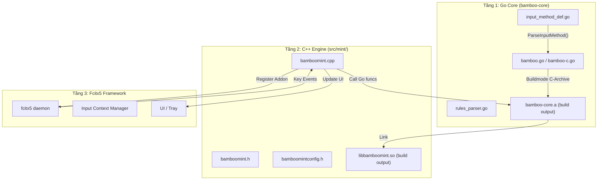
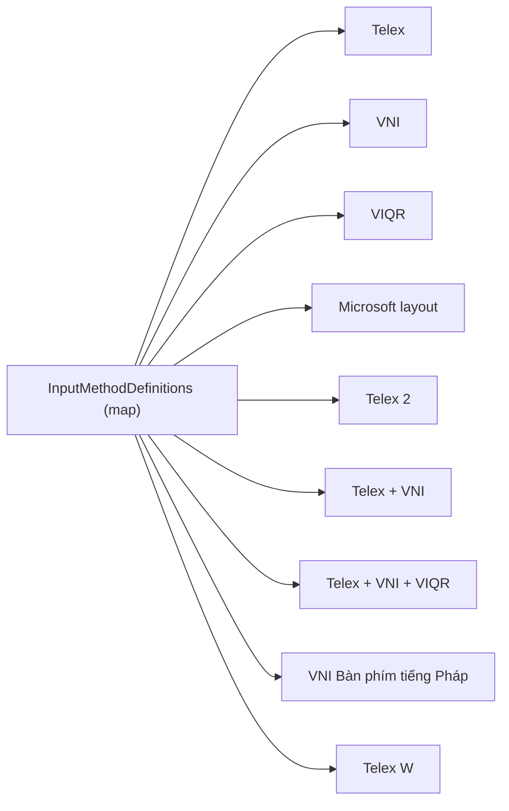
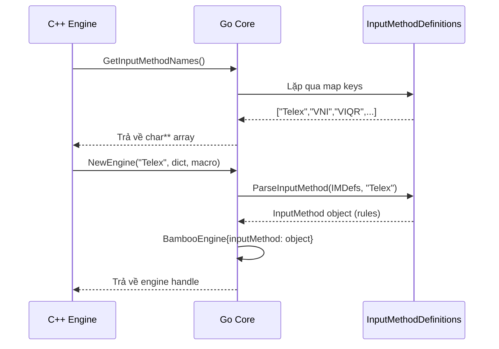
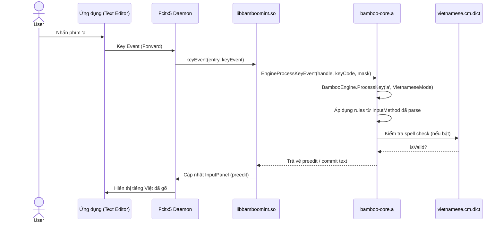
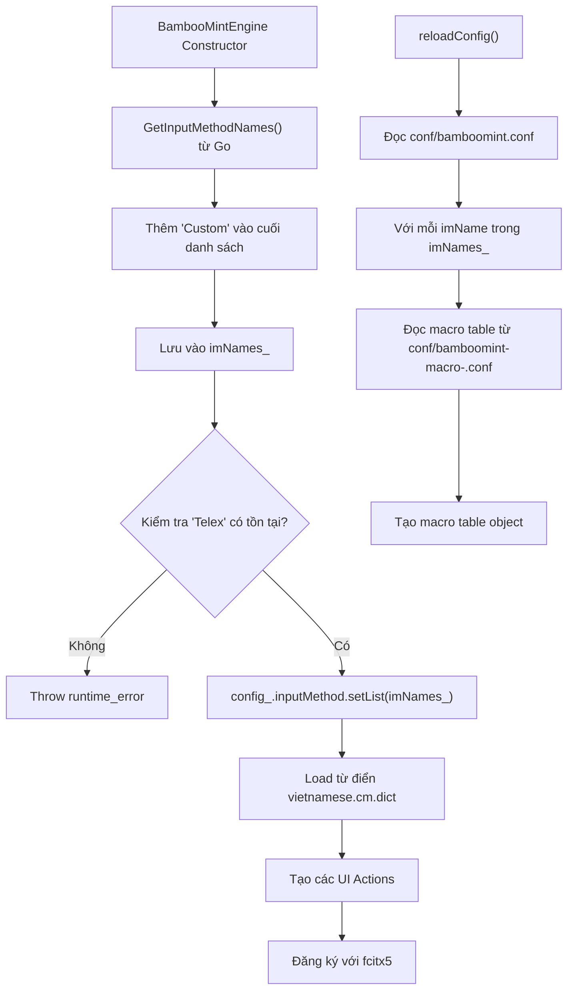
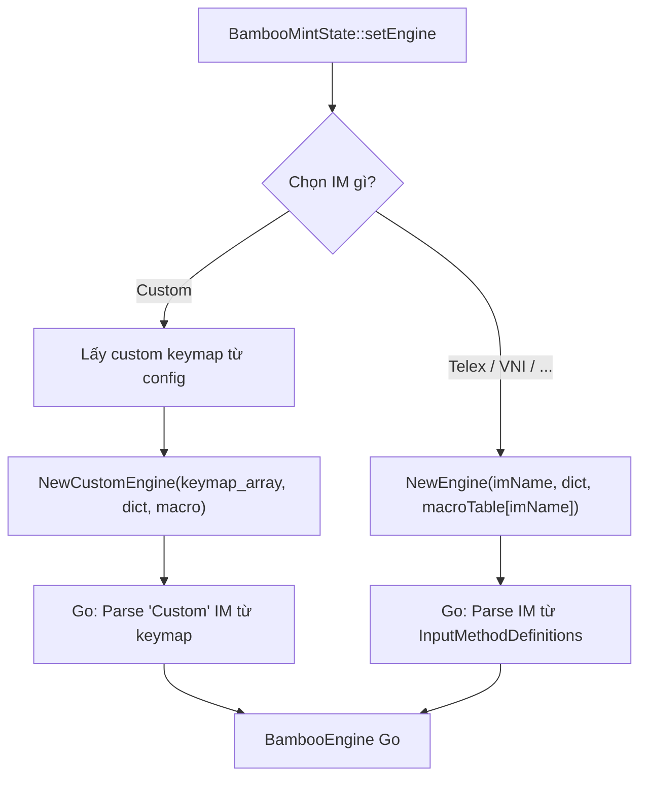
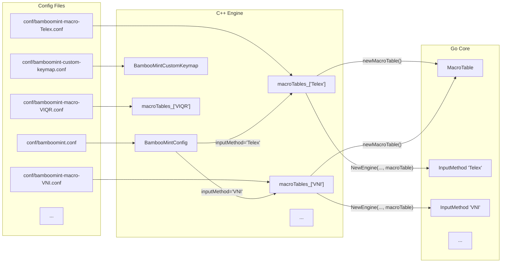
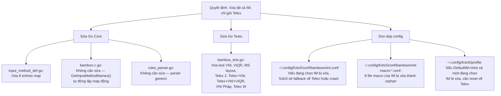
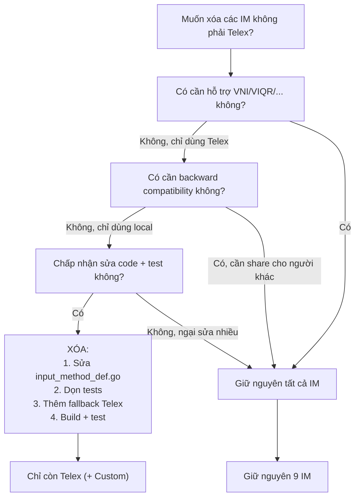

# REQ-003: Phân Tích Cấu Trúc Kiểu Gõ (Input Method) và Đánh Giá Ảnh Hưởng Khi Xóa

**Phiên bản:** 1.0  
**Ngày cập nhật:** 2026-08-16  
**Ngôn ngữ:** Tiếng Việt  
**Mục đích:** Hiểu rõ cấu trúc các kiểu gõ trong project để quyết định xóa những kiểu không dùng (chỉ giữ Telex).

---

## 1. Tổng Quan Kiến Trúc

Dự án chia làm 3 tầng:



---

## 2. Cấu Trúc Các Kiểu Gõ Trong Go Core

### 2.1. Nơi định nghĩa

**File:** `bamboo/bamboo-core/input_method_def.go`

Đây là **nguồn duy nhất** định nghĩa các kiểu gõ. Có tổng cộng **9 kiểu gõ** được khai báo trong map `InputMethodDefinitions`:



### 2.2. Chi tiết từng kiểu gõ

| STT | Tên | Ý nghĩa | Ví dụ phím tắt |
|-----|-----|---------|----------------|
| 1 | **Telex** | Chuẩn Telex | `a`→â, `w`→ư/ơ/ă, `s`→sắc |
| 2 | **VNI** | Kiểu VNI số | `1`→sắc, `6`→â/ê/ô |
| 3 | **VIQR** | Kiểu VIQR dấu | `'`→sắc, `^`→â/ê/ô |
| 4 | **Microsoft layout** | Layout MS Office | `8`→sắc, `1`→ă, `2`→â |
| 5 | **Telex 2** | Telex mở rộng | Thêm `[]{}` cho ư/ơ/Ư/Ơ |
| 6 | **Telex + VNI** | Gộp Telex + VNI | `af` hoặc `a1` đều ra `à` |
| 7 | **Telex + VNI + VIQR** | Gộp cả 3 | `af`, `a1`, `a'` đều ra `à` |
| 8 | **VNI Bàn phím tiếng Pháp** | VNI cho bàn phím AZERTY Pháp | `é`→sắc, `è`→â/ê/ô |
| 9 | **Telex W** | Telex variant W | Tương tự Telex 2 |

### 2.3. Cách Go parse kiểu gõ



---

## 3. Luồng Dữ Liệu Khi Người Dùng Gõ Phím



---

## 4. C++ Engine Khởi Tạo Như Thế Nào?

### 4.1. Constructor `BambooMintEngine`



### 4.2. Tạo engine thực tế trong `BambooMintState::setEngine()`



---

## 5. Liên Kết Với Macro Table và Custom Keymap



---

## 6. Đánh Giá Ảnh Hưởng Nếu Xóa Các Kiểu Gõ (Chỉ Giữ Telex)

### 6.1. Phân tích từng file cần sửa

| File | Dòng cần sửa | Mức độ ảnh hưởng |
|------|-------------|-----------------|
| `bamboo/bamboo-core/input_method_def.go` | Xóa 8 entries khỏi `InputMethodDefinitions`, chỉ giữ `"Telex"` | **Cao** — Nguồn duy nhất định nghĩa IM |
| `bamboo/bamboo-core/bamboo_test.go` | Xóa các test dùng VNI, VIQR, Microsoft layout, Telex 2, v.v. | **Trung bình** — Chỉ ảnh hưởng test |
| `src/mint/bamboomint.cpp` | Dòng 235-238: Kiểm tra `"Telex"` tồn tại → **giữ nguyên** | **Thấp** — Không cần sửa, vẫn hợp lệ |
| `src/bamboo.cpp` | Tương tự trên — kiểm tra `"Telex"` | **Thấp** — Không cần sửa |
| `src/mint/bamboomintconfig.h` | Không cần sửa — dropdown list tự động từ `imNames_` | **Thấp** |
| Các file `conf/bamboomint-macro-*.conf` | Các file config cũ sẽ không còn được đọc | **Thấp** — Chỉ là orphan files |

### 6.2. Sơ đồ impact toàn cục



### 6.3. Rủi ro cần lưu ý

| Rủi ro | Mô tả | Cách tránh |
|--------|-------|-----------|
| **Crash khởi động** | Nếu `~/.config/fcitx5/conf/bamboomint.conf` lưu `InputMethod=VNI` trong khi VNI đã bị xóa khỏi Go map, engine C++ vẫn cố gọi `NewEngine("VNI",...)` và Go không tìm thấy → crash | Thêm validation trong C++: nếu IM không tồn tại trong list, fallback về `"Telex"` |
| **Config orphan** | 8 file macro `.conf` cũ chiếm dung lượng (nhỏ) | Không cần xóa thủ công, chỉ cần bỏ qua |
| **Tests Go lỗi** | `bamboo_test.go` có ~20 test dùng các IM bị xóa | Xóa hoặc comment các test đó |
| **Người dùng khác** | Nếu đã cài addon này trên máy khác, họ đang dùng VNI → sau update sẽ bị lỗi | Thêm fallback Telex trong `NewEngine()` hoặc migration logic |

---

## 7. Sơ Đồ Quyết Định: Có Nên Xóa Không?



---

## 8. Tóm Tắt Các Bước Thực Hiện Nếu Xóa

### Bước 1: Sửa Go Core

```go
// File: bamboo/bamboo-core/input_method_def.go
// Trước: 9 entries
// Sau: Chỉ giữ Telex

var InputMethodDefinitions = map[string]InputMethodDefinition{
    "Telex": {
        "z": "XoaDauThanh",
        "s": "DauSac",
        "f": "DauHuyen",
        "r": "DauHoi",
        "x": "DauNga",
        "j": "DauNang",
        "a": "A_Â",
        "e": "E_Ê",
        "o": "O_Ô",
        "w": "UOA_ƯƠĂ",
        "d": "D_Đ",
    },
}
```

### Bước 2: Dọn tests

Xóa hoặc comment các test trong `bamboo_test.go` dùng: VNI, VIQR, Microsoft layout, Telex 2, Telex+VNI, Telex+VNI+VIQR, VNI Bàn phím tiếng Pháp, Telex W.

### Bước 3: (Tùy chọn) Thêm fallback trong C++

Trong `bamboomint.cpp`, trước khi gọi `NewEngine()`, kiểm tra nếu tên IM không tồn tại thì fallback về `"Telex"`.

### Bước 4: Build + Test

```bash
cd build && make -j4
sudo cp src/mint/libbamboomint.so /usr/lib/x86_64-linux-gnu/fcitx5/
fcitx5-remote -r
```

---

## 9. Kết Luận

- Các kiểu gõ được **định nghĩa tập trung** trong `bamboo/bamboo-core/input_method_def.go`.
- C++ engine **không hardcode** danh sách IM; nó đọc động từ Go qua `GetInputMethodNames()`.
- Nếu xóa các IM không phải Telex, **chỉ cần sửa 1 file Go** là đủ về mặt logic. Nhưng cần dọn tests và xử lý config cũ.
- **Rủi ro chính:** Người dùng đang có config chọn IM bị xóa (ví dụ `InputMethod=VNI`) sẽ gặp lỗi khi engine cố khởi tạo. Cần thêm fallback Telex trong C++.
