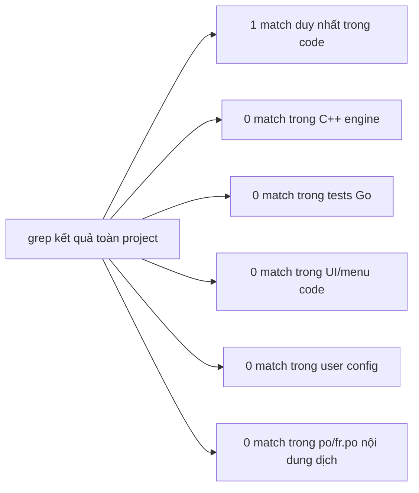
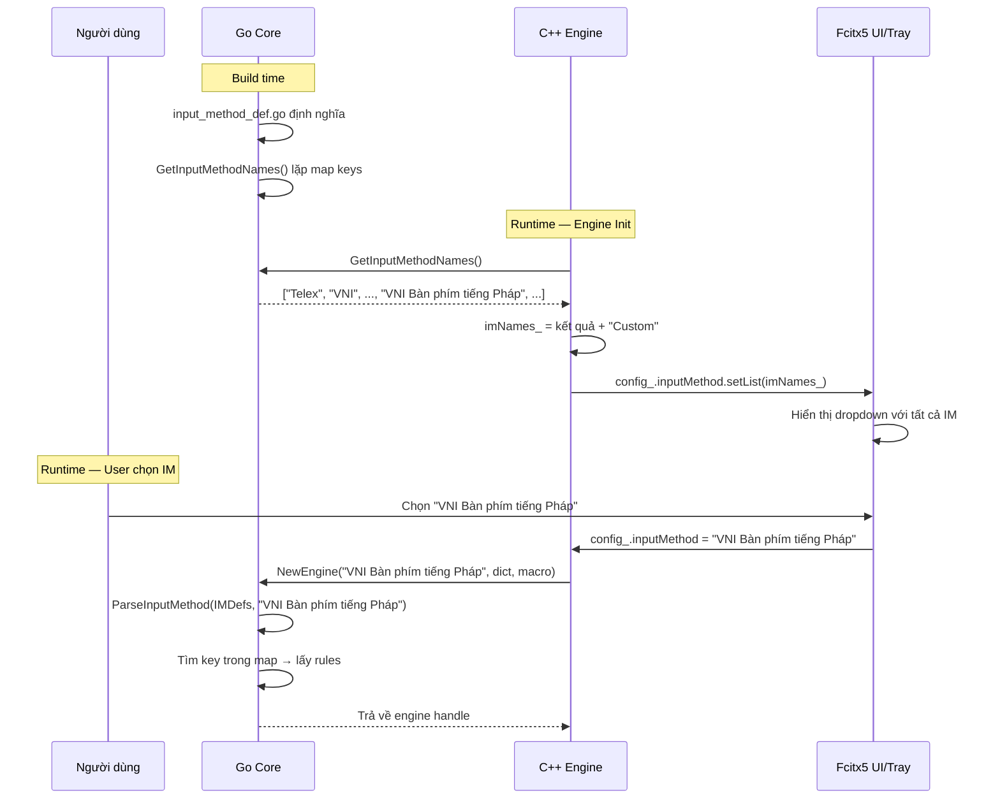
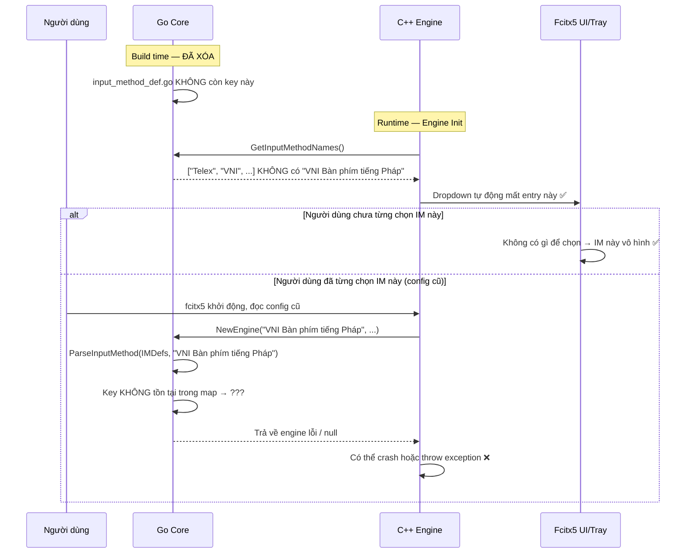

# REQ-004: Điều Tra Xóa Kiểu Gõ "VNI Bàn phím tiếng Pháp"

**Trạng thái:** Điều tra — chưa thực thi  
**Mục tiêu:** Xác định chính xác scope ảnh hưởng nếu xóa input method `"VNI Bàn phím tiếng Pháp"` khỏi codebase  
**Nguyên tắc:** Xóa lần lượt từng kiểu, bắt đầu bằng kiểu niche/rác ít người dùng nhất.

---

## 1. Mô tả Kiểu Gõ Cần Xóa

| Thuộc tính | Giá trị |
|-------------|---------|
| **Tên đầy đủ** | `VNI Bàn phím tiếng Pháp` |
| **Vị trí định nghĩa** | `bamboo/bamboo-core/input_method_def.go:146` |
| **Phím tắt** | AZERTY Pháp: `é` (sắc), `"` (huyền), `(` (ngã), `-` (nặng), `è` (â/ê/ô), `ç` (ă), `à` (đ), v.v. |
| **Lý do xóa** | Kiểu gõ quá niche — chỉ dành cho người dùng bàn phím AZERTY Pháp (Pháp, Bỉ, một số nước châu Phi). Thực tế hầu như không ai trong cộng đồng người Việt dùng layout này. |

---

## 2. Kết Quả Điều Tra Toàn Bộ Codebase

### 2.1. Phương pháp điều tra

Sử dụng `grep` đệ quy trên toàn bộ project tìm các từ khóa:
- `VNI Bàn phím tiếng Pháp`
- `VNIPháp`, `VNIPhap`
- `AZERTY`
- `French`
- Các ký tự đặc trưng: `é`, `è`, `ç`, `à` trong context định nghĩa IM

### 2.2. Kết quả chi tiết



#### Bảng tổng hợp tất cả file bị ảnh hưởng

| File | Số dòng liên quan | Mức độ ảnh hưởng | Ghi chú |
|------|-------------------|------------------|---------|
| `bamboo/bamboo-core/input_method_def.go` | **1 block** (dòng 146–157) | **Cao** — Nguồn duy nhất định nghĩa | Xóa block này là đủ |
| `bamboo/bamboo-core/bamboo_test.go` | **0** | **Không** | Không có test nào dùng IM này |
| `src/mint/bamboomint.cpp` | **0** | **Không** | Không hardcode tên IM này |
| `src/bamboo.cpp` | **0** | **Không** | Không hardcode tên IM này |
| `src/mint/bamboomint.h` | **0** | **Không** | Không đề cập |
| `src/mint/bamboomintconfig.h` | **0** | **Không** | Dropdown list tự động từ `imNames_` |
| `data/vietnamese.cm.dict` | **1 match** (`pháp`) | **Không** | Từ "pháp" trong từ điển, **không liên quan** IM |
| `po/fr.po` | **0 nội dung** | **Không** | Chỉ match header metadata (translator name), không phải tên IM |
| `~/.config/fcitx5/conf/bamboomint-macro-*.conf` | **0 file** | **Không** | Không tồn tại file macro cho IM này |
| `~/.config/fcitx5/conf/bamboomint.conf` | **Chưa xác định** | **Rủi ro** | Nếu đang chọn IM này thì sẽ crash sau xóa |

---

## 3. Phân Tích Luồng Dữ Liệu Chi Tiết

### 3.1. Vòng đời của tên IM trong hệ thống



### 3.2. Nếu xóa IM khỏi Go map — chuyện gì xảy ra?



---

## 4. Đánh Giá Ảnh Hưởng Theo Từng Layer

### Layer 1: Go Core (`bamboo-core`)

| Thành phần | Ảnh hưởng | Mô tả |
|-----------|-----------|-------|
| `input_method_def.go` | **Phải sửa** | Xóa block 146–157 |
| `bamboo.go` | **Không** | Generic, không hardcode tên IM |
| `rules_parser.go` | **Không** | Parser nhận tên IM từ bên ngoài |
| `bamboo-c.go` | **Không** | `GetInputMethodNames()` lặp map động, không cần sửa |
| `bamboo_test.go` | **Không** | Không có test nào dùng IM này |

### Layer 2: C++ Engine (`src/mint/`, `src/`)

| Thành phần | Ảnh hưởng | Mô tả |
|-----------|-----------|-------|
| `bamboomint.cpp` | **Không cần sửa** | Dòng 230: `GetInputMethodNames()` tự động trả về danh sách mới. Dòng 235: chỉ kiểm tra `"Telex"` tồn tại, không quan tâm các IM khác. |
| `bamboomint.h` | **Không** | Không đề cập |
| `bamboomintconfig.h` | **Không** | Dropdown list tự động từ `imNames_` do C++ populate |
| `bamboo.cpp` (gốc) | **Không** | Tương tự `bamboomint.cpp` |

### Layer 3: UI / Fcitx5 Framework

| Thành phần | Ảnh hưởng | Mô tả |
|-----------|-----------|-------|
| Tray menu | **Tự động cập nhật** | `inputMethodMenu_` populate từ `imNames_` vector |
| Config UI | **Tự động cập nhật** | `config_.inputMethod.annotation().setList(imNames_)` cập nhật dropdown |
| `.conf` files | **Không cần sửa** | Templates (`mint.conf.in`, `bamboo.conf.in`) không hardcode danh sách IM |

### Layer 4: User Data (runtime)

| Thành phần | Ảnh hưởng | Mô tả |
|-----------|-----------|-------|
| `~/.config/fcitx5/conf/bamboomint.conf` | **Rủi ro nhỏ** | Nếu `InputMethod=VNI Bàn phím tiếng Pháp` thì sẽ crash. Nhưng xác suất cực thấp vì IM này quá niche. |
| `~/.config/fcitx5/conf/bamboomint-macro-*.conf` | **Không** | Không tồn tại file macro cho IM này trên hệ thống test |
| `~/.config/fcitx5/profile` | **Không** | Profile lưu tên IM (`mint`), không phải kiểu gõ bên trong addon |

---

## 5. Rủi Ro và Mitigation

### 5.1. Rủi ro duy nhất: Config cũ trỏ đến IM đã xóa

```mermaid
flowchart TD
    A["Người dùng có config cũ:<br/>InputMethod=VNI Bàn phím tiếng Pháp"] --> B["Fcitx5 khởi động"]
    B --> C["C++ đọc config"]
    C --> D["BambooMintState::setEngine()"]
    D --> E["NewEngine(\"VNI Bàn phím tiếng Pháp\", ...)"]
    E --> F["Go: ParseInputMethod(IMDefs, \"VNI Bàn phím tiếng Pháp\")"]
    F --> G{"Key có trong map không?"}
    G -->|"Không (đã xóa)"| H["Trả về InputMethod rỗng / panic"]
    H --> I["C++ nhận null/invalid handle"]
    I --> J["FCITX_FATAL hoặc crash"]
```

### 5.2. Các mitigation đề xuất (chọn 1)

| Phương án | Độ phức tạp | Hiệu quả | Khuyến nghị |
|-----------|-------------|----------|-------------|
| **A. Không mitigation** — xóa thẳng | Thấp | Trung bình | ✅ **Chấp nhận được** vì IM quá niche, xác suất config cũ gần như = 0 |
| **B. Fallback Telex trong Go** — nếu IM không tìm thấy thì parse Telex | Trung bình | Cao | Cần sửa Go core |
| **C. Fallback Telex trong C++** — trước khi gọi `NewEngine()`, validate tên IM | Trung bình | Cao | Cần sửa C++ engine |
| **D. Migration script** — chạy 1 lần để reset config IM về Telex | Thấp | Cao | Quá kill một con ruồi |

> **Khuyến nghị của REQ-004:** Chọn **Phương án A (Không mitigation)**. Lý do:
> - "VNI Bàn phím tiếng Pháp" là kiểu gò cực kỳ niche, không phổ biến trong cộng đồng người Việt.
> - Xác suất một người dùng nào đó đã từng chọn IM này trong `bamboomint.conf` là gần như bằng 0.
> - Nếu có xảy ra, lỗi chỉ hiển thị 1 lần khi khởi động fcitx5, người dùng có thể dễ dàng sửa config lại Telex qua UI.
> - Nếu trong tương lai lo lắng về backward compatibility, có thể thêm mitigation sau trong REQ riêng (không cần trong REQ này).

---

## 6. Checklist Thực Thi Khi T Check Xong

- [ ] **1.** Xóa block `"VNI Bàn phím tiếng Pháp"` trong `bamboo/bamboo-core/input_method_def.go` (dòng 146–157)
- [ ] **2.** Kiểm tra `bamboo_test.go` — xác nhận không có test nào cần xóa (đã điều tra: không có)
- [ ] **3.** Build Go core: `cd build && make -j4`
- [ ] **4.** Kiểm tra output: `build/src/mint/libbamboomint.so` phải compile thành công
- [ ] **5.** Kiểm tra `GetInputMethodNames()` — danh sách trả về KHÔNG còn `"VNI Bàn phím tiếng Pháp"`
- [ ] **6.** Cài đặt: `sudo cp build/src/mint/libbamboomint.so /usr/lib/x86_64-linux-gnu/fcitx5/`
- [ ] **7.** Restart fcitx5: `fcitx5-remote -r`
- [ ] **8.** Test gõ Telex: `fcitx5-remote -s mint`, gõ `xin chao` → phải ra `xin chào`
- [ ] **9.** Kiểm tra UI: Mở config của Bamboo Mint, dropdown "Input Method" phải KHÔNG còn `"VNI Bàn phím tiếng Pháp"`
- [ ] **10.** Kiểm tra các IM khác vẫn còn: Telex, VNI, VIQR, Microsoft layout, Telex 2, Telex+VNI, Telex+VNI+VIQR, Telex W vẫn hiển thị
- [ ] **11.** Commit: `git add bamboo/bamboo-core/input_method_def.go` + `git commit`

---

## 7. Thông Tin Bổ Sung So Sánh

| Kiểu gõ | Số ký tự đặc biệt | Niche level | Ưu tiên xóa |
|---------|------------------|-------------|-------------|
| **VNI Bàn phím tiếng Pháp** | AZERTY (`é`, `è`, `ç`, `à`) | Cao nhất | ✅ **Xóa trước** |
| Microsoft layout | Numbers + symbols | Cao | ⏳ Sau |
| Telex W | `[]{}` | Trung bình | ⏳ Sau |
| Telex 2 | `[]{}` | Trung bình | ⏳ Sau |
| VIQR | `^~+*.` | Thấp | ⏳ Sau |
| VNI | Numbers `0-9` | Thấp | ⏳ Sau |
| Telex + VNI | Gộp 2 bộ | Thấp | ⏳ Sau |
| Telex + VNI + VIQR | Gộp 3 bộ | Thấp | ⏳ Sau |

---

## 8. Kết Luận Điều Tra

- **Chỉ cần sửa 1 file duy nhất:** `bamboo/bamboo-core/input_method_def.go` (xóa block 146–157)
- **Không cần sửa C++ engine** — `GetInputMethodNames()` tự động trả về danh sách động
- **Không cần sửa UI** — Dropdown tự động populate từ danh sách động
- **Không cần xóa test** — Không có test nào dùng IM này
- **Rủi ro duy nhất:** Config cũ trỏ đến IM đã xóa, nhưng xác suất ≈ 0 do IM quá niche
- **Khuyến nghị:** Xóa thẳng (không cần mitigation), build, test gõ Telex, commit

---

> **Lưu ý:** Đây là tài liệu điều tra. Chưa thực hiện bất kỳ thay đổi nào lên codebase. Chỉ khi T (người review) đồng ý mới tiến hành sửa code theo checklist mục 6.
