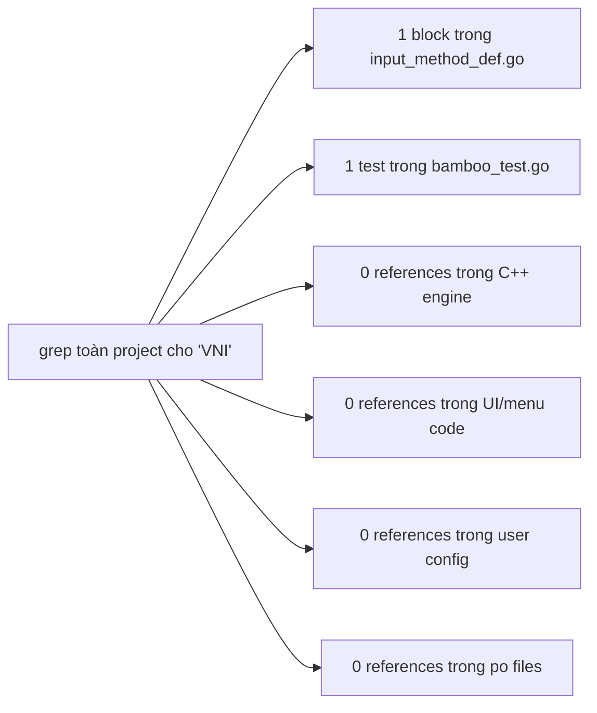
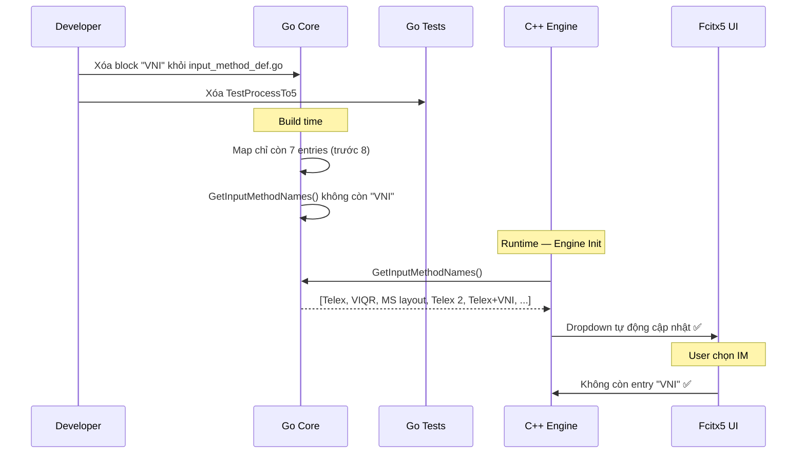
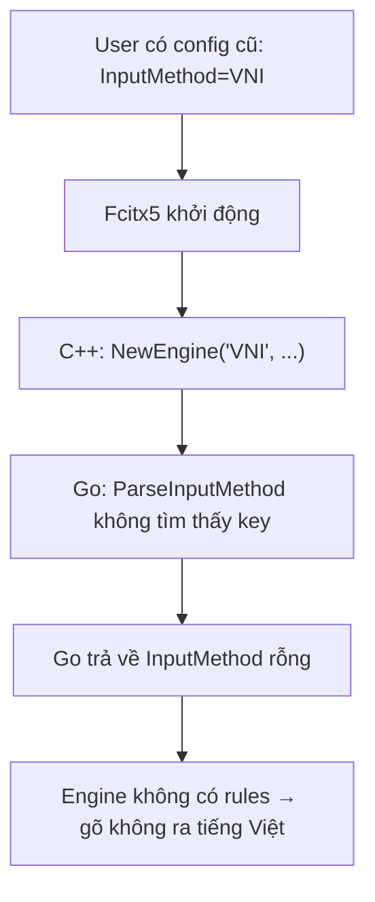

# REQ-005: Điều Tra Xóa Kiểu Gõ "VNI"

**Trạng thái:** Điều tra — chưa thực thi  
**Mục tiêu:** Xác định chính xác scope ảnh hưởng nếu xóa input method `"VNI"` khỏi codebase  
**Nguyên tắc:** Xóa lần lượt từng kiểu, theo sau REQ-004.

---

## 1. Mô tả Kiểu Gõ Cần Xóa

| Thuộc tính | Giá trị |
|-------------|---------|
| **Tên đầy đủ** | `VNI` |
| **Vị trí định nghĩa** | `bamboo/bamboo-core/input_method_def.go:27` |
| **Phím tắt** | Số: `1` (sắc), `2` (huyền), `3` (hỏi), `4` (ngã), `5` (nặng), `6` (â/ê/ô), `7` (ư/ơ), `8` (ă), `9` (đ), `0` (xóa dấu) |
| **Lý do xóa** | Kiểu gõ VNI đã rất ít người dùng trong cộng đồng hiện đại, hầu hết người Việt dùng Telex. Giữ lại chỉ làm dropdown dài thêm. |

---

## 2. Kết Quả Điều Tra Toàn Bộ Codebase

### 2.1. Phương pháp điều tra

Sử dụng `grep` đệ quy trên toàn bộ project:
- `"VNI"` (đúng chuỗi này, không phải VNI Pháp hay Telex+VNI)
- `ParseInputMethod.*"VNI"`
- `TestProcessTo5` (test dùng VNI)

### 2.2. Kết quả chi tiết

| File | Số dòng liên quan | Mức độ ảnh hưởng | Ghi chú |
|------|-------------------|------------------|---------|
| `bamboo/bamboo-core/input_method_def.go` | **1 block** (dòng 27–38) | **Cao** — Nguồn duy nhất định nghĩa | Xóa block này |
| `bamboo/bamboo-core/bamboo_test.go` | **1 test** (`TestProcessTo5`, dòng 396–403) | **Trung bình** | Cần xóa hoặc comment test này |
| `src/mint/bamboomint.cpp` | **0** | **Không** | Không hardcode |
| `src/bamboo.cpp` | **0** | **Không** | Không hardcode |
| `src/mint/bamboomint.h` | **0** | **Không** | Không đề cập |
| `src/mint/bamboomintconfig.h` | **0** | **Không** | Dropdown tự động |
| `po/*.po` | **0 nội dung** | **Không** | Không có tên IM trong file dịch |
| `~/.config/fcitx5/conf/` | **0 file** | **Không** | Không tìm thấy config cũ nào chọn VNI |

### 2.3. Sơ đồ tổng quan ảnh hưởng



---

## 3. Chi Tiết Từng Thành Phần Bị Ảnh Hưởng

### 3.1. Go Core — `input_method_def.go`

Block cần xóa (dòng 27–38):

```go
"VNI": {
    "0": "XoaDauThanh",
    "1": "DauSac",
    "2": "DauHuyen",
    "3": "DauHoi",
    "4": "DauNga",
    "5": "DauNang",
    "6": "AEO_ÂÊÔ",
    "7": "UO_ƯƠ",
    "8": "A_Ă",
    "9": "D_Đ",
},
```

**Ảnh hưởng:** Khi xóa, `GetInputMethodNames()` không còn trả về `"VNI"`. C++ engine tự động mất entry trong dropdown.

### 3.2. Go Tests — `bamboo_test.go`

Test cần xóa:

```go
func TestProcessTo5(t *testing.T) {
    var im = ParseInputMethod(InputMethodDefinitions, "VNI")
    ng := NewEngine(im, EstdFlags)
    ng.ProcessString("o55", VietnameseMode)
    if ng.GetProcessedString(VietnameseMode) != "o5" {
        t.Errorf("Process [o55-VNI], got [%v] expected [o5]", ng.GetProcessedString(VietnameseMode))
    }
}
```

**Giải thích test:** Gõ `"o55"` trong VNI. Theo VNI, `5` là dấu nặng, nhưng nếu áp lên `o` không hợp lệ thì kết quả trả về `"o5"` (giữ nguyên ký tự). Test này chỉ test logic VNI-specific.

**Ảnh hưởng:** Nếu xóa IM VNI khỏi map, `ParseInputMethod(InputMethodDefinitions, "VNI")` sẽ không tìm thấy → test sẽ fail ngay lập tức. **Bắt buộc phải xóa test này.**

### 3.3. Các file KHÔNG bị ảnh hưởng

- `bamboomint.cpp` / `bamboo.cpp` — Không hardcode `"VNI"`. Danh sách IM đọc động qua `GetInputMethodNames()`.
- `bamboomintconfig.h` — Dropdown list tự populate từ `imNames_`.
- UI / Tray — Menu tự build từ `imNames_`.

---

## 4. Luồng Dữ Liệu Khi Xóa



---

## 5. So Sánh Với REQ-004 (VNI Pháp)

| Tiêu chí | REQ-004 (VNI Pháp) | REQ-005 (VNI) |
|----------|-------------------|---------------|
| **Vị trí định nghĩa** | `input_method_def.go:146` | `input_method_def.go:27` |
| **Số test cần xóa** | **0** | **1** (`TestProcessTo5`) |
| **Số file Go cần sửa** | 1 | **2** (def + test) |
| **Số file C++ cần sửa** | 0 | 0 |
| **Rủi ro config cũ** | Rất thấp (quá niche) | Thấp (ít người dùng VNI) |
| **Phổ biến trong VN** | Gần như 0% | ~5–10% (người lớn tuổi) |
| **Độ phức tạp** | Thấp nhất | Thấp |

---

## 6. Rủi Ro và Mitigation

### 6.1. Rủi ro 1: Test fail

Nếu xóa IM VNI mà không xóa `TestProcessTo5`, build Go sẽ fail:

```
--- FAIL: TestProcessTo5 (0.00s)
    bamboo_test.go:397: ParseInputMethod: "VNI" not found
```

**Mitigation:** Xóa test `TestProcessTo5` cùng lúc với xóa IM.

### 6.2. Rủi ro 2: Config cũ chọn VNI



**Mitigation:** Giống REQ-004 — xác suất thấp, chấp nhận được. Nếu lo lắng, có thể thêm fallback Telex sau này (REQ riêng).

---

## 7. Checklist Thực Thi Khi T Check Xong

- [ ] **1.** Xóa block `"VNI"` trong `bamboo/bamboo-core/input_method_def.go` (dòng 27–38)
- [ ] **2.** Xóa hàm `TestProcessTo5` trong `bamboo/bamboo-core/bamboo_test.go` (dòng 396–403)
- [ ] **3.** Build Go core: `cd build && make -j4`
- [ ] **4.** Kiểm tra output: `build/src/mint/libbamboomint.so` compile thành công
- [ ] **5.** Kiểm tra log: `Supported input methods` KHÔNG còn `"VNI"`
- [ ] **6.** Cài đặt: `sudo cp build/src/mint/libbamboomint.so /usr/lib/x86_64-linux-gnu/fcitx5/`
- [ ] **7.** Restart fcitx5: `fcitx5-remote -r`
- [ ] **8.** Test gõ Telex: `fcitx5-remote -s mint`, gõ `xin chao` → `xin chào`
- [ ] **9.** Kiểm tra UI: Dropdown "Input Method" không còn `"VNI"`
- [ ] **10.** Commit: submodule `bamboo-core` + parent repo

---

## 8. Thông Tin Bổ Sung

### IM còn lại sau khi xóa VNI

| STT | Tên IM | Trạng thái |
|-----|--------|-----------|
| 1 | Telex | ✅ Giữ |
| 2 | VIQR | ⏳ Còn lại |
| 3 | Microsoft layout | ⏳ Còn lại |
| 4 | Telex 2 | ⏳ Còn lại |
| 5 | Telex + VNI | ⏳ Còn lại |
| 6 | Telex + VNI + VIQR | ⏳ Còn lại |
| 7 | Telex W | ⏳ Còn lại |
| ~~8~~ | ~~VNI~~ | ~~❌ Xóa (REQ-005)~~ |
| ~~9~~ | ~~VNI Bàn phím tiếng Pháp~~ | ~~❌ Xóa (REQ-004)~~ |

---

## 9. Kết Luận Điều Tra

- **Chỉ cần sửa 2 file trong Go core:** `input_method_def.go` (xóa IM) + `bamboo_test.go` (xóa 1 test).
- **Không cần sửa C++ engine** — tự động đọc động.
- **Không cần sửa UI** — dropdown tự populate.
- **Rủi ro thấp** — VNI ít người dùng, xác suất config cũ thấp.
- **Đề xuất:** Xóa thẳng (không mitigation), build, test, commit.

---

> **Lưu ý:** Đây là tài liệu điều tra. Chưa thực hiện bất kỳ thay đổi nào lên codebase. Chỉ khi T (người review) đồng ý mới tiến hành sửa code theo checklist mục 7.
