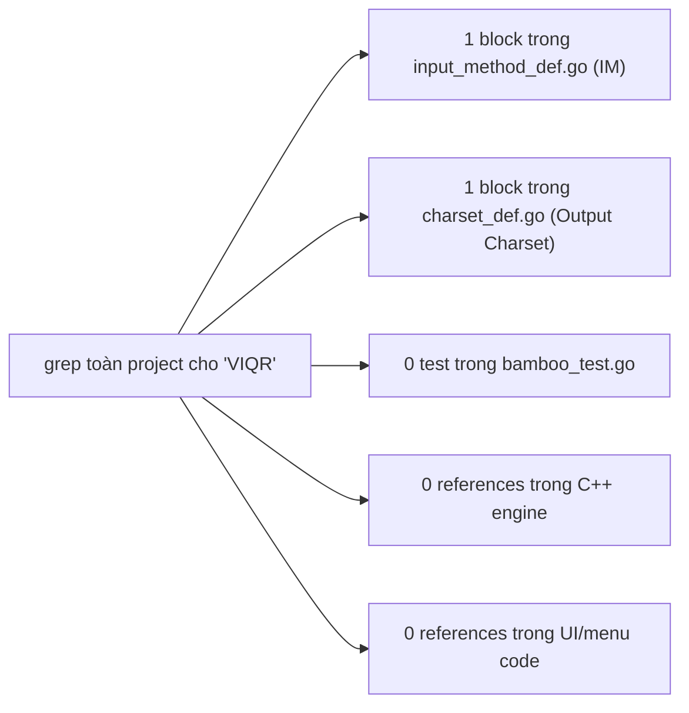
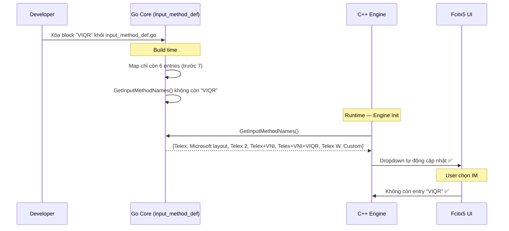

# REQ-006: Điều Tra Xóa Kiểu Gõ "VIQR"

**Trạng thái:** Điều tra — chưa thực thi  
**Mục tiêu:** Xác định chính xác scope ảnh hưởng nếu xóa input method `"VIQR"` khỏi codebase  
**Nguyên tắc:** Xóa lần lượt từng kiểu, theo sau REQ-005.

---

## 1. Mô tả Kiểu Gõ Cần Xóa

| Thuộc tính | Giá trị |
|-------------|---------|
| **Tên đầy đủ** | `VIQR` |
| **Vị trí định nghĩa** | `bamboo/bamboo-core/input_method_def.go:39` |
| **Phím tắt** | Dấu: `'` (sắc), `` ` `` (huyền), `?` (hỏi), `~` (ngã), `.` (nặng), `^` (â/ê/ô), `+` (ư/ơ), `*` (ư/ơ), `(` (ă), `d` (đ), `\` (đ), `0` (xóa dấu) |
| **Lý do xóa** | Kiểu gõ VIQR cũng rất ít người dùng hiện đại. Hầu hết người Việt dùng Telex. Giữ lại chỉ làm dropdown dài thêm. |

---

## 2. Kết Quả Điều Tra Toàn Bộ Codebase

### 2.1. Phương pháp điều tra

Sử dụng `grep` đệ quy trên toàn bộ project:
- `"VIQR"` (đúng chuỗi này, trong context input method)
- `ParseInputMethod.*"VIQR"`
- Kiểm tra `charset_def.go` vì có block `VIQR` riêng

### 2.2. Kết quả chi tiết

| File | Số dòng liên quan | Mức độ ảnh hưởng | Ghi chú |
|------|-------------------|------------------|---------|
| `bamboo/bamboo-core/input_method_def.go` | **1 block** (dòng 39–51) | **Cao** — Nguồn duy nhất định nghĩa kiểu gõ | Xóa block này |
| `bamboo/bamboo-core/charset_def.go` | **1 block** (dòng 558+) | **Không** — Đây là Output Charset, không phải Input Method | **Không xóa** |
| `bamboo/bamboo-core/bamboo_test.go` | **0** | **Không** | Không có test nào dùng IM VIQR |
| `src/mint/bamboomint.cpp` | **0** | **Không** | Không hardcode |
| `src/bamboo.cpp` | **0** | **Không** | Không hardcode |
| `po/*.po` | **0 nội dung** | **Không** | Không có tên IM trong file dịch |

### 2.3. Sơ đồ tổng quan ảnh hưởng



### 2.4. Giải thích quan trọng: `charset_def.go` có block "VIQR"

```go
// File: bamboo/bamboo-core/charset_def.go
"VIQR": {
    'đ': "dd",
    'â': "a^",
    // ...
},
```

Block này trong `charset_def.go` **không liên quan** đến kiểu gõ (Input Method). Nó định nghĩa **Output Charset** — cách chuyển ký tự Unicode sang dạng VIQR khi xuất text (ví dụ: `đ` → `dd`, `â` → `a^`).

> **Không xóa block này.** Người dùng vẫn có thể chọn "Output Charset = VIQR" ngay cả khi kiểu gõ chỉ còn Telex. Hai khái niệm này độc lập:
> - **Input Method** = cách gõ phím để nhập tiếng Việt
> - **Output Charset** = cách hiển thị/xuất ký tự tiếng Việt

---

## 3. Chi Tiết Từng Thành Phần Bị Ảnh Hưởng

### 3.1. Go Core — `input_method_def.go`

Block cần xóa (dòng 39–51):

```go
"VIQR": {
    "0": "XoaDauThanh",
    "'": "DauSac",
    "`": "DauHuyen",
    "?": "DauHoi",
    "~": "DauNga",
    ".": "DauNang",
    "^": "AEO_ÂÊÔ",
    "+": "UO_ƯƠ",
    "*": "UO_ƯƠ",
    "(": "A_Ă",
    "d": "D_Đ",
    "\\": "D_Đ",
},
```

**Ảnh hưởng:** Khi xóa, `GetInputMethodNames()` không còn trả về `"VIQR"`. C++ engine tự động mất entry trong dropdown.

### 3.2. Các file KHÔNG bị ảnh hưởng

- `bamboomint.cpp` / `bamboo.cpp` — Không hardcode `"VIQR"`.
- `bamboo_test.go` — Không có test nào dùng IM VIQR.
- `charset_def.go` — Block VIQR ở đây là Output Charset, giữ nguyên.

---

## 4. Luồng Dữ Liệu Khi Xóa



---

## 5. So Sánh Với REQ-004 (VNI Pháp) và REQ-005 (VNI)

| Tiêu chí | REQ-004 (VNI Pháp) | REQ-005 (VNI) | REQ-006 (VIQR) |
|----------|-------------------|---------------|----------------|
| **Vị trí định nghĩa** | `input_method_def.go:146` | `input_method_def.go:27` | `input_method_def.go:39` |
| **Số test cần xóa** | **0** | **1** (`TestProcessTo5`) | **0** |
| **Số file Go cần sửa** | 1 | 2 (def + test) | **1** (def only) |
| **Số file C++ cần sửa** | 0 | 0 | 0 |
| **Phức tạp đặc biệt** | Không | Có test cần xóa | Charset_def.go có block VIQR nhưng **không xóa** |
| **Độ phức tạp** | Thấp nhất | Thấp | **Thấp nhất** (chỉ 1 file, 0 test) |

---

## 6. Rủi Ro và Mitigation

### 6.1. Rủi ro duy nhất: Config cũ trỏ đến IM đã xóa

```mermaid
flowchart TD
    A["User có config cũ: InputMethod=VIQR"] --> B["Fcitx5 khởi động"]
    B --> C["C++: NewEngine(\"VIQR\", ...)"]
    C --> D["Go: ParseInputMethod không tìm thấy key"]
    D --> E["Go trả về InputMethod rỗng"]
    E --> F["Engine không có rules → gõ không ra tiếng Việt"]
```

**Mitigation:** Giống REQ-004 và REQ-005 — xác suất thấp, chấp nhận được. Nếu lo lắng, có thể thêm fallback Telex sau này (REQ riêng).

---

## 7. Checklist Thực Thi Khi T Check Xong

- [ ] **1.** Xóa block `"VIQR"` trong `bamboo/bamboo-core/input_method_def.go` (dòng 39–51)
- [ ] **2.** KHÔNG xóa block `"VIQR"` trong `bamboo/bamboo-core/charset_def.go` (đó là Output Charset)
- [ ] **3.** Build Go core: `cd build && make -j4`
- [ ] **4.** Kiểm tra output: `build/src/mint/libbamboomint.so` compile thành công
- [ ] **5.** Kiểm tra log: `Supported input methods` KHÔNG còn `"VIQR"`
- [ ] **6.** Cài đặt: `sudo cp build/src/mint/libbamboomint.so /usr/lib/x86_64-linux-gnu/fcitx5/`
- [ ] **7.** Restart fcitx5: `fcitx5-remote -r`
- [ ] **8.** Test gõ Telex: `fcitx5-remote -s mint`, gõ `xin chao` → `xin chào`
- [ ] **9.** Kiểm tra UI: Dropdown "Input Method" không còn `"VIQR"`
- [ ] **10.** Kiểm tra Output Charset: "VIQR" vẫn còn trong danh sách charset ✅
- [ ] **11.** Commit: submodule `bamboo-core` + parent repo

---

## 8. Thông Tin Bổ Sung

### IM còn lại sau khi xóa VIQR

| STT | Tên IM | Trạng thái |
|-----|--------|-----------|
| 1 | Telex | ✅ Giữ |
| 2 | Microsoft layout | ⏳ Còn lại |
| 3 | Telex 2 | ⏳ Còn lại |
| 4 | Telex + VNI | ⏳ Còn lại |
| 5 | Telex + VNI + VIQR | ⏳ Còn lại |
| 6 | Telex W | ⏳ Còn lại |
| ~~7~~ | ~~VIQR~~ | ~~❌ Xóa (REQ-006)~~ |
| ~~8~~ | ~~VNI~~ | ~~❌ Xóa (REQ-005)~~ |
| ~~9~~ | ~~VNI Bàn phím tiếng Pháp~~ | ~~❌ Xóa (REQ-004)~~ |

---

## 9. Kết Luận Điều Tra

- **Chỉ cần sửa 1 file trong Go core:** `input_method_def.go` (xóa IM VIQR).
- **KHÔNG cần xóa test** — không có test nào dùng IM VIQR.
- **KHÔNG xóa `charset_def.go`** — block VIQR ở đó là Output Charset, độc lập với Input Method.
- **Không cần sửa C++ engine** — tự động đọc động.
- **Không cần sửa UI** — dropdown tự populate.
- **Rủi ro thấp** — VIQR ít người dùng, xác suất config cũ thấp.
- **Đề xuất:** Xóa thẳng (không mitigation), build, test, commit.

---

> **Lưu ý:** Đây là tài liệu điều tra. Chưa thực hiện bất kỳ thay đổi nào lên codebase. Chỉ khi T (người review) đồng ý mới tiến hành sửa code theo checklist mục 7.
