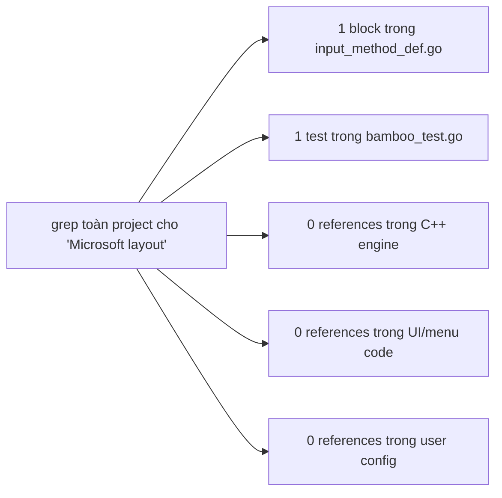
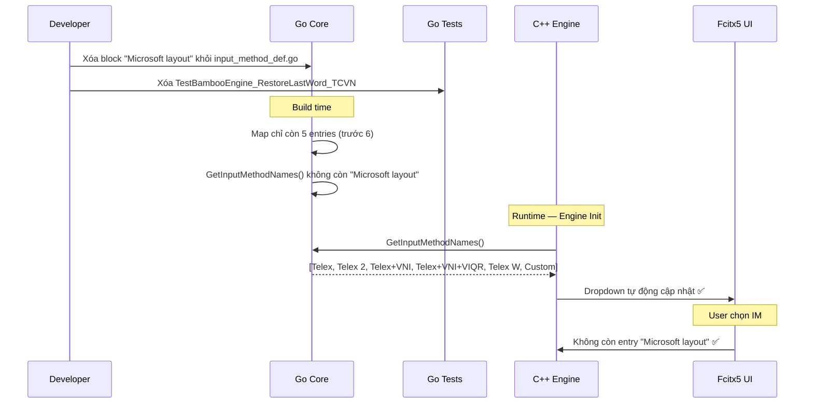

# REQ-007: Điều Tra Xóa Kiểu Gõ "Microsoft layout"

**Trạng thái:** Điều tra — chưa thực thi  
**Mục tiêu:** Xác định chính xác scope ảnh hưởng nếu xóa input method `"Microsoft layout"` khỏi codebase  
**Nguyên tắc:** Xóa lần lượt từng kiểu, theo sau REQ-006.

---

## 1. Mô tả Kiểu Gõ Cần Xóa

| Thuộc tính | Giá trị |
|-------------|---------|
| **Tên đầy đủ** | `Microsoft layout` |
| **Vị trí định nghĩa** | `bamboo/bamboo-core/input_method_def.go:40` |
| **Phím tắt** | Số ký hiệu đặc biệt: `8` (sắc), `5` (huyền), `6` (hỏi), `7` (ngã), `9` (nặng), `1` (ă), `2` (â), `3` (ê), `4` (ô), `0` (đ), `[` (ư), `]` (ơ) |
| **Lý do xóa** | Kiểu gõ Microsoft layout rất ít người dùng, không phổ biến trong cộng đồng người Việt. Giữ lại chỉ làm dropdown dài thêm. |

---

## 2. Kết Quả Điều Tra Toàn Bộ Codebase

### 2.1. Phương pháp điều tra

Sử dụng `grep` đệ quy trên toàn bộ project:
- `"Microsoft layout"` (đúng chuỗi này, trong context input method)
- `ParseInputMethod.*"Microsoft layout"`
- `TestBambooEngine_RestoreLastWord_TCVN` (test dùng Microsoft layout)

### 2.2. Kết quả chi tiết

| File | Số dòng liên quan | Mức độ ảnh hưởng | Ghi chú |
|------|-------------------|------------------|---------|
| `bamboo/bamboo-core/input_method_def.go` | **1 block** (dòng 40–60) | **Cao** — Nguồn duy nhất định nghĩa kiểu gõ | Xóa block này |
| `bamboo/bamboo-core/bamboo_test.go` | **1 test** (`TestBambooEngine_RestoreLastWord_TCVN`, dòng 433–450) | **Trung bình** | Cần xóa hoặc comment test này |
| `src/mint/bamboomint.cpp` | **0** | **Không** | Không hardcode |
| `src/bamboo.cpp` | **0** | **Không** | Không hardcode |
| `src/mint/bamboomint.h` | **0** | **Không** | Không đề cập |
| `src/mint/bamboomintconfig.h` | **0** | **Không** | Dropdown tự động |
| `po/*.po` | **0 nội dung** | **Không** | Không có tên IM trong file dịch |
| `~/.config/fcitx5/conf/` | **0 file** | **Không** | Không tìm thấy config cũ nào chọn Microsoft layout |

### 2.3. Sơ đồ tổng quan ảnh hưởng



---

## 3. Chi Tiết Từng Thành Phần Bị Ảnh Hưởng

### 3.1. Go Core — `input_method_def.go`

Block cần xóa (dòng 40–60):

```go
"Microsoft layout": {
    "8": "DauSac",
    "5": "DauHuyen",
    "6": "DauHoi",
    "7": "DauNga",
    "9": "DauNang",
    "1": "__ă",
    "!": "_Ă",
    "2": "__â",
    "@": "_Â",
    "3": "__ê",
    "#": "_Ê",
    "4": "__ô",
    "$": "_Ô",
    "0": "__đ",
    ")": "_Đ",
    "[": "__ư",
    "{": "_Ư",
    "]": "__ơ",
    "}": "_Ơ",
},
```

**Ảnh hưởng:** Khi xóa, `GetInputMethodNames()` không còn trả về `"Microsoft layout"`. C++ engine tự động mất entry trong dropdown.

### 3.2. Go Tests — `bamboo_test.go`

Test cần xóa:

```go
func TestBambooEngine_RestoreLastWord_TCVN(t *testing.T) {
    var im = ParseInputMethod(InputMethodDefinitions, "Microsoft layout")
    ng := NewEngine(im, EstdFlags)
    ng.ProcessString("112", VietnameseMode)
    if ng.GetProcessedString(VietnameseMode) != "1â" {
        t.Errorf("Process-VIE 112 (Microsoft layout), got [%v] expected [1â]", ng.GetProcessedString(VietnameseMode))
    }
    ng.RestoreLastWord(false)
    if ng.GetProcessedString(EnglishMode) != "12" {
        t.Errorf("Process-ENG 112 (Microsoft layout), got [%v] expected [12]", ng.GetProcessedString(EnglishMode))
    }
    ng.Reset()
    ng.ProcessString("d[]ng9 t4i", VietnameseMode)
    ng.RestoreLastWord(false)
    if ng.GetProcessedString(VietnameseMode) != "t4i" {
        t.Errorf("Process [duongwj t4i - MS layout], got [%v] expected [t4i]", ng.GetProcessedString(VietnameseMode))
    }
}
```

**Giải thích test:** Kiểm tra logic gõ và phục hồi từ (restore last word) trong kiểu Microsoft layout. Chỉ test logic MS layout-specific.

**Ảnh hưởng:** Nếu xóa IM Microsoft layout khỏi map, `ParseInputMethod` sẽ không tìm thấy → test sẽ fail. **Bắt buộc phải xóa test này.**

### 3.3. Các file KHÔNG bị ảnh hưởng

- `bamboomint.cpp` / `bamboo.cpp` — Không hardcode `"Microsoft layout"`. Danh sách IM đọc động qua `GetInputMethodNames()`.
- `bamboomintconfig.h` — Dropdown list tự populate từ `imNames_`.
- UI / Tray — Menu tự build từ `imNames_`.

---

## 4. Luồng Dữ Liệu Khi Xóa



---

## 5. So Sánh Với REQ-004, REQ-005, REQ-006

| Tiêu chí | REQ-004 (VNI Pháp) | REQ-005 (VNI) | REQ-006 (VIQR) | REQ-007 (MS Layout) |
|----------|-------------------|---------------|----------------|-------------------|
| **Vị trí định nghĩa** | `input_method_def.go:146` | `input_method_def.go:27` | `input_method_def.go:39` | `input_method_def.go:40` |
| **Số test cần xóa** | **0** | **1** | **0** | **1** |
| **Số file Go cần sửa** | 1 | 2 (def + test) | 1 | **2** (def + test) |
| **Số file C++ cần sửa** | 0 | 0 | 0 | 0 |
| **Phức tạp đặc biệt** | Không | Không | charset_def.go có VIQR nhưng giữ | Không |
| **Độ phức tạp** | Thấp nhất | Thấp | Thấp nhất | **Thấp** |

---

## 6. Rủi Ro và Mitigation

### 6.1. Rủi ro 1: Test fail

Nếu xóa IM Microsoft layout mà không xóa `TestBambooEngine_RestoreLastWord_TCVN`, build Go sẽ fail:

```
--- FAIL: TestBambooEngine_RestoreLastWord_TCVN (0.00s)
    bamboo_test.go:434: ParseInputMethod: "Microsoft layout" not found
```

**Mitigation:** Xóa test `TestBambooEngine_RestoreLastWord_TCVN` cùng lúc với xóa IM.

### 6.2. Rủi ro 2: Config cũ chọn Microsoft layout

```mermaid
flowchart TD
    A["User có config cũ: InputMethod=Microsoft layout"] --> B["Fcitx5 khởi động"]
    B --> C["C++: NewEngine(\"Microsoft layout\", ...)"]
    C --> D["Go: ParseInputMethod không tìm thấy key"]
    D --> E["Go trả về InputMethod rỗng"]
    E --> F["Engine không có rules → gõ không ra tiếng Việt"]
```

**Mitigation:** Giống các REQ trước — xác suất thấp, chấp nhận được.

---

## 7. Checklist Thực Thi Khi T Check Xong

- [ ] **1.** Xóa block `"Microsoft layout"` trong `bamboo/bamboo-core/input_method_def.go` (dòng 40–60)
- [ ] **2.** Xóa hàm `TestBambooEngine_RestoreLastWord_TCVN` trong `bamboo/bamboo-core/bamboo_test.go` (dòng 433–450)
- [ ] **3.** Build Go core: `cd build && make -j4`
- [ ] **4.** Kiểm tra output: `build/src/mint/libbamboomint.so` compile thành công
- [ ] **5.** Kiểm tra log: `Supported input methods` KHÔNG còn `"Microsoft layout"`
- [ ] **6.** Cài đặt: `sudo cp build/src/mint/libbamboomint.so /usr/lib/x86_64-linux-gnu/fcitx5/`
- [ ] **7.** Restart fcitx5: `fcitx5-remote -r`
- [ ] **8.** Test gõ Telex: `fcitx5-remote -s mint`, gõ `xin chao` → `xin chào`
- [ ] **9.** Kiểm tra UI: Dropdown "Input Method" không còn `"Microsoft layout"`
- [ ] **10.** Commit: submodule `bamboo-core` + parent repo

---

## 8. Thông Tin Bổ Sung

### IM còn lại sau khi xóa Microsoft layout

| STT | Tên IM | Trạng thái |
|-----|--------|-----------|
| 1 | Telex | ✅ Giữ |
| 2 | Telex 2 | ⏳ Còn lại |
| 3 | Telex + VNI | ⏳ Còn lại |
| 4 | Telex + VNI + VIQR | ⏳ Còn lại |
| 5 | Telex W | ⏳ Còn lại |
| ~~6~~ | ~~Microsoft layout~~ | ~~❌ Xóa (REQ-007)~~ |
| ~~7~~ | ~~VIQR~~ | ~~❌ Xóa (REQ-006)~~ |
| ~~8~~ | ~~VNI~~ | ~~❌ Xóa (REQ-005)~~ |
| ~~9~~ | ~~VNI Bàn phím tiếng Pháp~~ | ~~❌ Xóa (REQ-004)~~ |

---

## 9. Kết Luận Điều Tra

- **Chỉ cần sửa 2 file trong Go core:** `input_method_def.go` (xóa IM) + `bamboo_test.go` (xóa 1 test).
- **Không cần sửa C++ engine** — tự động đọc động.
- **Không cần sửa UI** — dropdown tự populate.
- **Rủi ro thấp** — Microsoft layout ít người dùng, xác suất config cũ thấp.
- **Đề xuất:** Xóa thẳng (không mitigation), build, test, commit.

---

> **Lưu ý:** Đây là tài liệu điều tra. Chưa thực hiện bất kỳ thay đổi nào lên codebase. Chỉ khi T (người review) đồng ý mới tiến hành sửa code theo checklist mục 7.
