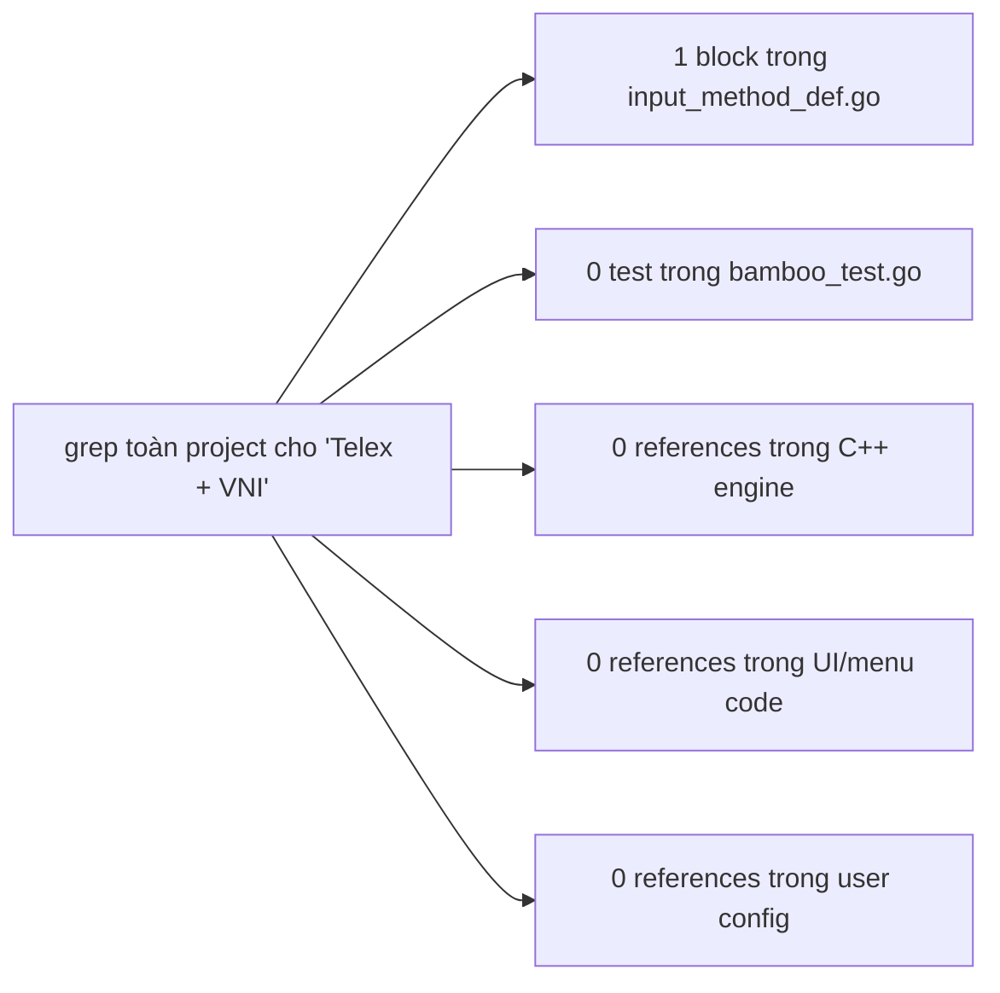
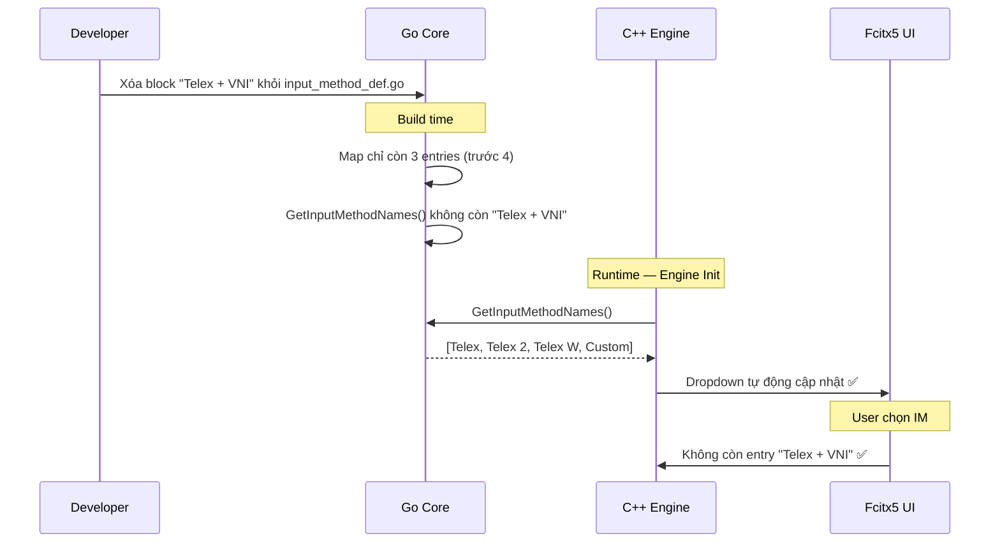
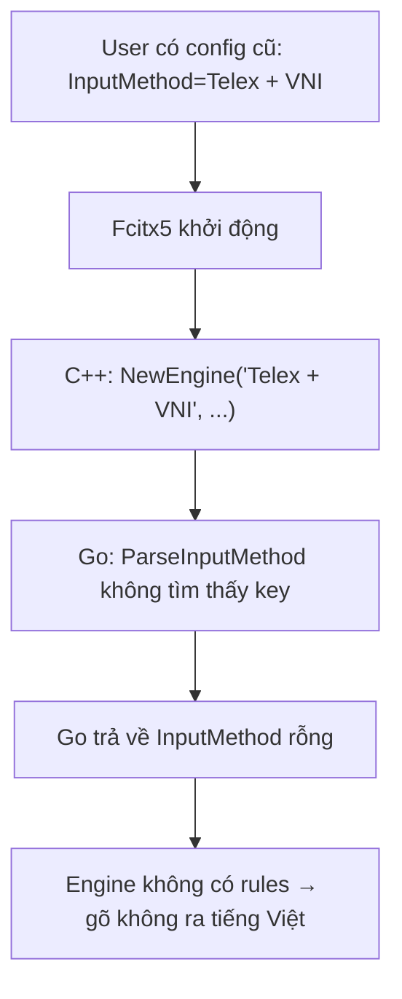

# REQ-009: Điều Tra Xóa Kiểu Gõ "Telex + VNI"

**Trạng thái:** Điều tra — chưa thực thi  
**Mục tiêu:** Xác định chính xác scope ảnh hưởng nếu xóa input method `"Telex + VNI"` khỏi codebase  
**Nguyên tắc:** Xóa lần lượt từng kiểu, theo sau REQ-008.

---

## 1. Mô tả Kiểu Gõ Cần Xóa

| Thuộc tính | Giá trị |
|-------------|---------|
| **Tên đầy đủ** | `Telex + VNI` |
| **Vị trí định nghĩa** | `bamboo/bamboo-core/input_method_def.go:44` |
| **Phím tắt** | Gộp Telex (`asfrxj`) + VNI (`0123456789`) |
| **Lý do xóa** | Kiểu gộp 2 bộ. VNI đã bị xóa (REQ-005), việc giữ lại kiểu gộp này không còn ý nghĩa. Người dùng Telex không cần phím số VNI. |

---

## 2. Kết Quả Điều Tra Toàn Bộ Codebase

### 2.1. Phương pháp điều tra

Sử dụng `grep` đệ quy trên toàn bộ project:
- `"Telex + VNI"` (đúng chuỗi này, trong context input method)
- `"Telex+VNI"` (không khoảng trắng)
- `ParseInputMethod.*"Telex \+ VNI"`

### 2.2. Kết quả chi tiết

| File | Số dòng liên quan | Mức độ ảnh hưởng | Ghi chú |
|------|-------------------|------------------|---------|
| `bamboo/bamboo-core/input_method_def.go` | **1 block** (dòng 44–66) | **Cao** — Nguồn duy nhất định nghĩa kiểu gõ | Xóa block này |
| `bamboo/bamboo-core/bamboo_test.go` | **0** | **Không** | Không có test nào dùng IM này |
| `src/mint/bamboomint.cpp` | **0** | **Không** | Không hardcode |
| `src/bamboo.cpp` | **0** | **Không** | Không hardcode |
| `src/mint/bamboomint.h` | **0** | **Không** | Không đề cập |
| `src/mint/bamboomintconfig.h` | **0** | **Không** | Dropdown tự động |
| `po/*.po` | **0 nội dung** | **Không** | Không có tên IM trong file dịch |
| `~/.config/fcitx5/conf/` | **0 file** | **Không** | Không tìm thấy config cũ nào chọn Telex + VNI |

### 2.3. Sơ đồ tổng quan ảnh hưởng



---

## 3. Chi Tiết Từng Thành Phần Bị Ảnh Hưởng

### 3.1. Go Core — `input_method_def.go`

Block cần xóa (dòng 44–66):

```go
"Telex + VNI": {
    "z": "XoaDauThanh",
    "s": "DauSac",
    "f": "DauHuyen",
    "r": "DauHoi",
    "x": "DauNga",
    "j": "DauNang",
    "a": "A_Â",
    "e": "E_Ê",
    "o": "O_Ô",
    "w": "UOA_ƯƠĂ",
    "d": "D_Đ",
    "0": "XoaDauThanh",
    "1": "DauSac",
    "2": "DauHuyen",
    "3": "DauHoi",
    "4": "DauNga",
    "5": "DauNang",
    "6": "AEO_ÂÊÔ",
    "7": "UO_ƯƠ",
    "8": "A_Ă",
    "9": "D_Đ",
},
```

**Ảnh hưởng:** Khi xóa, `GetInputMethodNames()` không còn trả về `"Telex + VNI"`. C++ engine tự động mất entry trong dropdown.

### 3.2. Các file KHÔNG bị ảnh hưởng

- `bamboomint.cpp` / `bamboo.cpp` — Không hardcode `"Telex + VNI"`. Danh sách IM đọc động qua `GetInputMethodNames()`.
- `bamboomintconfig.h` — Dropdown list tự populate từ `imNames_`.
- UI / Tray — Menu tự build từ `imNames_`.

---

## 4. Luồng Dữ Liệu Khi Xóa



---

## 5. So Sánh Với Các REQ Trước

| Tiêu chí | REQ-004–008 | REQ-009 (này) |
|----------|-------------|---------------|
| **Vị trí định nghĩa** | `input_method_def.go` | `input_method_def.go:44` |
| **Số test cần xóa** | 0–1 | **0** |
| **Số file Go cần sửa** | 1–2 | **1** (def only) |
| **Số file C++ cần sửa** | 0 | 0 |
| **Độ phức tạp** | Thấp | **Thấp nhất** (chỉ 1 file, 0 test) |

---

## 6. Rủi Ro và Mitigation

### 6.1. Rủi ro duy nhất: Config cũ trỏ đến IM đã xóa



**Mitigation:** Giống các REQ trước — xác suất thấp, chấp nhận được.

---

## 7. Checklist Thực Thi (Chỉ Khi T Đồng Ý)

- [ ] **1.** Xóa block `"Telex + VNI"` trong `bamboo/bamboo-core/input_method_def.go` (dòng 44–66)
- [ ] **2.** Build Go core: `cd build && make -j4`
- [ ] **3.** Kiểm tra output: `build/src/mint/libbamboomint.so` compile thành công
- [ ] **4.** Kiểm tra log: `Supported input methods` KHÔNG còn `"Telex + VNI"`
- [ ] **5.** Cài đặt: `sudo cp build/src/mint/libbamboomint.so /usr/lib/x86_64-linux-gnu/fcitx5/`
- [ ] **6.** Restart fcitx5: `fcitx5-remote -r`
- [ ] **7.** Test gõ Telex: `fcitx5-remote -s mint`, gõ `xin chao` → `xin chào`
- [ ] **8.** Kiểm tra UI: Dropdown "Input Method" không còn `"Telex + VNI"`
- [ ] **9.** Commit: submodule `bamboo-core` + parent repo

---

## 8. Thông Tin Bổ Sung

### IM còn lại sau khi xóa Telex + VNI

| STT | Tên IM | Trạng thái |
|-----|--------|-----------|
| 1 | Telex | ✅ Giữ |
| 2 | Telex 2 | ⏳ Còn lại |
| 3 | Telex W | ⏳ Còn lại |
| ~~4~~ | ~~Telex + VNI~~ | ~~❌ Xóa (REQ-009)~~ |
| ~~5~~ | ~~Telex + VNI + VIQR~~ | ~~❌ Đã xóa (REQ-008)~~ |
| ~~6~~ | ~~Microsoft layout~~ | ~~❌ Đã xóa (REQ-007)~~ |
| ~~7~~ | ~~VIQR~~ | ~~❌ Đã xóa (REQ-006)~~ |
| ~~8~~ | ~~VNI~~ | ~~❌ Đã xóa (REQ-005)~~ |
| ~~9~~ | ~~VNI Bàn phím tiếng Pháp~~ | ~~❌ Đã xóa (REQ-004)~~ |

---

## 9. Kết Luận Điều Tra

- **Chỉ cần sửa 1 file trong Go core:** `input_method_def.go` (xóa IM).
- **Không cần xóa test** — không có test nào dùng IM này.
- **Không cần sửa C++ engine** — tự động đọc động.
- **Không cần sửa UI** — dropdown tự populate.
- **Rủi ro thấp** — Telex + VNI ít người dùng (VNI đã bị xóa).
- **Đề xuất:** Xóa thẳng (không mitigation), build, test, commit.

---

> **Lưu ý:** Đây là tài liệu điều tra. Chưa thực hiện bất kỳ thay đổi nào lên codebase. Chỉ khi T (người review) đồng ý mới tiến hành sửa code theo checklist mục 7.
