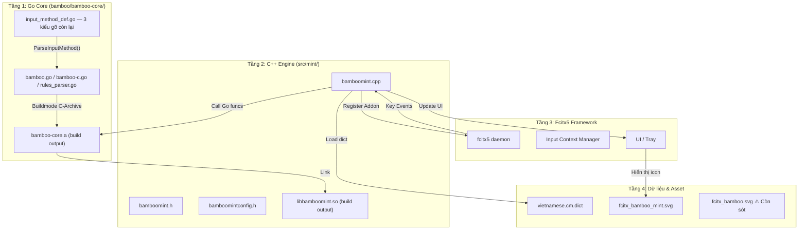
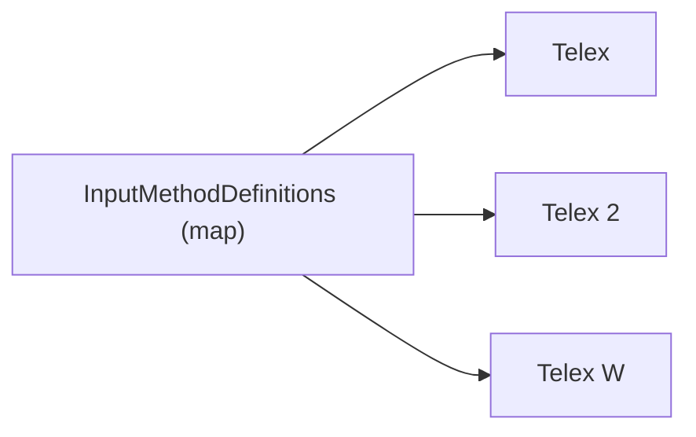
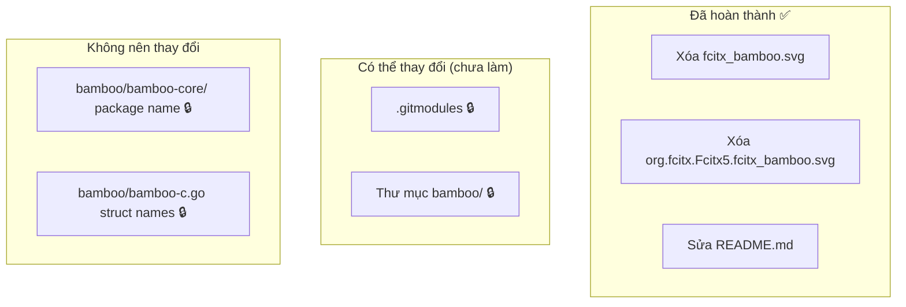
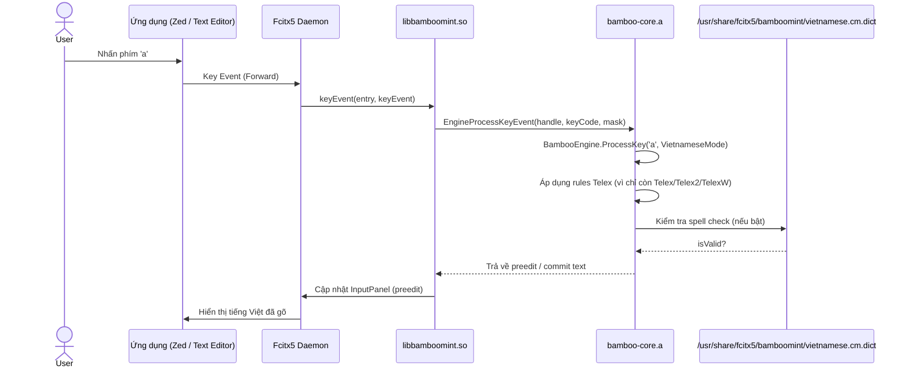
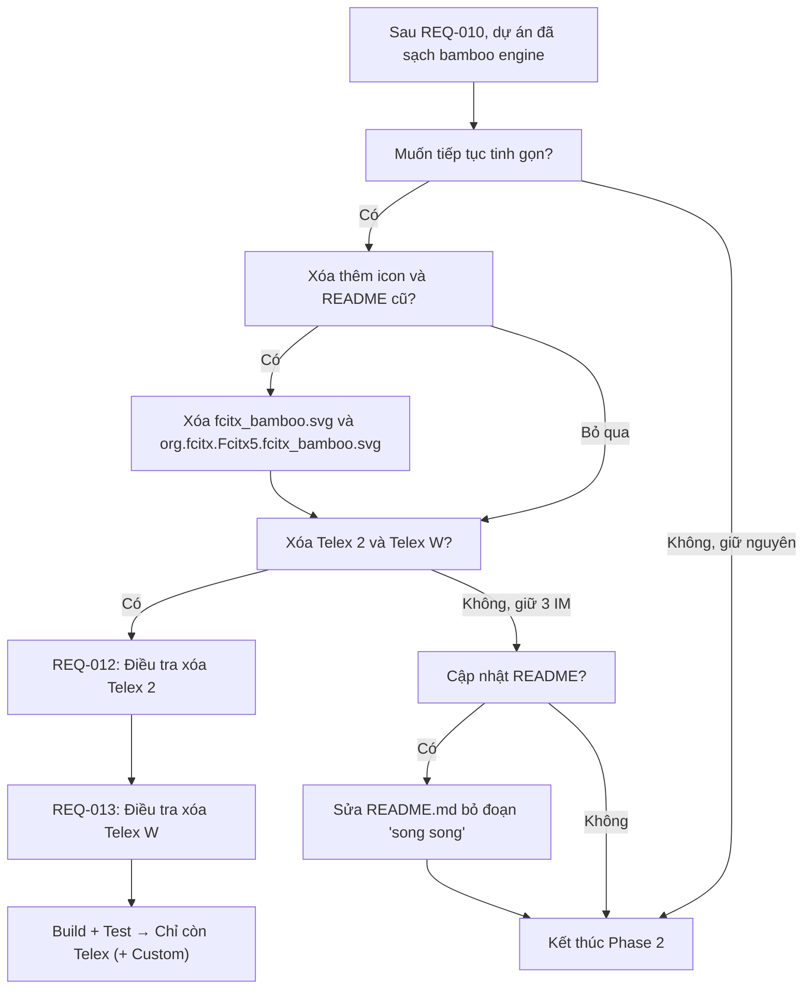

# REQ-011: Phân Tích Cấu Trúc Hệ Thống Hiện Tại Sau Khi Xóa Bamboo Gốc

**Phiên bản:** 1.0  
**Ngày cập nhật:** 2026-08-16  
**Ngôn ngữ:** Tiếng Việt  
**Mục đích:** Vẽ lại toàn bộ kiến trúc dự án sau REQ-010, xác định các "di sản" tên `bamboo` còn sót lại và đề xuất các bước cải thiện tiếp theo.

---

## 1. Tổng Quan Kiến Trúc Hiện Tại

Sau REQ-010, dự án chỉ còn **một engine duy nhất** là `bamboomint`. Engine `bamboo` gốc đã bị xóa hoàn toàn khỏi source tree.



### Thay đổi so với trước REQ-010

| Trước REQ-010 | Sau REQ-010 |
|---------------|-------------|
| 2 engine C++: `bamboo` + `bamboomint` | Chỉ còn `bamboomint` |
| 9 kiểu gõ trong Go core | 3 kiểu gõ: Telex, Telex 2, Telex W |
| 2 bộ config addon (`bamboo.conf`, `bamboomint.conf`) | Chỉ còn `bamboomint.conf` |
| Dict path: `/usr/share/fcitx5/bamboo/` | Dict path: `/usr/share/fcitx5/bamboomint/` |
| Gettext domain: `fcitx5-bamboo` | Gettext domain: `fcitx5-bamboo-mint` |

---

## 2. Cấu Trúc Thư Mục Hiện Tại

```
fcitx5-bamboo/
├── bamboo/                     # Thư mục Go (tên vẫn là "bamboo")
│   ├── bamboo-core/            # Submodule: engine Go lõi
│   │   ├── bamboo.go
│   │   ├── input_method_def.go # Chỉ còn 3 IM
│   │   └── ...
│   ├── bamboo-c.go             # Wrapper C-Go (tên struct cũ)
│   └── CMakeLists.txt          # Build bamboo-core.a
├── src/
│   ├── CMakeLists.txt          # Chỉ add_subdirectory(mint)
│   └── mint/
│       ├── bamboomint.cpp      # Engine C++ (KHÔNG còn từ "bamboo" nào)
│       ├── bamboomint.h
│       ├── bamboomintconfig.h
│       ├── CMakeLists.txt
│       ├── mint-addon.conf.in.in
│       └── mint.conf.in
├── data/
│   ├── CMakeLists.txt          # Install dict → bamboomint/
│   ├── scalable/apps/
│   │   ├── fcitx_bamboo.svg           # ⚠️ Icon gốc — không còn engine nào dùng
│   │   ├── fcitx_bamboo_mint.svg      # ✅ Icon hiện tại
│   │   ├── org.fcitx.Fcitx5.fcitx_bamboo.svg      # ⚠️ Còn sót
│   │   └── org.fcitx.Fcitx5.fcitx_bamboo_mint.svg # ✅
│   └── vietnamese.cm.dict
├── po/
│   ├── CMakeLists.txt          # fcitx5-bamboo-mint
│   └── *.po / *.pot
├── requirement/
│   ├── phase1/                 # REQ-001..009 (đã hoàn thành)
│   └── phase2/
│       ├── REQ-010.md          # Đã hoàn thành: xóa bamboo gốc
│       └── REQ-011.md          # Báo cáo này
├── CMakeLists.txt              # project(fcitx5-bamboo-mint)
├── Messages.sh                 # fcitx5-bamboo-mint
└── README.md
```

---

## 3. Các Kiểu Gõ Còn Lại Trong Go Core

Sau Phase 1, Go core chỉ còn **3 kiểu gõ** trong `InputMethodDefinitions`:



| Kiểu gõ | Đặc điểm | Quyết định tiếp theo |
|---------|-----------|---------------------|
| **Telex** | Chuẩn, dùng phím `w` cho ư/ơ/ă | **Giữ lại** — đây là mục tiêu cuối cùng |
| **Telex 2** | Thêm `[]{}` cho ư/ơ | **Có thể xóa** — không phổ biến |
| **Telex W** | Tương tự Telex 2 nhưng không có `[]{}` | **Có thể xóa** — gần như trùng Telex |

> **Nhận xét:** Telex 2 và Telex W chỉ khác Telex ở cách xử lý thêm phím `[]{}`. Nếu người dùng không dùng các phím này thì gần như giống hệt Telex.

---

## 4. Các Từ "Bamboo" Còn Sót Lại Trong Project

### 4.1. Không thể đổi (nằm trong submodule bên thứ ba)

| Vị trí | Lý do không đổi |
|--------|-----------------|
| `bamboo/bamboo-core/bamboo.go` — `package bamboo` | Đây là submodule `github.com/BambooEngine/bamboo-core`. Đổi tên package sẽ break import |
| `bamboo/bamboo-core/BambooEngine` struct | Tên struct trong thư viện bên thứ ba |
| `bamboo/bamboo-c.go` — `FcitxBambooEngine` struct | Tên struct dùng trong CGO export, đổi có thể break ABI với C++ |

### 4.2. Có thể đổi / xóa được

| Vị trí | Mức độ | Hành động | Trạng thái |
|--------|--------|-----------|------------|
| `data/scalable/apps/fcitx_bamboo.svg` | Thấp | **Xóa** — Không còn engine `bamboo` nào dùng icon này | ✅ Đã xóa |
| `data/scalable/apps/org.fcitx.Fcitx5.fcitx_bamboo.svg` | Thấp | **Xóa** — Tương tự trên | ✅ Đã xóa |
| `README.md` — đoạn "song song với bamboo gốc" | Thấp | **Sửa** — Không còn chạy song song nữa, giờ chỉ có Mint | ✅ Đã sửa |
| `.gitmodules` — tên submodule | Trung bình | **Có thể giữ** — `bamboo-core` vẫn là tên repo gốc, đổi không cần thiết | ⏳ Chưa thực hiện |
| Thư mục `bamboo/` | Trung bình | **Có thể giữ** — Đổi tên thư mục cần sửa nhiều CMake path | ⏳ Chưa thực hiện |



---

## 5. Luồng Dữ Liệu Khi Người Dùng Gõ Phím (Hiện Tại)



---

## 6. Các Hướng Cải Thiện Tiếp Theo (Đề Xuất)

### 6.1. Phase 2 — Tiếp Tục (có thể thực hiện ngay)

| STT | Yêu cầu | Mức độ | Ghi chú | Trạng thái |
|-----|---------|--------|---------|------------|
| 1 | **Xóa icon `fcitx_bamboo.svg` và `org.fcitx.Fcitx5.fcitx_bamboo.svg`** | Dễ | Không còn engine nào dùng | ✅ Đã xóa |
| 2 | **Cập nhật `README.md`** | Dễ | Bỏ đoạn "song song với bamboo gốc", mô tả lại dự án là standalone | ✅ Đã sửa |
| 3 | **Xóa Telex 2 và Telex W khỏi Go core** | Trung bình | Tương tự Phase 1, chỉ sửa `input_method_def.go` và tests | ⏳ Chưa thực hiện — cần REQ-012/013 |
| 4 | **Kiểm tra tên macro config cũ** | Thấp | `~/.config/fcitx5/conf/bamboomint-macro-Telex 2.conf` và `Telex W.conf` sẽ thành orphan nếu xóa IM | ⏳ Chưa thực hiện |

### 6.2. Phase 3 — Tinh Chỉnh (tùy chọn sau)

| STT | Yêu cầu | Mức độ | Ghi chú |
|-----|---------|--------|---------|
| 5 | **Đổi tên thư mục `bamboo/` → `core/` hoặc `mint-core/`** | Khó | Cần sửa `CMakeLists.txt`, `.gitmodules`, import paths... Rủi ro cao, lợi ích thấp |
| 6 | **Tạo metainfo XML mới cho `bamboomint`** | Trung bình | `org.fcitx.Fcitx5.Addon.BambooMint.metainfo.xml.in` — cần khi đóng gói `.deb`/Flatpak |
| 7 | **Thêm `make install` chuẩn** | Trung bình | Hiện tại phải `sudo cp` thủ công từng file. Có thể viết script install |

---

## 7. Sơ Đồ Quyết Định: Làm Gì Tiếp Theo?



---

## 8. Đánh Giá Rủi Ro Nếu Tiếp Tục Xóa Telex 2 + Telex W

| Rủi ro | Mô tả | Mức độ |
|--------|-------|--------|
| **Crash config cũ** | Nếu user đang chọn `Telex 2` trong `bamboomint.conf`, sau khi xóa engine sẽ không tìm thấy IM → cần fallback về Telex | Trung bình |
| **Tests Go lỗi** | `bamboo_test.go` có test cho Telex 2 và Telex W | Thấp — chỉ cần xóa test |
| **Macro table orphan** | `~/.config/fcitx5/conf/bamboomint-macro-Telex 2.conf` thành orphan | Thấp — không ảnh hưởng chức năng |

---

## 9. Kết Luận

- Dự án đã **sạch sẽ** về mặt engine C++: không còn `bamboo` gốc, chỉ còn `bamboomint`.
- Các từ "bamboo" còn lại chủ yếu nằm trong **Go submodule** (`bamboo-core`) — đây là thư viện bên thứ ba, không nên đụng vào.
- Các **asset/icon** cũ của `bamboo` vẫn còn trong `data/scalable/apps/` — có thể xóa an toàn.
- **README.md** vẫn còn mô tả dự án "song song với bamboo gốc" — cần cập nhật.
- Nếu muốn tiếp tục tinh gọn, bước tiếp theo tự nhiên là **xóa Telex 2 và Telex W** khỏi Go core, để chỉ còn **Telex duy nhất** (+ Custom).
