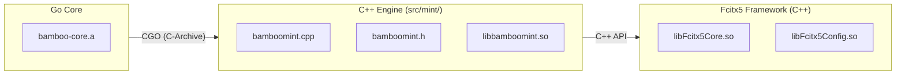
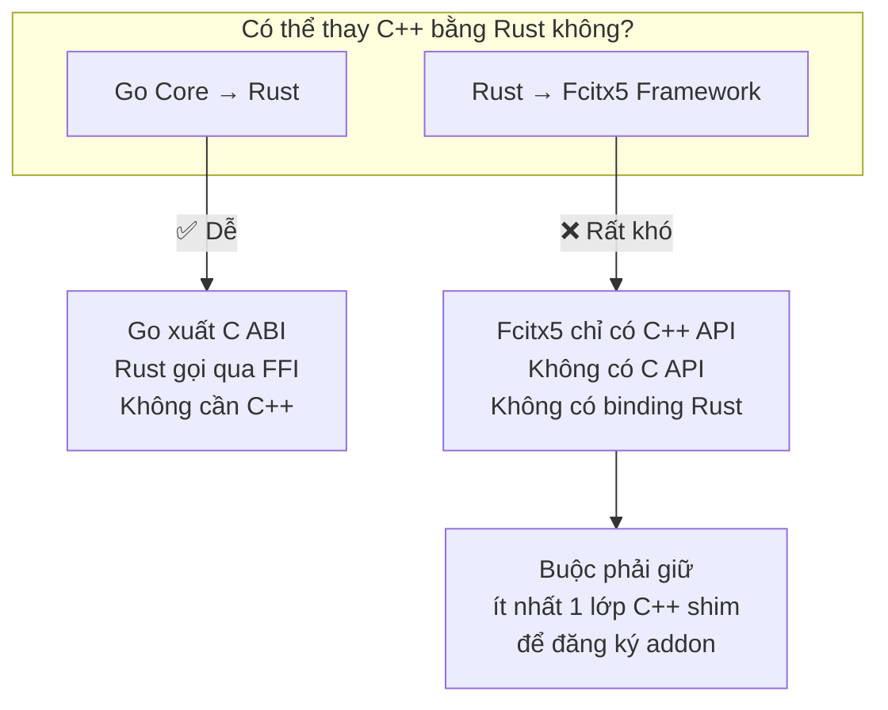

# REQ-012: Điều tra thay thế C++ Engine bằng Rust

**Phiên bản:** 1.0  
**Ngày cập nhật:** 2026-08-16  
**Ngôn ngữ:** Tiếng Việt  
**Mục đích:** Đánh giá khả năng viết lại toàn bộ phần C++ Engine (`src/mint/`) bằng Rust thuần túy, loại bỏ hoàn toàn dependency vào C++ (Fcitx5 C++ API, CMake, GCC...).

---

## 1. Vấn Đề Đặt Ra

Hiện tại, dù đã tách riêng thành `bamboomint`, phần **C++ Engine** (`src/mint/bamboomint.cpp`, `bamboomint.h`) vẫn phụ thuộc vào:

- **Fcitx5 C++ API**: `InputMethodEngine`, `AddonFactory`, `InputContext`, `KeyEvent`, v.v.
- **CMake + GCC/Clang**: build system
- **CGo**: liên kết Go core (`bamboo-core.a`) qua CGO

Câu hỏi: **Có thể viết addon fcitx5 bằng Rust không?** Nếu được, Rust sẽ thay thế hoàn toàn phần C++ hiện tại.

---

## 2. Kiến Trúc Hiện Tại



Như vậy, để thay C++ bằng Rust, ta cần Rust nói chuyện được với **cả hai** phía:
1. **Fcitx5** — cung cấp/handle events từ framework
2. **Go Core** — gọi các hàm xử lý tiếng Việt

---

## 3. Khả Năng Viết Fcitx5 Addon Bằng Rust

### 3.1. Fcitx5 API là C++ hay C?

**Kết luận điều tra:** Fcitx5 framework chủ yếu cung cấp API **bằng C++** (class, template, STL). Không có C API chuẩn cho việc viết addon.

- `InputMethodEngine` là **abstract class C++** — bắt buộc phải kế thừa.
- `AddonFactory` cũng là **abstract class C++** — phải override `create()`.
- Các class `InputContext`, `KeyEvent`, `Text`, `Action`, `Menu`... đều là C++ class/template.

### 3.2. Rust FFI với C++ — Khả thi không?

Rust có thể FFI với C thuần túy (`extern "C"`), nhưng **không thể FFI trực tiếp với C++ class** một cách native. Các hướng:

| Hướng tiếp cận | Khả thi | Độ phức tạp | Rủi ro |
|----------------|---------|-------------|--------|
| **A — Viết C wrapper** | Có thể | **Cực cao** | Phải viết lớp C wrapper cho toàn bộ Fcitx5 C++ API (~50 class) |
| **B — Dùng cxx crate** | Khó | **Cao** | `cxx` giúp bridge C++ ↔ Rust nhưng vẫn cần đầu vào là C++ header. Fcitx5 header rất phức tạp (template, STL, Qt...) |
| **C — Dùng bindgen** | Khó | **Cao** | `bindgen` tạo Rust binding từ C++ header, nhưng Fcitx5 header dùng nhiều C++ advanced feature không hỗ trợ |
| **D — fcitx5 có C API không?** | Không rõ | Trung bình | Cần kiểm tra thực tế |

### 3.3. Có ai đã viết fcitx5 addon bằng Rust không?

**Kết luận điều tra:** Không tìm thấy addon fcitx5 nào được viết bằng Rust trong cộng đồng.

- Không có crate `fcitx5` trên crates.io.
- Không có repo GitHub nào mang tên `fcitx5-rust-addon` hoặc tương tự.
- Các bộ gõ fcitx5 phổ biến (rime, ibus-bamboo, mozc...) đều viết bằng C++.

### 3.4. So sánh với IBus (đối thủ của fcitx5)

| Framework | API chính | Viết addon bằng Rust |
|-----------|-----------|---------------------|
| **Fcitx5** | C++ (abstract class) | Khó / Không có binding |
| **IBus** | C (GObject) | Có thể (có `ibus` crate) |

> Nếu dùng IBus, viết Rust addon khả thi hơn nhiều vì IBus cung cấp C API qua GObject. Nhưng điều đó đồng nghĩa phải bỏ hoàn toàn fcitx5 và chuyển sang IBus — ảnh hưởng toàn bộ hệ thống.

---

## 4. Phân Tích Cụ Thể Hướng Viết Rust Addon

### 4.1. Vấn đề kỹ thuật lớn nhất

Fcitx5 addon cần export một **factory function** có signature C++ như sau:

```cpp
// Fcitx5 yêu cầu addon export class kế thừa AddonFactory
class BambooMintFactory : public fcitx::AddonFactory {
public:
    fcitx::AddonInstance* create(fcitx::AddonManager *manager) override {
        return new BambooMintEngine(manager->instance());
    }
};

// Và macro đăng ký
FCITX_ADDON_FACTORY(BambooMintFactory)
```

Rust **không thể** kế thừa C++ class một cách native. Để làm được, phải:

1. Viết một lớp C++ wrapper tối thiểu kế thừa `AddonFactory` — phần này vẫn phải build bằng C++.
2. Lớp wrapper đó gọi sang Rust qua C ABI.
3. Rust implement logic engine rồi gọi ngược vào Fcitx5 qua C++ wrapper.

**Như vậy, ta không xóa hết C++ được — vẫn phải giữ ít nhất một lớp C++ shim!**

### 4.2. Vấn đề CGo / Go Core

Hiện tại, Go core (`bamboo-core.a`) được build với `-buildmode=c-archive`, xuất ra các hàm C:

```c
char* EnginePullPreedit(uintptr_t engine);
bool EngineProcessKeyEvent(uintptr_t engine, uint32_t keyVal, uint32_t state);
// ...
```

Rust có thể gọi các hàm này dễ dàng qua FFI (vì đây là C ABI). Vậy **phần Go → Rust là khả thi**.

### 4.3. Tóm tắt khả năng



---

## 5. Đánh Giá Chi Phí — Lợi Ích

### Nếu cố viết Rust addon

| Hạng mục | Chi phí | Lợi ích |
|----------|---------|---------|
| Viết C++ shim để đăng ký addon | Cao | Không có — vẫn còn C++ |
| Bridge Rust ↔ C++ shim | Cao | Không có — thêm layer phức tạp |
| Maintain binding tự viết | Rất cao | Không có — mỗi lần fcitx5 update là break |
| Rust toolchain (cargo, rustc) | Trung bình | Đồng nhất với Go (đều không phải C++) |
| Build time | Cao hơn | Không rõ — phải build C++ shim + Rust + Go |

### Nếu giữ C++

| Hạng mục | Chi phí | Lợi ích |
|----------|---------|---------|
| Không cần viết shim | — | Code C++ đã hoạt động |
| CGo (Go ↔ C++) đã sẵn | Thấp | Được upstream hỗ trợ |
| CMake đã hoạt động | Thấp | Được upstream hỗ trợ |
| Phụ thuộc Fcitx5 C++ | Trung bình | Đây là framework — không thể tránh |

---

## 6. Kết Luận

| Câu hỏi | Đáp án |
|---------|--------|
| Có thể viết fcitx5 addon **thuần Rust** không? | **Không** — fcitx5 không cung cấp C API cho addon |
| Có thể viết fcitx5 addon **Rust + C++ shim** không? | **Có**, nhưng vẫn phải giữ C++ |
| Có addon fcitx5 nào viết bằng Rust trên thế giới không? | **Không** — không tìm thấy |
| Phần **Go Core** có thể gọi từ Rust không? | **Có** — qua C ABI, dễ dàng |
| Có đáng để chuyển sang Rust không? | **Không** — chi phí cao, lợi ích không tương xứng |

### Nhận định cuối cùng

> **Không khuyến nghị** viết lại phần C++ Engine bằng Rust. Lý do:
>
> 1. Fcitx5 là framework C++ — viết addon bằng Rust đòi hỏi C++ shim, vẫn không thoát khỏi C++.
> 2. Không có binding Rust cho fcitx5 — phải tự viết và maintain, rủi ro cao.
> 3. Phần C++ hiện tại (`bamboomint.cpp`) chỉ ~500 dòng, hoạt động ổn định, không có lý do thay thế.
> 4. CGo (Go ↔ C++) đã giải quyết tốt việc liên kết Go core với C++.
>
> Nếu muốn **bỏ C++ hoàn toàn**, cách duy nhất là chuyển sang framework khác có hỗ trợ C API (ví dụ: IBus). Điều này ảnh hưởng toàn bộ hệ thống desktop (GNOME/KDE), không nằm trong phạm vi dự án này.

---

## 7. Phương Án Thay Thế (Nếu Muốn Giảm Phụ Thuộc)

Nếu mục tiêu là giảm phụ thuộc C++, có thể xem xét:

| Phương án | Mô tả | Khả thi |
|-----------|-------|---------|
| **A — Giữ nguyên** | C++ engine hiện tại | ✅ Đang chạy tốt |
| **B — Chuyển IBus + Rust** | Bỏ fcitx5, dùng IBus (C API), viết Rust addon | ⚠️ Ảnh hưởng toàn bộ DE |
| **C — Chuyển Wayland IME** | Viết Rust native cho Wayland `zwp_input_method_v2` | ⚠️ Rất phức tạp, mất tính năng |
| **D — Gọn hơn C++** | Viết lại C++ engine gọn hơn (hiện tại ~500 dòng) | ✅ Có thể, nhưng vẫn là C++ |

---

## 8. Quyết Định Chờ Phê Duyệt

- [ ] Đồng ý giữ nguyên C++ Engine (`src/mint/bamboomint.cpp`)
- [ ] Đồng ý không chuyển sang Rust
- [ ] Muốn điều tra thêm phương án khác (IBus, Wayland...)
- [ ] Muốn tiếp tục với các cải tiến khác trên C++ (ví dụ: xóa Telex 2, Telex W)
