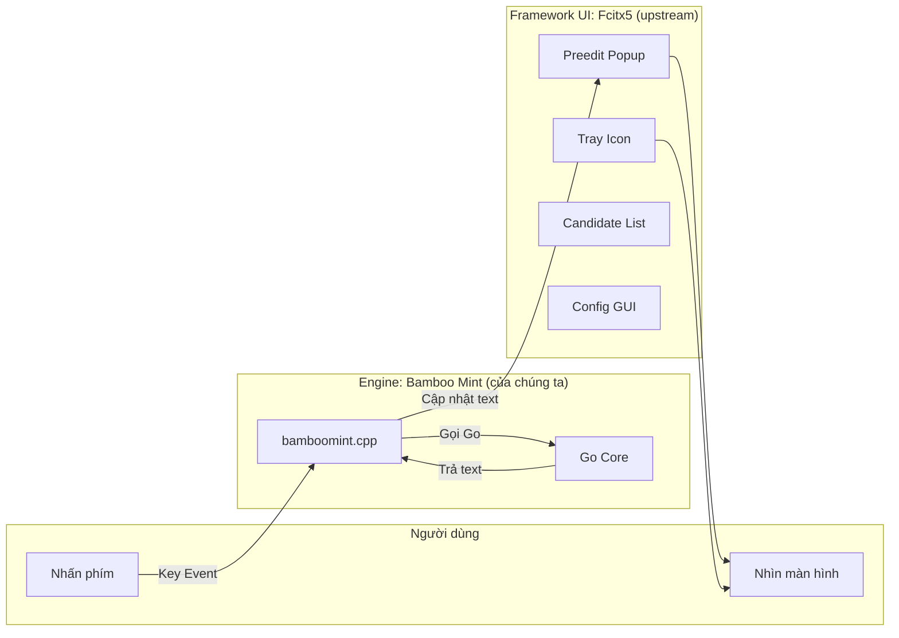
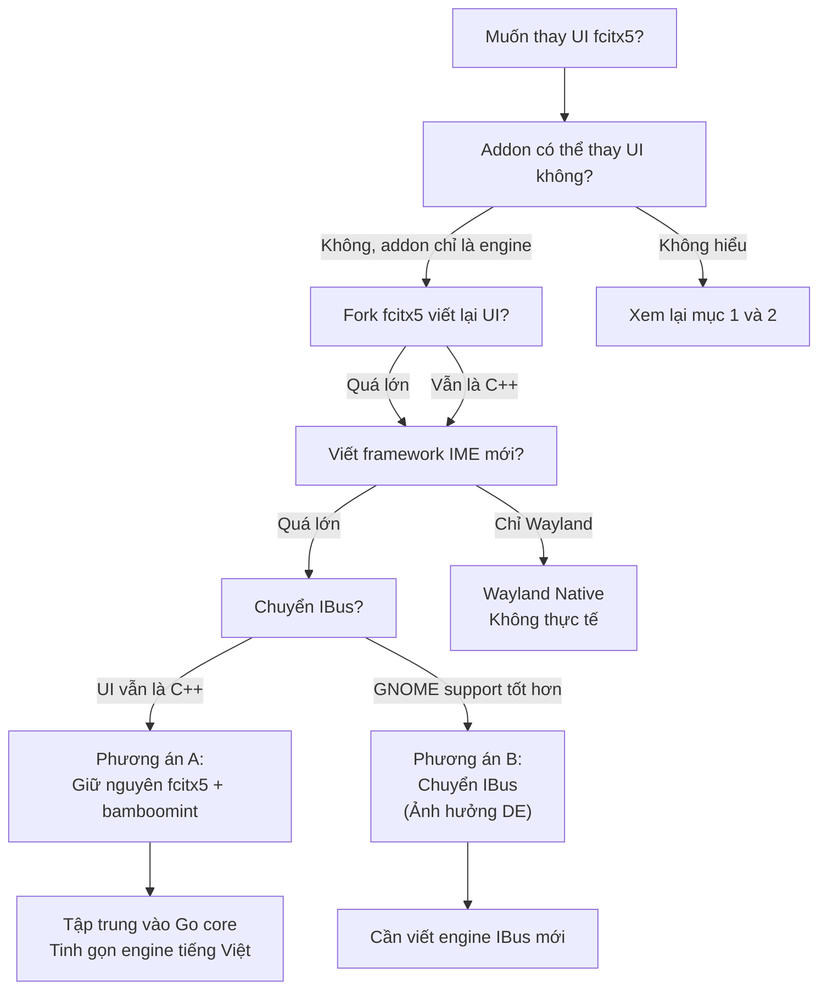

# REQ-013: Điều Tra Thay Thế Giao Diện (UI) Fcitx5 — Phân Tách Khỏi Code C++ Của Framework

**Phiên bản:** 1.0  
**Ngày cập nhật:** 2026-08-16  
**Ngôn ngữ:** Tiếng Việt  
**Mục đích:** Làm rõ ranh giới giữa "engine addon" và "framework UI", đánh giá khả năng thay thế UI của fcitx5 bằng giải pháp khác.

---

## 1. Phân Biệt: Engine vs. Framework UI

Để tránh nhầm lẫn, cần phân biệt rõ hai thành phần:

| Thành phần | Thuộc về | Code hiện tại | Vai trò |
|------------|----------|---------------|---------|
| **Engine** (`bamboomint`) | Dự án của chúng ta | C++ (`src/mint/`) | Nhận key event → xử lý tiếng Việt → trả text về framework |
| **Framework UI** (tray, popup, config) | Fcitx5 upstream | C++ (fcitx5 team) | Hiển thị preedit text, candidate list, tray icon, config GUI |

> **Quan trọng:** `bamboomint` chỉ gọi `ic->inputPanel().setClientPreedit(text)` — nó **không vẽ** lên màn hình. Việc vẽ là do fcitx5 framework.

---

## 2. Fcitx5 UI Gồm Những Gì?

Fcitx5 UI không phải là một thứ duy nhất, mà là **nhiều module** C++:

| Module | Chức năng | Viết bằng | Có thể thay từ addon? |
|--------|-----------|-----------|----------------------|
| `fcitx5` (daemon) | Quản lý input context, điều phối events | C++ | ❌ Không |
| `classicui` | Hiển thị preedit, candidate list, tray | C++/Qt | ❌ Không |
| `kimpanel` | Tích hợp với KDE Plasma panel | C++/DBus | ❌ Không |
| `notificationitem` | Tray icon (System tray / GNOME) | C++/DBus | ❌ Không |
| `configtool` | GUI chỉnh sửa config (`fcitx5-config-qt`) | C++/Qt | ❌ Không |
| `module/unicode` | Bảng chọn ký tự Unicode | C++ | ❌ Không |

**Tất cả các module UI trên đều thuộc về fcitx5 upstream**, không phải của addon. Addon chỉ có quyền:
- Đăng ký 1 icon tên (`fcitx_bamboo_mint`) → framework hiển thị.
- Đăng ký các action (Input Method menu, Charset menu, Spell check toggle) → framework render menu.
- Gửi preedit text và commit text → framework hiển thị.

---

## 3. Có Thể Viết UI Thay Thế Cho Fcitx5 Không?

### 3.1. Viết UI module riêng cho fcitx5

Fcitx5 hỗ trợ viết **UI module** (addon loại `UI`) bằng C++. Ví dụ: thay vì dùng `classicui`, có thể viết `bamboomint-ui` để tự vẽ preedit/candidate.

**Tuy nhiên:**
- Vẫn phải viết bằng **C++** (vì fcitx5 UI API là C++).
- Không giải quyết được vấn đề "không muốn dùng code C++ của họ" — vẫn phải dùng framework của họ.
- Rất phức tạp (phải handle X11/Wayland drawing, font rendering, positioning...).

### 3.2. Dùng `kimpanel` protocol

KDE cung cấp **DBUS protocol** `org.kde.impanel` để addon IME giao tiếp với panel (UI) bên ngoài.

- Nếu viết một **panel UI riêng** (bằng Rust/Qt/GTK...) lắng nghe DBUS này, có thể hiển thị preedit/candidate list.
- Nhưng fcitx5 daemon vẫn phải chạy để điều phối.
- **Không giải quyết được:** vẫn cần fcitx5 daemon (C++).

### 3.3. Viết framework IME mới hoàn toàn

Thay vì dùng fcitx5, viết một framework IME mới từ đầu (ví dụ: bằng Rust).

| Yêu cầu | Độ khó |
|---------|--------|
| Nhận key events từ X11/Wayland | Cao |
| Quản lý input context (focus, window ID...) | Rất cao |
| Vẽ preedit text / candidate list trên màn hình | Rất cao |
| Tích hợp với GTK/Qt/SDL apps | Cao |
| Xử lý Wayland security (`zwp_input_method_v2`) | Cao |
| Xử lý nhiều bộ gõ cùng lúc (Việt, Nhật, Trung...) | Trung bình |

**Kết luận:** Viết framework IME mới là dự án **cấp hệ điều hành**, không phải cấp addon. Không thực tế cho scope hiện tại.

---

## 4. So Sánh Với Các Framework IME Khác

| Framework | Ngôn ngữ chính | Có thể viết addon = ngôn ngữ khác? | Giao tiếp UI |
|-----------|---------------|-----------------------------------|--------------|
| **Fcitx5** | C++ | Khó (C++ API) | Tích hợp trong framework |
| **IBus** | C (GObject) | Dễ hơn (C API) | Tích hợp trong framework |
| **uim** | C | C API | Tích hợp trong framework |
| **Wayland IME (native)** | Protocol | Bất kỳ ngôn ngữ nào | Phải tự vẽ hoặc dùng compositor |

### Ví dụ: IBus

IBus cung cấp C API cho engine (`ibus_engine`), có binding Python, Rust... Nhưng:
- UI (panel, tray) vẫn là C++ (IBus upstream).
- Muốn thay UI thì vẫn phải fork/modify IBus itself.

---

## 5. Nhận Định Cuối Cùng

> **Không thể thay thế UI của fcitx5 từ addon `bamboomint`.**
> 
> Lý do:
> 1. Addon chỉ cung cấp **engine** (xử lý text), không cung cấp **UI**.
> 2. UI (tray, popup, config) là **framework-level**, thuộc về fcitx5 daemon.
> 3. Muốn thay UI thì phải:
>    - **Fork fcitx5** và viết lại UI module bằng ngôn ngữ khác (vẫn là C++ vì API là C++), hoặc
>    - **Viết framework IME mới hoàn toàn** (quá lớn), hoặc
>    - **Chuyển sang IBus** (nhưng UI của IBus vẫn là C++).
>
> **Như vậy, không có con đường nào dẫn đến "dùng fcitx5 mà không dùng UI C++ của họ".**

---

## 6. Các Phương Án Thực Tế (Nếu Vẫn Muốn Tiến)

### Phương án A: Giữ nguyên (Khuyến nghị)

- Tiếp tục dùng fcitx5 + `bamboomint`.
- Chấp nhận fcitx5 framework là dependency hệ thống (như kernel, systemd...).
- Tập trung vào **Go core** — đây là phần "logic tiếng Việt" thuộc về chúng ta.

### Phương án B: Chuyển sang IBus

- Viết engine `bamboomint` cho IBus (bằng C hoặc Rust binding).
- Vẫn phải dùng UI của IBus (C++).
- Ảnh hưởng toàn bộ DE (GNOME native hỗ trợ IBus tốt hơn fcitx5).

### Phương án C: Wayland Native (Siêu dài hạn)

- Viết Rust app lắng nghe `zwp_input_method_v2` protocol.
- Không dùng fcitx5/IBus, tự quản lý input context.
- Chỉ hoạt động trên Wayland (không hỗ trợ X11).
- Mất tính năng nâng cao (macro, custom keymap, config GUI...).
- **Không thực tế cho production.**

### Phương án D: Tự vẽ UI bên ngoài (Hack)

- Engine vẫn chạy trong fcitx5.
- Viết app riêng (Rust/GTK) chạy song song, lắng nghe DBUS từ fcitx5 để hiển thị preedit/candidate theo cách mình muốn.
- Bỏ `classicui` của fcitx5, dùng app riêng.
- **Rất phức tạp**, cần maintain song song hai process.

---

## 7. Sơ Đồ Quyết Định

---

## 8. Quyết Định Chờ Phê Duyệt

- [ ] Đồng ý giữ nguyên fcitx5 + C++ engine (`bamboomint`)
- [ ] Đồng ý không thể thay UI framework từ addon
- [ ] Muốn tìm hiểu thêm IBus
- [ ] Muốn tìm hiểu thêm Wayland native
- [ ] Tiếp tục tinh gọn Go core (xóa Telex 2, Telex W)
