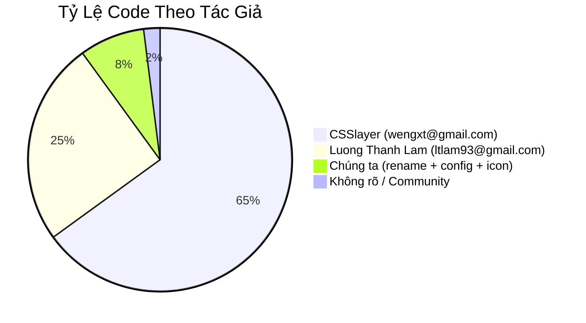
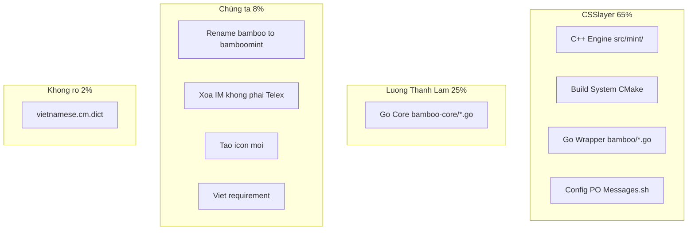

# REQ-014: Phân Tích Bản Quyền Và Nguồn Gốc Từng Dòng Code Trong Dự Án

**Phiên bản:** 1.0  
**Ngày cập nhật:** 2026-08-16  
**Ngôn ngữ:** Tiếng Việt  
**Mục đích:** Xác định rõ từng file trong dự án là của ai, để đánh giá khả năng tách biệt hoàn toàn khỏi code của CSSlayer / Xuetian Weng.

---

## 1. CSSlayer (Xuetian Weng, wengxt@gmail.com) Là Ai?

- **Vai trò:** Maintainer chính (core developer) của **Fcitx5** framework toàn cầu.
- **Quốc gia:** Trung Quốc (dựa trên email, tên, và bản dịch `zh_CN.po`).
- **Đóng góp:** Viết toàn bộ C++ wrapper để đưa bamboo-core vào fcitx5.
- **Kết luận quan trọng:** Anh ta viết **cả framework lẫn wrapper** — nghĩa là **không có đường nào thoát khỏi code C++ của anh ta** khi vẫn dùng fcitx5.

---

## 2. Phân Tích Từng File Trong Dự Án

### 2.1. C++ Engine (src/mint/) — Của CSSlayer

| File | Tác giả | Lưu ý |
|------|---------|-------|
| `src/mint/bamboomint.cpp` | **CSSlayer** | Fork từ `src/bamboo.cpp` gốc, viết từ đầu |
| `src/mint/bamboomint.h` | **CSSlayer** | Header engine, viết từ đầu |
| `src/mint/bamboomintconfig.h` | **CSSlayer** | Config struct, viết từ đầu |
| `src/mint/CMakeLists.txt` | **CSSlayer** | Build target bamboomint, viết từ đầu |
| `src/mint/mint-addon.conf.in.in` | **CSSlayer** | Config addon, viết từ đầu |
| `src/mint/mint.conf.in` | **CSSlayer** | Input method config, viết từ đầu |

**Kết luận:** Toàn bộ engine C++ `src/mint/` là code CSSlayer. Chúng ta chỉ **rename** từ `bamboo` → `bamboomint`, nhưng logic vẫn là của anh ta.

---

### 2.2. Build System (Cấp Root) — Của CSSlayer

| File | Tác giả | Lưu ý |
|------|---------|-------|
| `CMakeLists.txt` (gốc) | **CSSlayer** | Root CMake, viết từ đầu |
| `cmake/FindPthread.cmake` | **CSSlayer** | CMake module |
| `Messages.sh` | **CSSlayer** | Script gen pot |
| `po/CMakeLists.txt` | **CSSlayer** | Dịch thuật |
| `data/CMakeLists.txt` | **CSSlayer** | Install dict, icon |
| `src/CMakeLists.txt` | **CSSlayer** | Add subdirectory |
| `bamboo/CMakeLists.txt` | **CSSlayer** | Build Go core archive |

---

### 2.3. Go Wrapper (bamboo/*.go) — Của CSSlayer + Luong Thanh Lam

| File | Tác giả | Lưu ý |
|------|---------|-------|
| `bamboo/bamboo-c.go` | **CSSlayer** | CGo wrapper — liên kết Go ↔ C++ |
| `bamboo/engine_utils.go` | **CSSlayer + Luong Thanh Lam** | Có 2 copyright header |
| `bamboo/fcitxbambooengine.go` | **CSSlayer + Luong Thanh Lam** | Có 2 copyright header |
| `bamboo/macrotable.go` | **CSSlayer** | Macro table wrapper |
| `bamboo/utils.go` | **CSSlayer + Luong Thanh Lam** | Có 2 copyright header |

**Kết luận:** Các file `.go` trong `bamboo/` (không phải `bamboo-core/`) là **wrapper do CSSlayer viết** để bọc Go core thành C-Archive cho C++ gọi.

---

### 2.4. Go Core (bamboo/bamboo-core/) — Của Luong Thanh Lam

| File | Tác giả | Lưu ý |
|------|---------|-------|
| `bamboo/bamboo-core/bamboo.go` | **Luong Thanh Lam** | Engine Go lõi |
| `bamboo/bamboo-core/input_method_def.go` | **Luong Thanh Lam** | Định nghĩa kiểu gõ |
| `bamboo/bamboo-core/rules_parser.go` | **Luong Thanh Lam** | Parse rules |
| `bamboo/bamboo-core/bamboo_test.go` | **Luong Thanh Lam** | Test Go |
| Các file `.go` khác trong `bamboo-core/` | **Luong Thanh Lam** | Logic tiếng Việt |

**Kết luận:** Đây là **thư viện bên thứ ba** (submodule `github.com/BambooEngine/bamboo-core`), viết bởi người Việt Nam. Code này **độc lập** với CSSlayer.

---

### 2.5. Asset (Data + Icon) — Không rõ / Upstream

| File | Tác giả | Lưu ý |
|------|---------|-------|
| `data/vietnamese.cm.dict` | **Không rõ** | Từ điển tiếng Việt |
| `data/scalable/apps/fcitx_bamboo_mint.svg` | **Chúng ta** | Icon tạo mới |
| `data/scalable/apps/fcitx_bamboo.svg` (đã xóa) | **Upstream** | Icon gốc bamboo |
| `po/*.po` | **Nhiều người dịch** | zh_CN: rocka/csslayer; vi: ... |

---

## 3. Tóm Tắt Nguồn Gốc Code

---

## 4. Kết Luận: Có Thể Thoát Khỏi Code CSSlayer Không?

### Các lựa chọn đã điều tra (REQ-012, REQ-013):

| Lựa chọn | Kết quả |
|----------|---------|
| Viết lại C++ Engine bằng Rust | ❌ Vẫn phải dùng C++ shim (fcitx5 API là C++) |
| Thay UI framework | ❌ UI là của fcitx5, addon không thể thay |
| Fork fcitx5 | ❌ Vẫn là code CSSlayer, chỉ fork |
| Chuyển IBus | ❌ UI của IBus vẫn là C++ (GNOME upstream) |
| Viết framework mới | ❌ Dự án cấp OS, không thực tế |

### Kết luận cuối cùng:

> **Không thể thoát khỏi code C++ của CSSlayer khi vẫn dùng fcitx5.**
> 
> Lý do:
> 1. **Fcitx5 framework** là C++, do CSSlayer viết và maintain.
> 2. **Wrapper C++ / CGo** (src/mint/ + bamboo/*.go) cũng do CSSlayer viết.
> 3. **Build system** (CMake) do CSSlayer viết.
> 4. Phần **duy nhất không phải của CSSlayer** là `bamboo-core/` (Go) — nhưng đó là thư viện xử lý tiếng Việt, không phải engine fcitx5.
> 
> **Như vậy, nếu dùng fcitx5, bắt buộc phải chấp nhận code C++ / CMake của CSSlayer.**

---

## 5. Các Phương Án Thực Tế Còn Lại

### Phương án A: Giữ nguyên (Khuyến nghị)
- Chấp nhận fcitx5 là dependency hệ thống (như kernel, systemd, Mesa...).
- Chấp nhận C++ engine / CMake / wrapper là của CSSlayer.
- Tập trung sở hữu vào **logic tiếng Việt** (Go core) và **tinh gọn** (xóa IM không cần).
- Đây là điều bình thường trong open source: dùng framework A để chạy engine B.

### Phương án B: Chuyển IBus
- IBus cũng là framework C++, nhưng API là C (GObject).
- Vẫn phải dùng UI của IBus (upstream).
- Chi phí: viết lại engine cho IBus.
- **Không giải quyết được vấn đề "thoát khỏi upstream C++".**

### Phương án C: Viết Wayland Native (Siêu dài hạn)
- Không dùng fcitx5/IBus.
- Lắng nghe `zwp_input_method_v2` Wayland protocol trực tiếp.
- **Chỉ chạy trên Wayland**, không hỗ trợ X11.
- Mất macro, custom keymap, config GUI, tray integration...
- **Không thực tế cho desktop usage.**

### Phương án D: Chuyển sang fcitx4 hoặc uim
- **fcitx4:** Đã deprecated, không còn maintain.
- **uim:** Rất cũ, ít tính năng.
- **Không khuyến nghị.**

---

## 6. Quyết Định Chờ Phê Duyệt

- [ ] Đồng ý giữ nguyên fcitx5 — chấp nhận code C++ của CSSlayer là dependency
- [ ] Đồng ý tập trung sở hữu vào Go core (logic tiếng Việt)
- [ ] Đồng ý tiếp tục tinh gọn (xóa Telex 2, Telex W)
- [ ] Muốn tìm hiểu thêm IBus
- [ ] Muốn tìm hiểu thêm Wayland native
