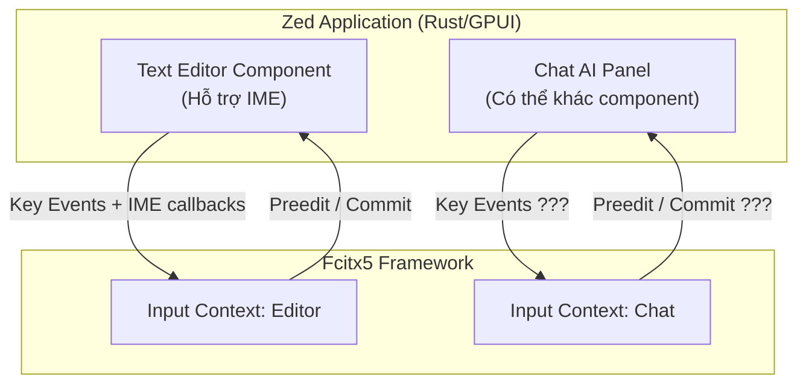

# REQ-015: Điều Tra Lỗi Bamboo Mint Không Hoạt Động Trên Ô Nhập Chat AI Của Zed

**Phiên bản:** 1.0  
**Ngày cập nhật:** 2026-08-16  
**Ngôn ngữ:** Tiếng Việt  
**Mục đích:** Điều tra nguyên nhân Bamboo Mint không thể kích hoạt (không chuyển sang tiếng Việt) khi focus vào ô nhập chat AI của Zed, mặc dù vẫn hoạt động bình thường trong Text Editor của Zed.

---

## 1. Mô Tả Hiện Tượng

| Kịch bản | Kết quả |
|----------|---------|
| Mở file `.txt` trong Zed Text Editor | ✅ Bamboo Mint hoạt động, gõ được tiếng Việt |
| Focus vào ô nhập chat AI (panel bên phải/bên dưới) | ❌ Bamboo Mint không kích hoạt, vẫn gõ tiếng Anh |
| Chuyển sang Mozc trong ô chat AI | ❓ Cần kiểm chứng — nếu Mozc cũng không được thì là lỗi Zed |

> **Ghi chú từ người dùng:** "Lúc đầu thì được" — tức là trước đây từng hoạt động, sau này mới bị lỗi. Điều này gợi ý có thể do update Zed hoặc thay đổi cấu hình.

---

## 2. Giả Thuyết Nguyên Nhân

### 2.1. Giả thuyết A: Zed Chat Panel Không Hỗ Trợ IME

Zed được viết bằng Rust + GPUI (custom UI framework của họ). Text Editor có thể đã được implement để hỗ trợ IME/fcitx5, nhưng Chat AI panel có thể là một component khác (ví dụ: webview, hoặc custom canvas) không gửi key events qua IME framework.

| Dấu hiệu | Nếu đúng |
|----------|----------|
| Mozc / Pinyin cũng không hoạt động trong Chat AI | Đúng — Zed Chat panel không support IME |
| Chỉ Bamboo Mint bị, Mozc vẫn được | Sai — là lỗi cụ thể của bamboomint |

### 2.2. Giả thuyết B: Input Context Khác Nhau

Fcitx5 quản lý input context theo từng window/panel. Có thể Zed Chat AI panel được tạo như một input context riêng biệt không được fcitx5 attach đúng cách.

| Dấu hiệu | Nếu đúng |
|----------|----------|
| `fcitx5-remote` hiển thị input method khác khi focus Chat AI | Đúng — context khác, chưa set IM |
| `fcitx5-remote` vẫn hiển thị `bamboomint` nhưng không gõ được | Sai — IM đã active nhưng Zed không gửi events |

### 2.3. Giả thuyết C: Zed Update Phá Vỡ IME Support

Như người dùng nói "lúc đầu thì được" — có thể một bản update Zed gần đây đã thay đổi cách handle text input trong Chat panel, làm mất khả năng kết nối với fcitx5.

| Dấu hiệu | Nếu đúng |
|----------|----------|
| Tìm thấy issue Zed GitHub liên quan IME/chat | Đúng — regression từ Zed |
| Không có issue nào | Cần tạo issue hoặc tìm workaround |

### 2.4. Giả thuyết D: Wayland vs X11

Nếu Zed chạy dưới Wayland, các protocol IME có thể khác nhau giữa Text Editor và Chat Panel (ví dụ: panel dùng XWayland còn editor dùng native Wayland).

| Dấu hiệu | Nếu đúng |
|----------|----------|
| `xeyes` theo chuột trong Chat panel nhưng không theo trong Editor | Chat panel là XWayland, Editor là native |
| `echo $XDG_SESSION_TYPE` = `wayland` | Hệ thống đang dùng Wayland |

---

## 3. Phương Pháp Debug (Cần Thực Hiện)

### 3.1. Bước 1: Kiểm tra IME có active không

```bash
# Khi focus vào Text Editor (đang gõ được tiếng Việt)
fcitx5-remote
# Output mong đợi: bamboomint hoặc tên IM hiện tại

# Khi focus vào Zed Chat AI (không gõ được)
fcitx5-remote
# Output: ???
```

Nếu output giống nhau → IM đang active nhưng Zed Chat không gửi events.
Nếu output khác nhau → Input context khác nhau.

### 3.2. Bước 2: Kiểm tra với IME khác

```bash
# Chuyển sang Mozc (hoặc Pinyin)
fcitx5-remote -s mozc
# Focus Zed Chat AI, thử gõ tiếng Nhật

# Chuyển sang keyboard-us
fcitx5-remote -s keyboard-us
# Focus Zed Chat AI
```

Nếu Mozc cũng không hoạt động → Lỗi Zed Chat panel, không phải của chúng ta.

### 3.3. Bước 3: Xem log fcitx5

```bash
# Chạy fcitx5 ở foreground để xem log
killall fcitx5
fcitx5 --verbose=bamboo-mint --verbose=key_trace
# Hoặc xem log file
journalctl -u fcitx5 --since "1 minute ago"
```

Quan sát:
- Khi focus Text Editor: có log `keyEvent` không?
- Khi focus Chat AI: có log `activate` / `deactivate` không?

### 3.4. Bước 4: Kiểm tra Window Properties

```bash
# Dùng xprop hoặc xwininfo để xem Zed window
xprop | grep WM_CLASS
# Click vào Zed Chat AI panel
```

Nếu Chat AI panel có `WM_CLASS` hoặc window ID khác với Text Editor → có thể fcitx5 xử lý khác nhau.

### 3.5. Bước 5: Kiểm tra Wayland Protocol

```bash
# Kiểm tra Zed đang chạy native Wayland hay XWayland
xlsclients | grep zed
# Nếu có → Zed đang chạy X11 (XWayland)
# Nếu không → Zed đang chạy native Wayland

# Kiểm tra session type
echo $XDG_SESSION_TYPE
```

### 3.6. Bước 6: Tìm Kiếm Issue Zed

Tìm kiếm trên GitHub Zed:
- `fcitx5`
- `ime`
- `input method`
- `chat`
- `commit editor`

---

## 4. Phân Tích Kiến Trúc Zed Text Input



**Câu hỏi then chốt:**
- Zed Chat AI panel có implement `set_preedit` / `commit_string` callbacks giống Text Editor không?
- Hay Chat panel chỉ là một `<textarea>` / webview đơn giản?

---

## 5. Các Khả Năng Kết Quả

### Kết quả A: Zed Chat panel không hỗ trợ IME (phổ biến nhất)

**Nguyên nhân:** Chat AI panel là webview hoặc custom component không implement IME protocol.

**Cách fix:**
- Không thể fix từ addon — phải sửa Zed upstream.
- Tạo issue trên `zed-industries/zed` GitHub.
- Hoặc tìm workaround (ví dụ: gõ trong Text Editor rồi copy paste vào Chat).

### Kết quả B: Input Context fcitx5 không được set đúng

**Nguyên nhân:** Chat panel tạo input context mới nhưng fcitx5 chưa kích hoạt `bamboomint` cho context này.

**Cách fix:**
- Kiểm tra `bamboomint` có phải default IM không.
- Thử set `DefaultIM=bamboomint` trong fcitx5 profile.

### Kết quả C: Zed update regression

**Nguyên nhân:** Bản update Zed gần đây phá hỏng IME support cho Chat panel.

**Cách fix:**
- Rollback Zed về bản cũ để kiểm chứng.
- Tạo issue Zed.

---

## 6. Checklist Điều Tra (Chưa Thực Hiện)

- [ ] Kiểm tra `fcitx5-remote` khi focus Text Editor vs Chat AI
- [ ] Kiểm tra Mozc trong Chat AI
- [ ] Xem log fcitx5 khi chuyển focus
- [ ] Kiểm tra `xprop` window class của Chat panel
- [ ] Kiểm tra Zed chạy Wayland hay X11
- [ ] Tìm issue Zed GitHub về IME/chat

---

## 7. Quyết Định Chờ Phê Duyệt

- [ ] Đồng ý tiến hành điều tra debug theo các bước trên
- [ ] Đồng ý kiểm tra với Mozc/Pinyin để xác định là lỗi Zed hay lỗi addon
- [ ] Đồng ý tìm kiếm issue Zed GitHub
