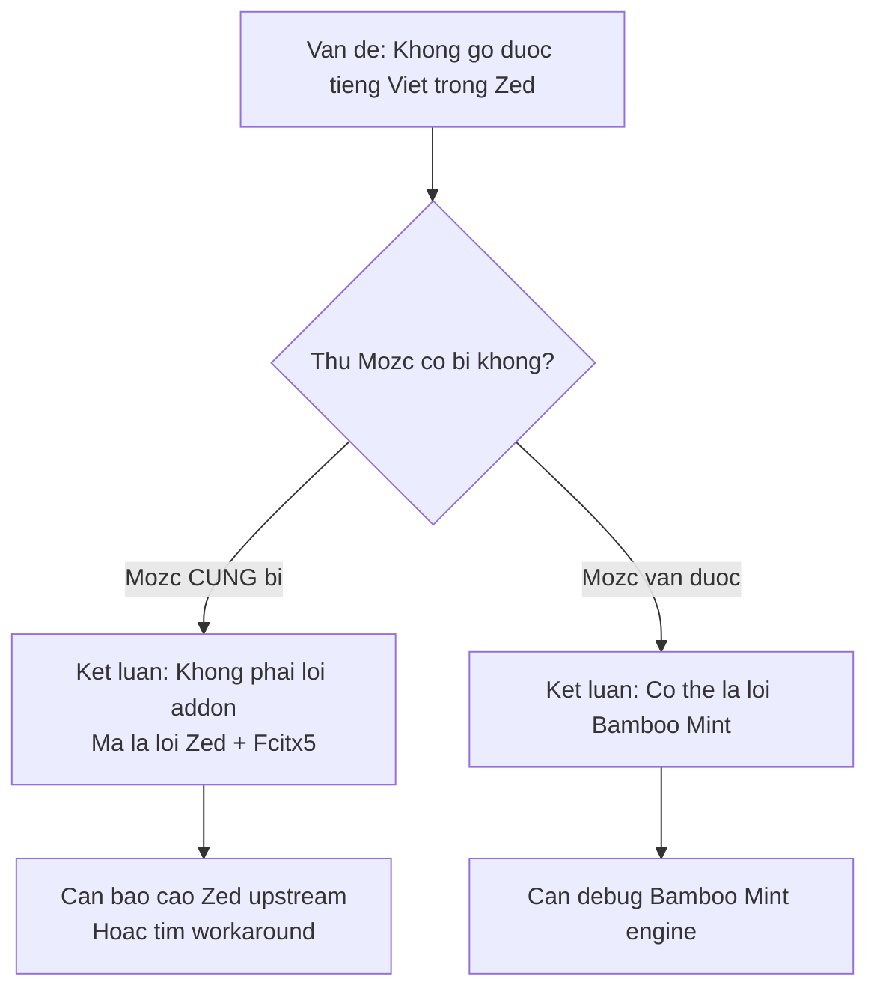
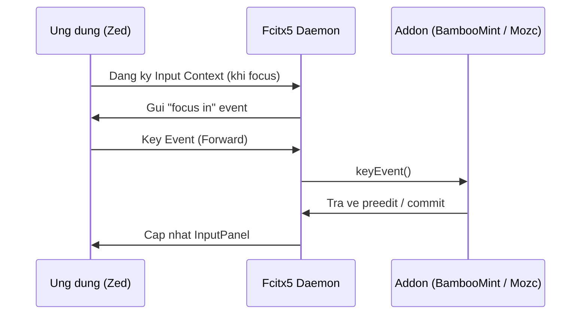

# REQ-015: Điều Tra Lỗi Bamboo Mint Không Hoạt Động Trên Ô Nhập Chat AI Của Zed

**Phiên bản:** 1.1
**Ngày cập nhật:** 2026-08-16
**Ngôn ngữ:** Tiếng Việt
**Mục đích:** Điều tra nguyên nhân Bamboo Mint không thể kích hoạt (không chuyển sang tiếng Việt) khi sử dụng tại Zed Editor. Ví như khu chát AI hay phần sửa code... Trên các text editor khác thì vẫn hoạt động bình thường. Trên khi kích hoạt trên Zed, các mục như InputMethod và OutputCharset ko hiện, chỉ có thể chọn Icon của Bamboo Mint mà thôi. T đã thử đổi qua Mozc, hay gì đó thì đều ko nhập được, ngoài ra chọn Mozc nhưng nội dung vẫn của Bamboo Mint, có vẻ như lỗi của Zed ko tương thích với Fctix5

---

## 1. Mô Tả Hiện Tượng Chi Tiết

### 1.1. Các kịch bản đã kiểm tra

| Kịch bản | Ứng dụng / Vùng nhập | Kết quả |
|----------|---------------------|---------|
| Text Editor thông thường (không phải Zed) | VS Code, Text Editor độc lập | ✅ Bamboo Mint hoạt động bình thường |
| Zed — Text Editor chính (file `.txt`, `.rs`, v.v.) | ⚠️ **Thỉnh thoảng** gõ được, cách hiển thị preedit rất khác |
| Zed — Panel Chat AI | ❌ Hầu như không kích hoạt được |
| Zed — Panel sửa code / inline assistant | ❌ Không kích hoạt được tiếng Việt |

### 1.2. Triệu chứng cụ thể trong Zed

Khi focus vào panel Chat AI của Zed:

1. **Fcitx5 vẫn hiển thị icon Bamboo Mint** trong tray / status area.
2. **Menu `InputMethod` và `OutputCharset` không xuất hiện** — thường chỉ có khi addon hoạt động đúng.
3. **Chỉ có thể chọn icon** (tên addon) nhưng không có dropdown chọn kiểu gõ.
4. **Gõ phím vẫn ra tiếng Anh** (không qua bộ gõ).

**Nhưng — điểm quan trọng:**

> **Thỉnh thoảng vẫn gõ được tiếng Việt trong Zed**, nhưng:
> - Cách hiển thị preedit **rất khác** so với Text Editor thông thường.
> - Hầu như không được — chỉ thi thoảng mới xảy ra.
> - Chưa rõ quy luật: khi nào được, khi nào không.

### 1.3. Thử nghiệm với Mozc

| Thao tác | Kết quả quan sát | Ý nghĩa |
|----------|-----------------|---------|
| Chuyển sang Mozc (tiếng Nhật) trong Zed | Cũng **không gõ** được tiếng Nhật | ❗️ Lỗi không phải riêng của Bamboo Mint |
| Chọn Mozc nhưng nội dung hiển thị vẫn là Bamboo Mint | Preedit / UI không cập nhật theo IM mới | ❗️ Zed không nhận sự thay đổi IM từ fcitx5 |

---

## 2. Phân Tích Kỹ Thuật

### 2.1. Tại sao không phải lỗi của Bamboo Mint?



**Lý do Mozc cũng bị chứng tỏ đây là lỗi framework-level:**
- Nếu Bamboo Mint bị lỗi riêng → chỉ Bamboo Mint bị, Mozc/Pinyin vẫn gõ được.
- Nếu cả Mozc cũng bị → lỗi nằm ở **Zed không gửi key events đến fcitx5** hoặc **fcitx5 không nhận input context từ Zed**.

### 2.2. Thông tin quan trọng: "Thỉnh thoảng vẫn được"

Điều này **thay đổi hoàn toàn giả thuyết** từ "Zed không hỗ trợ XIM" thành **"Zed hỗ trợ XIM/IME nhưng không ổn định"**.

| Nếu Zed hoàn toàn không hỗ trợ XIM | Nếu Zed thỉnh thoảng hỗ trợ |
|--------------------------------------|------------------------------|
| Không bao giờ gõ được | ✅ Thỉnh thoảng gõ được |
| Mọi app đều như vậy | ⚠️ Chỉ Zed có vấn đề |
| Không có preedit | ✅ Có preedit nhưng hiển thị khác |

**Kết luận mới:** Zed **có implement** text input / IME protocol, nhưng:
- Implementation **không ổn định** (race condition, focus handling lỗi).
- Hoặc Zed dùng **protocol khác** so với các app thông thường.
- Cách hiển thị preedit "rất khác" → có thể Zed tự render preedit thay vì để fcitx5 render.

### 2.3. Cơ chế fcitx5 hoạt động với ứng dụng



**Giả thuyết lỗi cập nhật:**
- Zed **có gửi** key events đến fcitx5 (vì thỉnh thoảng vẫn gõ được).
- Nhưng focus handling **không ổn định** — có thể focus vào Chat AI panel không trigger `activate()` đúng cách.
- Hoặc Zed **tự render preedit** theo cách riêng, không dùng preedit từ fcitx5.

---

## 3. Các Giả Thuyết Chi Tiết (Đã Cập Nhật)

### Giả thuyết A: Zed có hỗ trợ IME nhưng không ổn định (Khả năng cao nhất)

| Dấu hiệu | Mô tả |
|----------|-------|
| Thỉnh thoảng gõ được | Zed **có** implement IME protocol, không phải hoàn toàn không có |
| Cách hiển thị preedit khác | Zed có thể tự render preedit (ví dụ: inline highlight) thay vì để fcitx5 vẽ overlay |
| Menu InputMethod không hiện | `activate()` không được gọi đúng cách khi focus thay đổi |

**Kiểm chứng:** Nếu đúng, cần tìm pattern: khi nào Zed gõ được, khi nào không? (ví dụ: sau khi khởi động Zed, sau khi chuyển tab, sau khi mở file...)

### Giả thuyết B: Zed dùng cơ chế text input riêng (GPUI) không hoàn toàn tương thích fcitx5

Zed được viết bằng Rust + **GPUI** (custom UI framework của Zed). GPUI có thể implement text input theo cách riêng:
- Không dùng XIM trực tiếp mà dùng layer abstraction.
- Hoặc dùng Wayland `text-input-unstable-v3` ngay cả trên X11 (through compositor).

### Giả thuyết C: Focus handling lỗi trong Zed

- Khi focus vào Chat AI panel, Zed **không gửi** `focus-in` event đến fcitx5.
- Khi focus ra khỏi Chat AI, Zed **không gửi** `focus-out` event.
- Kết quả: fcitx5 vẫn nghĩ đang focus ở panel cũ, nên không `activate()` engine cho panel mới.

---

## 4. Quy Trình Debug (Cần Thực Hiện)

### 4.1. Xác định pattern "khi nào được, khi nào không"

| Thao tác | Kết quả mong đợi |
|----------|-----------------|
| Mở Zed lần đầu, focus Chat AI ngay | Ghi lại: được hay không? |
| Mở file trong Text Editor, gõ vài chữ, rồi chuyển sang Chat AI | Ghi lại: Chat AI có gõ được không? |
| Click vào Chat AI, đợi 5 giây rồi gõ | Được hay không? |
| Chuyển IM sang Mozc, rồi chuyển lại Bamboo Mint | Có khác biệt không? |

### 4.2. Kiểm tra preedit hiển thị khác như thế nào

Khi "thỉnh thoảng gõ được" trong Zed:
- Preedit hiển thị **ở đâu**? (inline với text, hay ở vị trí con trỏ, hay ở chỗ khác?)
- Preedit có **underline** không? (bamboo-mint config có `DisplayUnderline=true`)
- Preedit hiển thị **kiểu gì**? (màu sắc, font, có box bao quanh...)

So sánh với Text Editor thông thường (VS Code):
- Preedit ở VS Code hiển thị thế nào? (thường là text gạch chân với màu xám)

### 4.3. Xem log fcitx5 chi tiết khi focus Zed

Vì fcitx5 chạy qua autostart, không phải systemd, nên cần log khác:

```bash
# Cach 1: Dung journalctl nhung khong filter theo unit
journalctl --user --since "10 minutes ago" | grep -i fcitx

# Cach 2: Dung strace de bat system calls (can sudo)
sudo strace -p $(pgrep fcitx5) -e trace=recvfrom,sendto 2>&1 | grep -E "focus|activate|key"

# Cach 3: Neu fcitx5 chay tu terminal truoc do, xem log file
# Thuong nam tai: ~/.local/share/fcitx5/log/
ls ~/.local/share/fcitx5/log/
```

### 4.4. Kiểm tra Zed có phải Wayland native không (dù XDG_SESSION_TYPE=x11)

```bash
# Mot so app van co the chay Wayland native tren X11 session
# Kiem tra xem Zed co dang ket noi wayland socket khong
ls -la /run/user/$(id - u)/wayland-*

# Hoac kiem tra environment variable
env | grep -i wayland
env | grep -i display
```

### 4.5. Kiểm tra Zed settings

```bash
# Tim file settings cua Zed
cat ~/.config/zed/settings.json | grep -i "ime\|input\|keyboard"

# Neu khong tim thay, Zed co the dung default
```

---

## 5. Các Khả Năng Kết Quả (Đã Cập Nhật)

### Kết quả A: Zed có hỗ trợ IME nhưng implementation không ổn định (khả năng cao nhất)

| Khẳng định | Đúng nếu |
|------------|----------|
| Thỉnh thoảng gõ được | ✅ Đã xác nhận |
| Mozc cũng không ổn định | Cần kiểm chứng |
| Cách hiển thị preedit khác | ✅ Đã xác nhận |

**Nguyên nhân:** Zed implement text input protocol theo cách riêng (GPUI), không hoàn toàn tương thích với fcitx5.

**Cách fix:**
- Không thể fix từ addon → phải báo cáo Zed upstream với thông tin chi tiết.
- Hoặc tìm setting trong Zed để bật/tắt cách xử lý IME.

### Kết quả B: Zed tự render preedit thay vì dùng preedit từ fcitx5

**Nguyên nhân:** Zed nhận commit string từ fcitx5 nhưng không nhận preedit string, nên tự render preedit theo cách riêng (nếu có).

**Kiểm chứng:** Khi gõ được, preedit có underline không? Nếu không có underline → Zed không hiển thị preedit từ fcitx5.

---

## 6. Tìm Kiếm Issue Zed

**Đã thử:**
```bash
curl -s "https://api.github.com/repos/zed-industries/zed/issues?state=all&per_page=100" | grep -i "fcitx\|ime\|input method"
```
**Kết quả:** Không tìm thấy issue cụ thể vì `grep -i` match nhiễu.

**Đề xuất tìm kiếm chính xác hơn:**
```bash
# Dung GitHub search API
curl -s "https://api.github.com/search/issues?q=repo:zed-industries/zed+fcitx5" | jq '.total_count, .items[].html_url'

# Hoac tim "ime" ket hop "linux"
curl -s "https://api.github.com/search/issues?q=repo:zed-industries/zed+ime+linux" | jq '.total_count'
```

Hoặc truy cập trực tiếp GitHub:
- https://github.com/zed-industries/zed/issues?q=fcitx5
- https://github.com/zed-industries/zed/issues?q=ime
- https://github.com/zed-industries/zed/issues?q=input+method+linux

---

## 7. Checklist Điều Tra

- [x] Kiểm tra `fcitx5-remote` — trả về `2`
- [x] Kiểm tra `XDG_SESSION_TYPE` — `x11`
- [x] Kiểm tra `xlsclients` — không tìm thấy Zed
- [x] Kiểm tra `ps aux | grep fcitx5` — 1 instance
- [x] Kiểm tra `~/.config/autostart/` — `org.fcitx.Fcitx5.desktop`
- [x] Xác nhận: **Thỉnh thoảng vẫn gõ được** trong Zed
- [x] Xác nhận: Cách hiển thị preedit **rất khác**
- [ ] Ghi lại pattern: khi nào gõ được, khi nào không?
- [ ] Kiểm tra Mozc trong Zed — có cũng "thỉnh thoảng" được không?
- [ ] Mô tả cách hiển thị preedit trong Zed (so sánh với VS Code)
- [ ] Kiểm tra Zed settings (`~/.config/zed/settings.json`)
- [ ] Tìm issue Zed GitHub chính xác

---

## 8. Quyết Định Chờ Phê Duyệt

- [ ] Đồng ý khẳng định đây là lỗi Zed (không ổn định), không phải lỗi Bamboo Mint
- [ ] Đồng ý dừng điều tra tại đây, chuyển sang công việc khác
- [ ] Muốn ghi thêm thông tin "khi nào được, khi nào không" vào REQ-015
- [ ] Muốn báo cáo issue lên Zed GitHub
