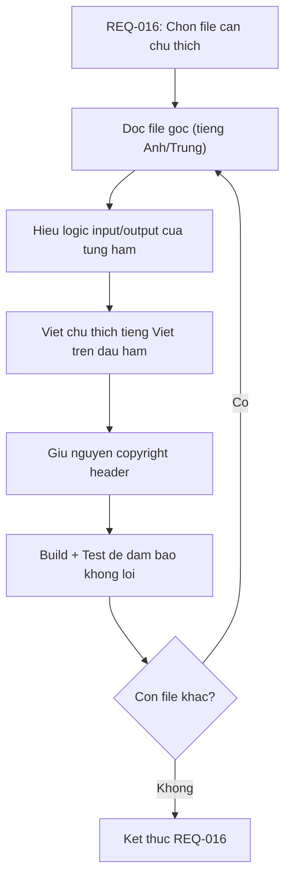

# REQ-016: Chú Thích (Document) Code Go Core — `bamboo/bamboo-core/`

**Phiên bản:** 1.0
**Ngày cập nhật:** 2026-08-16
**Ngôn ngữ:** Tiếng Việt
**Mục đích:** Thêm chú thích tiếng Việt chi tiết cho từng file trong `bamboo/bamboo-core/` để dễ tìm hiểu logic xử lý tiếng Việt, đồng thời giữ nguyên bản quyền tác giả gốc.

---

## 1. Nguyên Tắc Chú Thích

### 1.1. Giữ nguyên copyright

Chúng ta **KHÔNG** xóa header bản quyền gốc:

```go
/*
 * Bamboo - A Vietnamese Input method editor
 * Copyright (C) Luong Thanh Lam <ltlam93@gmail.com>
 *
 * This software is licensed under the MIT license...
 */
```

Header này được giữ nguyên ở đầu file.

### 1.2. Thêm chú thích tiếng Việt

Chú thích được thêm **bên dưới** header, hoặc **trước mỗi hàm/struct**, theo format:

```go
// =============================================================================
// CHU THICH THEM (Tieng Viet)
// =============================================================================
// File nay xu ly ... (tong quan)
// Cac ham chinh:
//   - HamA: lam gi do
//   - HamB: lam gi do
// =============================================================================

// HamA xu ly ...
// Input:  ... (kieu du lieu, y nghia)
// Output: ... (kieu du lieu, y nghia)
// Luu y:  ... (neu co)
func HamA(...) ... {
```

### 1.3. Quy ước

- Dùng `//` cho chú thích tiếng Việt (không dùng `/* */` để tránh nhầm với copyright).
- Chú thích đặt **trước** hàm/struct, cách 1 dòng trống.
- Tên biến/hàm trong chú thích viết đúng tên trong code (không dịch).
- Chỉ chú thích những hàm **quan trọng** (public API, logic phức tạp).
- Không chú thích những hàm quá đơn giản (getter/setter 1 dòng).

---

## 2. Danh Sách File Cần Chú Thích

```
bamboo/bamboo-core/
├── bamboo.go              # Engine chinh - UU TIEN CAO NHAT
├── input_method_def.go    # Dinh nghia kiểu gõ (Telex, Telex 2, Telex W)
├── rules_parser.go        # Parse rules từ definition
├── spelling.go            # Spell check (kiểm tra chính tả)
├── encoder.go             # Ma hoa / chuyển đổi charset output
├── flattener.go           # Flatten composition → chuỗi hiển thị
├── bamboo_utils.go        # Utils cho bamboo engine
├── utils.go               # Utils chung
├── charset_def.go         # Dinh nghia cac charset
├── bamboo_test.go         # Test chinh
├── rules_parser_test.go   # Test parser
└── utils_test.go          # Test utils
```

---

## 3. Trình Tự Thực Hiện (Đề Xuất)

Theo thứ tự **dependency** — file nào không phụ thuộc file khác thì làm trước:

| Thứ tự | File | Lý do | Độ ưu tiên |
|--------|------|-------|-----------|
| 1 | `input_method_def.go` | Định nghĩa kiểu gò, không phụ thuộc file khác | ⭐⭐⭐ |
| 2 | `rules_parser.go` | Parse rules từ `input_method_def.go` | ⭐⭐⭐ |
| 3 | `charset_def.go` | Dinh nghia charset, không phụ thuộc | ⭐⭐ |
| 4 | `spelling.go` | Spell check, phụ thuộc `rules_parser` | ⭐⭐⭐ |
| 5 | `encoder.go` | Ma hoa output, phụ thuộc `charset_def` | ⭐⭐ |
| 6 | `flattener.go` | Flatten composition | ⭐⭐⭐ |
| 7 | `utils.go` | Utils chung | ⭐⭐ |
| 8 | `bamboo_utils.go` | Utils riêng cho engine | ⭐⭐ |
| 9 | `bamboo.go` | **Engine chinh** — cần hiểu hết các file trên | ⭐⭐⭐⭐⭐ |
| 10 | Các file `*_test.go` | Test — chú thích sau cùng | ⭐ |

**Logic:**
- `input_method_def.go` → `rules_parser.go` → `spelling.go` là **pipeline xử lý tiếng Việt**.
- `bamboo.go` là **tổng hợp** tất cả, nên để sau cùng.

---

## 4. Mẫu Chú Thích

### 4.1. File `input_method_def.go` (ví dụ)

```go
/*
 * Bamboo - A Vietnamese Input method editor
 * Copyright (C) Luong Thanh Lam <ltlam93@gmail.com>
 *
 * ... (gium nguyên) ...
 */

package bamboo

// =============================================================================
// CHU THICH THEM (Tieng Viet)
// =============================================================================
// File nay dinh nghia cac kieu go tieng Viet.
// Moi kieu go la mot ban do (map) anh xa phim bam → hanh dong xu ly.
// Vi du: "s" → "DauSac", "a" → "A_Â"
//
// Cac ham chinh:
//   - InputMethodDefinitions: bien toan cuc chua tat ca cac kieu go
//   - GetInputMethodDefinitions(): tra ve ban sao cua dinh nghia
// =============================================================================

type InputMethodDefinition map[string]string

// InputMethodDefinitions chua dinh nghia tat ca cac kieu go.
// Khoa (key) la ten kieu go (vi du: "Telex", "Telex 2").
// Gia tri (value) la map[string]string, anh xa:
//   - Khoa: ky tu phim bam (vi du: "s", "f", "w")
//   - Gia tri: ten hanh dong (vi du: "DauSac", "DauHuyen", "UOA_ƯƠĂ")
var InputMethodDefinitions = map[string]InputMethodDefinition{
	"Telex": {
		"z": "XoaDauThanh",  // Phim 'z' → xoa dau thanh (ve chu khong dau)
		"s": "DauSac",      // Phim 's' → them dau sac (á, ế, ố...)
		"f": "DauHuyen",    // Phim 'f' → them dau huyen (à, è, ò...)
		// ...
	},
	// ...
}

// GetInputMethodDefinitions tra ve mot ban sao (deep copy) cua
// InputMethodDefinitions.
//
// Input:  khong co
// Output: map[string]InputMethodDefinition — ban sao doc lap
// Ly do:  De tranh thay doi bien toan cuc goc
func GetInputMethodDefinitions() map[string]InputMethodDefinition {
	var t = make(map[string]InputMethodDefinition)
	for k, v := range InputMethodDefinitions {
		t[k] = v
	}
	return t
}
```

### 4.2. File `bamboo.go` — Hàm `ProcessKey` (ví dụ)

```go
// ProcessKey xu ly mot phim duoc nhan, cap nhat preedit text.
//
// Input:
//   - key rune: ky tu phim duoc nhan (vi du: 'a', 's', '1')
//   - mode Mode: che do xu ly (VietnameseMode, EnglishMode...)
// Output:
//   - string: preedit text sau khi xu ly
//   - bool:   true neu ky tu duoc xu ly (consumed), false neu khong
//
// Luu y:
//   - Neu mode la EnglishMode, ham tra ve string rong va false
//   - Neu mode la VietnameseMode, ham ap dung rules tu inputMethod
func (e *BambooEngine) ProcessKey(key rune, mode Mode) (string, bool) {
	// ... logic ...
}
```

---

## 5. Quy Trình Thực Hiện



---

## 6. Checklist Chờ Phê Duyệt

- [ ] Đồng ý trình tự chú thích theo dependency (input_method_def → rules_parser → spelling → ... → bamboo.go)
- [ ] Đồng ý mẫu chú thích (giữ copyright, thêm `//` tiếng Việt trước hàm)
- [ ] Đồng ý bắt đầu với file `input_method_def.go`
- [ ] Muốn thay đổi thứ tự hoặc format chú thích
