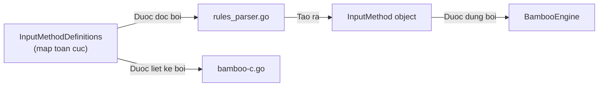
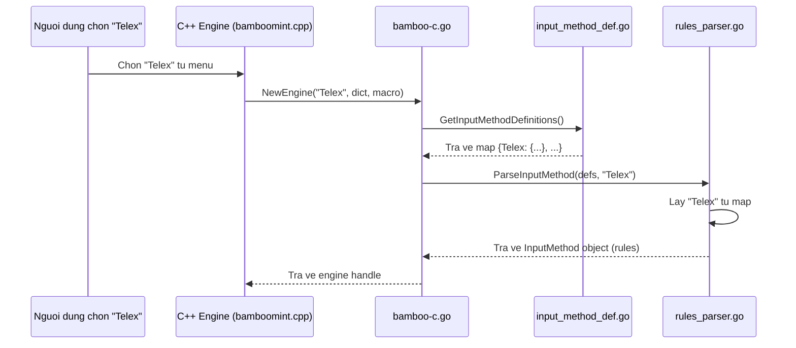

# REQ-017: Chú Thích `input_method_def.go` — Định Nghĩa Kiểu Gõ Tiếng Việt

**Phiên bản:** 1.0
**Ngày cập nhật:** 2026-08-16
**Ngôn ngữ:** Tiếng Việt
**File mục tiêu:** `bamboo/bamboo-core/input_method_def.go`
**Mục đích:** Mô tả chi tiết file định nghĩa kiểu gõ, chuẩn bị chú thích code.

---

## 1. Tổng Quan File

`input_method_def.go` là **nguồn duy nhất** định nghĩa các kiểu gõ tiếng Việt trong toàn bộ `bamboo-core`. File này không chứa logic xử lý phức tạp — chỉ chứa **dữ liệu** (data definition) dưới dạng map.



---

## 2. Nội Dung File Gốc

```go
/*
 * Bamboo - A Vietnamese Input method editor
 * Copyright (C) Luong Thanh Lam <ltlam93@gmail.com>
 * ...
 */

package bamboo

type InputMethodDefinition map[string]string

var InputMethodDefinitions = map[string]InputMethodDefinition{
	"Telex": {
		"z": "XoaDauThanh",
		"s": "DauSac",
		"f": "DauHuyen",
		"r": "DauHoi",
		"x": "DauNga",
		"j": "DauNang",
		"a": "A_Â",
		"e": "E_Ê",
		"o": "O_Ô",
		"w": "UOA_ƯƠĂ",
		"d": "D_Đ",
	},
	"Telex 2": { ... },
	"Telex W": { ... },
}

func GetInputMethodDefinitions() map[string]InputMethodDefinition {
	var t = make(map[string]InputMethodDefinition)
	for k, v := range InputMethodDefinitions {
		t[k] = v
	}
	return t
}
```

---

## 3. Phân Tích Chi Tiết

### 3.1. `InputMethodDefinition` — Kiểu dữ liệu

```go
type InputMethodDefinition map[string]string
```

| Thuộc tính | Giá trị |
|------------|---------|
| **Tên** | `InputMethodDefinition` |
| **Kiểu** | `map[string]string` |
| **Ý nghĩa** | Bản đồ ánh xạ **phím bấm** → **hành động xử lý** |
| **Ví dụ** | `"s" → "DauSac"` nghĩa là: khi người dùng bấm phím `s`, engine sẽ thêm dấu sắc |

**Giải thích các giá trị hành động:**

| Giá trị | Ý nghĩa | Ví dụ phím tắt |
|---------|---------|---------------|
| `XoaDauThanh` | Xóa dấu thanh (trả về chữ không dấu) | `z` → `á` → `a` |
| `DauSac` | Thêm dấu sắc | `as` → `á` |
| `DauHuyen` | Thêm dấu huyền | `af` → `à` |
| `DauHoi` | Thêm dấu hỏi | `ar` → `ả` |
| `DauNga` | Thêm dấu ngã | `ax` → `ã` |
| `DauNang` | Thêm dấu nặng | `aj` → `ạ` |
| `A_Â` | Biến `a` thành `â` | `aa` → `â` |
| `E_Ê` | Biến `e` thành `ê` | `ee` → `ê` |
| `O_Ô` | Biến `o` thành `ô` | `oo` → `ô` |
| `UOA_ƯƠĂ` | Biến `u` → `ư`, `o` → `ơ`, `a` → `ă` | `uw` → `ư`, `ow` → `ơ`, `aw` → `ă` |
| `D_Đ` | Biến `d` thành `đ` | `dd` → `đ` |

### 3.2. `InputMethodDefinitions` — Biến toàn cục

```go
var InputMethodDefinitions = map[string]InputMethodDefinition{
	"Telex": { ... },
	"Telex 2": { ... },
	"Telex W": { ... },
}
```

| Thuộc tính | Giá trị |
|------------|---------|
| **Tên** | `InputMethodDefinitions` (viết hoa chữ I, M, D) |
| **Phạm vi** | `var` → toàn cục trong package `bamboo` |
| **Kiểu** | `map[string]InputMethodDefinition` |
| **Ý nghĩa** | Chứa **tất cả** các kiểu gõ được hỗ trợ |

**Cấu trúc 3 lớp:**

```
InputMethodDefinitions (map[string]InputMethodDefinition)
  └── "Telex" (InputMethodDefinition = map[string]string)
        └── "z" → "XoaDauThanh"
        └── "s" → "DauSac"
        └── ...
  └── "Telex 2" (InputMethodDefinition)
        └── ...
```

**Sự khác nhau giữa 3 kiểu gõ:**

| Kiểu gõ | Đặc điểm riêng | So với Telex |
|---------|---------------|--------------|
| **Telex** | Cơ bản | — |
| **Telex 2** | Thêm `[]{}` cho `ư/ơ` | `]` → `ư`, `[` → `ơ`, `}` → `Ư`, `{` → `Ơ` |
| **Telex W** | `w` tạo thêm `Ư` (chữ hoa) | `UOA_ƯƠĂ__Ư` (có thêm `__Ư`) |

### 3.3. `GetInputMethodDefinitions()` — Hàm sao chép

```go
func GetInputMethodDefinitions() map[string]InputMethodDefinition {
	var t = make(map[string]InputMethodDefinition)
	for k, v := range InputMethodDefinitions {
		t[k] = v
	}
	return t
}
```

| Thuộc tính | Giá trị |
|------------|---------|
| **Input** | Không có (`void`) |
| **Output** | `map[string]InputMethodDefinition` — bản sao của `InputMethodDefinitions` |
| **Logic** | Tạo map mới, copy từng cặp key-value từ biến toàn cục |
| **Mục đích** | Tránh cho caller thay đổi biến toàn cục gốc |

> **Lưu ý:** Đây là **shallow copy** — `t[k] = v` copy giá trị map (vì `InputMethodDefinition` là `map[string]string`, trong Go map là reference type). Nhưng vì các giá trị bên trong (`string`) là immutable, nên về thực tế không có vấn đề.

---

## 4. Luồng Dữ Liệu



---

## 5. Bảng Các Hành Động (Actions) Đầy Đủ

Trong `bamboo-core`, các giá trị string trong `InputMethodDefinition` được `rules_parser.go` dịch thành các hằng số (constants). Dưới đây là bảng ánh xạ:

| Giá trị trong file | Hằng số trong rules_parser | Ý nghĩa |
|-------------------|---------------------------|---------|
| `XoaDauThanh` | `ToneRemove` | Xóa dấu thanh |
| `DauSac` | `ToneAcute` | Dấu sắc |
| `DauHuyen` | `ToneGrave` | Dấu huyền |
| `DauHoi` | `ToneHook` | Dấu hỏi |
| `DauNga` | `ToneTilde` | Dấu ngã |
| `DauNang` | `ToneDot` | Dấu nặng |
| `A_Â` | `ToneHat` + target `a` | Mũ trên `a` → `â` |
| `E_Ê` | `ToneHat` + target `e` | Mũ trên `e` → `ê` |
| `O_Ô` | `ToneHat` + target `o` | Mũ trên `o` → `ô` |
| `UOA_ƯƠĂ` | `ToneCross` + targets `u,o,a` | `w` → `ư/ơ/ă` |
| `D_Đ` | `ToneD` | `d` → `đ` |

---

## 6. Phạm Vi Chú Thích Đề Xuất

### 6.1. Giữ nguyên

```go
/*
 * Bamboo - A Vietnamese Input method editor
 * Copyright (C) Luong Thanh Lam <ltlam93@gmail.com>
 * ...
 */
```

### 6.2. Thêm vào đầu file (sau package declaration)

```go
// =============================================================================
// CHU THICH THEM (Tieng Viet)
// =============================================================================
// File: input_method_def.go
// Muc dich: Dinh nghia cac kieu go tieng Viet (Telex, Telex 2, Telex W).
//
// Kien truc:
//   - InputMethodDefinition: kieu map[string]string, anh xa phim bam -> hanh dong
//   - InputMethodDefinitions: bien toan cuc chua tat ca cac kieu go
//   - GetInputMethodDefinitions(): tra ve ban sao doc lap cua dinh nghia
//
// Luu y:
//   - Day la file DATA, khong chua logic xu ly phuc tap.
//   - Logic xu ly (parse rules, apply transformations) nam trong rules_parser.go.
//   - Cac hanh dong (XoaDauThanh, DauSac, A_Â...) se duoc rules_parser.go
//     dich thanh cac struct Transformation.
// =============================================================================
```

### 6.3. Thêm trước `InputMethodDefinition`

```go
// InputMethodDefinition dinh nghia mot kieu go (vi du: Telex).
// La map[string]string, trong do:
//   - Key:   ky tu phim bam (vi du: "s", "f", "w")
//   - Value: ten hanh dong can thuc hien (vi du: "DauSac", "A_Â")
type InputMethodDefinition map[string]string
```

### 6.4. Thêm trước `InputMethodDefinitions`

```go
// InputMethodDefinitions chua tat ca cac kieu go duoc ho tro.
// Hien tai con 3 kieu: Telex, Telex 2, Telex W.
//
// Moi kieu go la mot InputMethodDefinition, anh xa phim -> hanh dong.
// Vi du: "Telex" -> {"s": "DauSac", "f": "DauHuyen", ...}
//
// Cac hanh dong co the la:
//   - Them dau thanh: DauSac, DauHuyen, DauHoi, DauNga, DauNang
//   - Xoa dau thanh: XoaDauThanh
//   - Them dau mu/moc: A_Â, E_Ê, O_Ô
//   - Them dau mong: UOA_ƯƠĂ (w -> ư/ơ/ă)
//   - Them dau gach ngang: D_Đ (dd -> đ)
var InputMethodDefinitions = map[string]InputMethodDefinition{
```

### 6.5. Thêm comment cho từng entry

```go
	"Telex": {
		"z": "XoaDauThanh", // Phim 'z': xoa dau thanh (vi du: áz -> a)
		"s": "DauSac",      // Phim 's': them dau sac (vi du: as -> á)
		"f": "DauHuyen",    // Phim 'f': them dau huyen (vi du: af -> à)
		"r": "DauHoi",      // Phim 'r': them dau hoi (vi du: ar -> ả)
		"x": "DauNga",      // Phim 'x': them dau ngã (vi du: ax -> ã)
		"j": "DauNang",     // Phim 'j': them dau nang (vi du: aj -> ạ)
		"a": "A_Â",         // Phim 'a': them dau mũ (vi du: aa -> â)
		"e": "E_Ê",         // Phim 'e': them dau mũ (vi du: ee -> ê)
		"o": "O_Ô",         // Phim 'o': them dau mũ (vi du: oo -> ô)
		"w": "UOA_ƯƠĂ",     // Phim 'w': them dau moc (vi du: uw -> ư)
		"d": "D_Đ",         // Phim 'd': them dau gach ngang (vi du: dd -> đ)
	},
```

### 6.6. Thêm trước `GetInputMethodDefinitions`

```go
// GetInputMethodDefinitions tra ve mot ban sao (deep copy) cua
// InputMethodDefinitions.
//
// Input:  khong co
// Output: map[string]InputMethodDefinition — ban sao doc lap
//
// Muc dich: Bao ve bien toan cuc InputMethodDefinitions khoi bi thay doi
// boi caller. rules_parser.go se dung ham nay de lay du lieu.
//
// Luu y: Day la shallow copy vi map trong Go la reference type,
// nhung cac gia tri string ben trong la immutable nen khong co van de.
func GetInputMethodDefinitions() map[string]InputMethodDefinition {
```

## 8. Trang Thai

- [x] Da hoan thanh edit file `input_method_def.go`
- [x] Build thanh cong (khong loi)
- [ ] Commit len dev

---

- [ ] Đồng ý phạm vi chú thích cho `input_method_def.go`
- [ ] Đồng ý format chú thích (giữ copyright, thêm block `//` tiếng Việt)
- [ ] Đồng ý tiến hành edit file `input_method_def.go`
- [ ] Muốn bổ sung/sửa đổi nội dung chú thích
