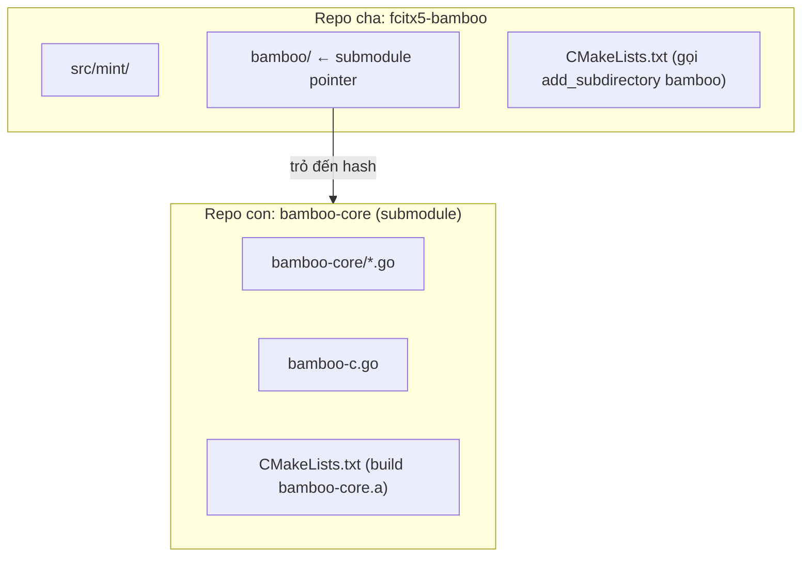

# REQ-018: Điều Tra Bỏ Submodule `bamboo-core` — Nhúng Code Trực Tiếp Vào Repo Cha

**Phiên bản:** 1.0
**Ngày cập nhật:** 2026-08-16
**Ngôn ngữ:** Tiếng Việt
**Mục đích:** Đánh giá việc bỏ submodule `bamboo/bamboo-core` để nhúng code trực tiếp vào repo cha `fcitx5-bamboo`, giúp commit chỉ cần 1 lần duy nhất.

---

## 1. Tại Sao Hiện Tại Phải Commit 2 Lần?



- `bamboo/` là **Git submodule** — repo con độc lập với `.git` riêng.
- Mỗi lần sửa file trong `bamboo-core/` → phải commit **trong submodule** trước, rồi mới commit **trong repo cha** (để cập nhật pointer).

---

## 2. Hiện Trạng Build System

### 2.1. `CMakeLists.txt` (repo cha, gốc)

```cmake
add_subdirectory(po)
add_subdirectory(bamboo)   # ← gọi bamboo/CMakeLists.txt
add_subdirectory(src)
add_subdirectory(data)
```

### 2.2. `bamboo/CMakeLists.txt` (submodule)

```cmake
file(GLOB BAMBOO_CORE_GO_SRCS bamboo-core/*.go)
file(GLOB BAMBOO_GO_SRCS *.go)

add_custom_command(OUTPUT bamboo-core.a bamboo-core.h
    DEPENDS ${BAMBOO_GO_SRCS} ${BAMBOO_CORE_GO_SRCS} go.mod
    WORKING_DIRECTORY ${CMAKE_CURRENT_SOURCE_DIR}
    COMMAND env go build -buildmode=c-archive
                -trimpath
                -o "${CMAKE_CURRENT_BINARY_DIR}/bamboo-core.a"
            ${BAMBOO_GO_SRCS})

add_custom_target(bamboo-core DEPENDS bamboo-core.a)
add_library(Bamboo::Core UNKNOWN IMPORTED GLOBAL)
# ...
```

### 2.3. Cấu trúc thư mục hiện tại

```
fcitx5-bamboo/
├── .gitmodules              # Định nghĩa submodule
├── CMakeLists.txt           # Repo cha: add_subdirectory(bamboo)
├── bamboo/                  # Submodule (có .git riêng)
│   ├── .git/                # Repo con
│   ├── CMakeLists.txt       # Build Go core
│   ├── bamboo-c.go          # CGo wrapper
│   ├── go.mod               # Go module
│   └── bamboo-core/         # Code Go lõi
│       ├── bamboo.go
│       ├── input_method_def.go
│       ├── rules_parser.go
│       └── ...
```

---

## 3. Phương Án: Bỏ Submodule, Nhúng Trực Tiếp

### 3.1. Cấu trúc sau khi nhúng

```
fcitx5-bamboo/
├── CMakeLists.txt           # Vẫn giữ add_subdirectory(bamboo)
├── bamboo/                  # Thư mục thường (KHÔNG còn .git riêng)
│   ├── CMakeLists.txt       # Giữ nguyên
│   ├── bamboo-c.go          # Giữ nguyên
│   ├── go.mod               # Giữ nguyên
│   └── bamboo-core/         # Code Go lõi
│       ├── bamboo.go
│       ├── input_method_def.go
│       └── ...
```

**Thay đổi duy nhất:** `bamboo/` không còn là submodule → không còn `.gitmodules`.

### 3.2. Các file cần sửa

| File | Thay đổi |
|------|----------|
| `.gitmodules` | **Xóa** entry `[submodule "bamboo"]` |
| `.git/config` | **Xóa** section `[submodule "bamboo"]` (nếu có) |
| Không cần sửa `CMakeLists.txt` | Vẫn giữ `add_subdirectory(bamboo)` |
| Không cần sửa `bamboo/CMakeLists.txt` | Vẫn giữ logic build Go |
| Không cần sửa Go code | Import paths không đổi vì vẫn trong `bamboo/` |

### 3.3. Cách thực hiện

```bash
# 1. Xóa submodule khỏi Git
# git rm --cached bamboo

# 2. Xóa .gitmodules entry
# Xóa file .gitmodules hoặc sửa bằng tay

# 3. Xóa thư mục submodule cũ (có .git riêng)
# rm -rf bamboo/

# 4. Tạo lại bamboo/ là thư mục thường, copy code từ submodule cũ
# mkdir -p bamboo/bamboo-core
# cp -r bamboo-old/bamboo-core/* bamboo/bamboo-core/
# cp bamboo-old/bamboo-c.go bamboo/
# cp bamboo-old/CMakeLists.txt bamboo/
# cp bamboo-old/go.mod bamboo/

# 5. Commit 1 lần duy nhất
# git add -A
# git commit -m "Nhúng bamboo-core trực tiếp, bỏ submodule"
```

---

## 4. Đánh Giá Ảnh Hưởng Build

| Hạng mục | Trước (submodule) | Sau (nhúng) | Thay đổi? |
|----------|-------------------|-------------|-----------|
| `add_subdirectory(bamboo)` | ✅ Hoạt động | ✅ Vẫn hoạt động | ❌ Không |
| `file(GLOB bamboo-core/*.go)` | ✅ | ✅ | ❌ Không |
| Go build `-buildmode=c-archive` | ✅ | ✅ | ❌ Không |
| `import "bamboo-core"` | ✅ | ✅ | ❌ Không |
| Số bước commit | 2 lần | **1 lần** | ✅ Giảm |
| `.gitmodules` | Có | **Không** | ✅ Bỏ |
| Đồng bộ upstream | Có thể `git submodule update` | **Không** | ⚠️ Mất |

**Kết luận:** Build system **không thay đổi** về mặt kỹ thuật. Chỉ thay đổi Git structure.

---

## 5. Lợi Ích và Rủi Ro

### Lợi ích

| Lợi ích | Mô tả |
|---------|-------|
| Commit 1 lần | Không còn phiền phức commit submodule + repo cha |
| Không còn `.gitmodules` | Repo gọn hơn |
| Code độc lập hoàn toàn | Không phụ thuộc upstream `BambooEngine/bamboo-core` |

### Rủi ro

| Rủi ro | Mô tả | Mức độ |
|--------|-------|--------|
| Không đồng bộ upstream | Nếu `bamboo-core` gốc có update, không tự động merge | ⭐ Thấp (vì anh đã xóa nhiều kiểu gõ, không cần sync) |
| Mất lịch sử commit của submodule | Lịch sử `bamboo-core` riêng sẽ mất nếu không backup | ⭐ Thấp (lịch sử gốc vẫn còn trên GitHub) |
| Team khác clone repo | Họ không cần `git submodule update --init` nữa | ⭐⭐ Tốt hơn |

---

## 6. Quyết Định Chờ Phê Duyệt

- [ ] Đồng ý bỏ submodule `bamboo-core`
- [ ] Đồng ý nhúng code trực tiếp vào repo cha
- [ ] Chấp nhận không còn đồng bộ với upstream `bamboo-core`
- [ ] Đồng ý tiến hành thực hiện
