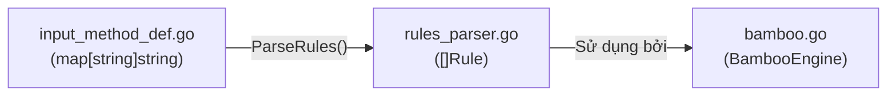

# REQ-019: Chú Thích `rules_parser.go` — Parse Rules Từ Định Nghĩa Kiểu Gõ

**Phiên bản:** 1.0
**Ngày cập nhật:** 2026-08-16
**Ngôn ngữ:** Tiếng Việt
**File mục tiêu:** `bamboo/bamboo-core/rules_parser.go`
**Mục đích:** Mô tả chi tiết logic parse rules từ `input_method_def.go` thành các `Rule` struct để engine sử dụng.

---

## 1. Tổng Quan File

`rules_parser.go` là **"trái tim"** của việc chuyển đổi định nghĩa kiểu gò thành rules có thể thực thi.



**Nhiệm vụ:**
- Đọc chuỗi như `"UOA_ƯƠĂ"` → tạo ra nhiều `Rule` struct tương ứng.
- Đọc `"DauSac"` → tạo `Rule` với `EffectType = ToneTransformation`.
- Đọc `"__ư"` → tạo `Rule` với `EffectType = Appending`.

---

## 2. Các Kiểu Dữ Liệu Chính

### 2.1. `Tone` — Thanh điệu

```go
type Tone uint8

const (
	ToneNone  Tone = iota // Không dấu
	ToneGrave Tone = iota // Dấu huyền (`)
	ToneAcute Tone = iota // Dấu sắc (´)
	ToneHook  Tone = iota // Dấu hỏi (>)
	ToneTilde Tone = iota // Dấu ngã (~)
	ToneDot   Tone = iota // Dấu nặng (.)
)
```

| Tên | Giá trị | Ký hiệu | Ví dụ |
|-----|---------|---------|-------|
| `ToneNone` | 0 | Không dấu | `a` |
| `ToneGrave` | 1 | Huyền | `à` |
| `ToneAcute` | 2 | Sắc | `á` |
| `ToneHook` | 3 | Hỏi | `ả` |
| `ToneTilde` | 4 | Ngã | `ã` |
| `ToneDot` | 5 | Nặng | `ạ` |

### 2.2. `Mark` — Dấu câu/mũ

```go
type Mark uint8

const (
	MarkNone  Mark = iota // Không có dấu mũ/móc
	MarkHat   Mark = iota // Dấu mũ (â, ê, ô)
	MarkBreve Mark = iota // Dấu bằng/móc ngược (ă)
	MarkHorn  Mark = iota // Dấu móc (ư, ơ)
	MarkDash  Mark = iota // Dấu gạch ngang (đ)
	MarkRaw   Mark = iota // Không xử lý đặc biệt
)
```

### 2.3. `EffectType` — Loại hiệu ứng

```go
type EffectType int

const (
	Appending          EffectType = iota // Thêm ký tự (không biến đổi)
	MarkTransformation EffectType = iota // Biến đổi dấu mũ/móc
	ToneTransformation EffectType = iota // Biến đổi thanh điệu
	Replacing          EffectType = iota // Thay thế ký tự
)
```

### 2.4. `Rule` — Một rule đơn lẻ

```go
type Rule struct {
	Key           rune         // Phím kích hoạt (ví dụ: 's', 'w')
	Effect        uint8        // Tone hoặc Mark (tùy EffectType)
	EffectType    EffectType   // Loại hiệu ứng
	EffectOn      rune         // Ký tự bị tác động (ví dụ: 'a' trong "as")
	Result        rune         // Ký tự kết quả (ví dụ: 'á')
	AppendedRules []Rule       // Rules phụ (cho Telex 2/W)
}
```

---

## 3. Luồng Parse Chi Tiết

### 3.1. Từ chuỗi đến Rule — Ví dụ cụ thể

**Ví dụ 1:** `"s": "DauSac"` trong `input_method_def.go`

```
input:  key='s', line="DauSac"
       |
       v
ParseRules('s', "DauSac")
       |
       +--> tones["DauSac"] = ToneAcute (2)
       |
       v
Rule{Key:'s', EffectType:ToneTransformation, Effect:2}
```

**Ví dụ 2:** `"w": "UOA_ƯƠĂ"` trong `input_method_def.go`

```
input:  key='w', line="UOA_ƯƠĂ"
       |
       v
ParseRules('w', "UOA_ƯƠĂ")
       |
       +--> Không match tones map
       |
       v
ParseTonelessRules('w', "UOA_ƯƠĂ")
       |
       +--> Regex: ([a-zA-Z]+)_(\p{L}+)
       |     Group 1: "UOA" (effectiveOns)
       |     Group 2: "ƯƠĂ" (results)
       |
       v
ParseToneLessRule('w', 'U', 'Ư', MarkHorn)
ParseToneLessRule('w', 'O', 'Ơ', MarkHorn)
ParseToneLessRule('w', 'A', 'Ă', MarkBreve)
       |
       v
Tạo nhiều Rule cho từng tone:
  Rule{Key:'w', EffectOn:'u', Result:'ư', Effect:MarkHorn} // ToneNone
  Rule{Key:'w', EffectOn:'ù', Result:'ứ', Effect:MarkHorn} // ToneGrave
  Rule{Key:'w', EffectOn:'ú', Result:'ứ', Effect:MarkHorn} // ToneAcute
  ... (6 tone × 3 ký tự = 18 rules)
```

### 3.2. Regex `regDsl`

```go
var regDsl = regexp.MustCompile(`([a-zA-Z]+)_(\p{L}+)([_\p{L}]*)`)
```

| Group | Mô tả | Ví dụ với `"UOA_ƯƠĂ"` |
|-------|-------|---------------------|
| `([a-zA-Z]+)` | Các chữ cái Latin (không dấu) | `"UOA"` |
| `_(\p{L}+)` | Dấu gạch dưới + chữ Unicode | `"_ƯƠĂ"` → group là `"ƯƠĂ"` |
| `([_\p{L}]*)` | Phần còn lại (optional) | `""` (rỗng) |

**Ví dụ với `"UOA_ƯƠĂ__Ư"`:**
- Group 1: `"UOA"`
- Group 2: `"ƯƠĂ"`
- Group 3: `"__Ư"`

### 3.3. Regex `regDslAppending`

```go
var regDslAppending = regexp.MustCompile(`(_?)_(\p{L}+)`)
```

Dùng cho Telex 2/W: `"__ư"`, `"_Ư"`, v.v.

| Chuỗi | Match? | Group 1 | Group 2 | Ý nghĩa |
|-------|--------|---------|---------|---------|
| `"__ư"` | ✅ | `"_"` | `"ư"` | Append chữ thường ư |
| `"_Ư"` | ✅ | `""` | `"Ư"` | Append chữ hoa Ư |

---

## 4. Các Hàm Chính

### 4.1. `ParseInputMethod(imDef, imName)` — Entry point

**Input:**
- `imDef`: `map[string]InputMethodDefinition` từ `GetInputMethodDefinitions()`
- `imName`: Tên kiểu gò (ví dụ: `"Telex"`)

**Output:** `InputMethod` struct chứa toàn bộ rules đã parse.

### 4.2. `parseInputMethods(imDef)` — Parse toàn bộ

Lặp qua tất cả kiểu gò trong `imDef`, tạo `InputMethod` cho mỗi kiểu.

### 4.3. `ParseRules(key, line)` — Phân loại rule

| `line` | Hành động | Ví dụ |
|--------|-----------|-------|
| Match `tones` map | Tạo `ToneTransformation` | `"DauSac"` → tone |
| Không match | Gọi `ParseTonelessRules()` | `"UOA_ƯƠĂ"` → mark |

### 4.4. `ParseTonelessRules(key, line)` — Parse rule không có tone

Sử dụng regex `regDsl` để tách chuỗi thành các phần.

### 4.5. `ParseToneLessRule(key, effectiveOn, result, effect)` — Tạo rules chi tiết

**Logic quan trọng:** Với mỗi ký tự trong `getMarkFamily(effectiveOn)`:
- Nếu ký tự = result → tạo 1 rule `MarkTransformation` đơn giản.
- Nếu ký tự là nguyên âm → tạo **6 rules** (1 cho mỗi tone).
- Nếu ký tự khác → tạo 1 rule `MarkTransformation`.

**Tại sao tạo 6 rules cho nguyên âm?**

Vì khi người dùng gõ `"uw"` → `"ư"`, có thể sau đó thêm dấu thanh → `"ứ"`. Engine cần biết rule nào áp dụng cho từng trường hợp:

| Trạng thái | Ký tự trước | Ký tự sau |
|------------|-------------|-----------|
| Không dấu | `u` | `ư` |
| Huyền | `ù` | `ừ` |
| Sắc | `ú` | `ứ` |
| Hỏi | `ủ` | `ử` |
| Ngã | `ũ` | `ữ` |
| Nặng | `ụ` | `ự` |

### 4.6. `getAppendingRule(key, value)` — Parse rule append

Tạo rule `Appending` cho Telex 2/W (thêm ký tự mà không biến đổi).

---

## 5. Ví Dụ Tổng Hợp: Parse `"Telex"`

```
"Telex": {
    "z": "XoaDauThanh"  →  1 Rule (ToneTransformation, ToneNone)
    "s": "DauSac"       →  1 Rule (ToneTransformation, ToneAcute)
    "f": "DauHuyen"     →  1 Rule (ToneTransformation, ToneGrave)
    "r": "DauHoi"       →  1 Rule (ToneTransformation, ToneHook)
    "x": "DauNga"       →  1 Rule (ToneTransformation, ToneTilde)
    "j": "DauNang"      →  1 Rule (ToneTransformation, ToneDot)
    "a": "A_Â"          →  6 Rules (MarkHat × 6 tone)
    "e": "E_Ê"          →  6 Rules (MarkHat × 6 tone)
    "o": "O_Ô"          →  6 Rules (MarkHat × 6 tone)
    "w": "UOA_ƯƠĂ"      →  18 Rules (MarkHorn/MarkBreve × 6 tone × 3 ký tự)
    "d": "D_Đ"          →  1 Rule (MarkDash)
}

Tổng cộng: ~50 rules cho kiểu gò Telex
```

---

## 6. Phạm Vi Chú Thích Đề Xuất

### Giữ nguyên
- Header copyright
- Các hàm getter/setter đơn giản (`SetTone`, `GetTone`, `SetMark`, `GetMark`)

### Chú thích chi tiết
- `Rule` struct — giải thích từng field
- `InputMethod` struct — ý nghĩa từng field
- `ParseInputMethod()` — entry point
- `parseInputMethods()` — luồng parse toàn bộ
- `ParseRules()` — phân loại rule
- `ParseTonelessRules()` — regex và logic tách chuỗi
- `ParseToneLessRule()` — logic tạo 6 rules cho nguyên âm
- `getAppendingRule()` — parse append

---

## 7. Checklist Chờ Phê Duyệt

- [x] Đồng ý phạm vi chú thích cho `rules_parser.go`
- [x] Đồng ý giải thích regex `regDsl` và `regDslAppending`
- [x] Đồng ý giải thích tại sao tạo 6 rules cho nguyên âm
- [x] Đồng ý tiến hành edit file `rules_parser.go`
