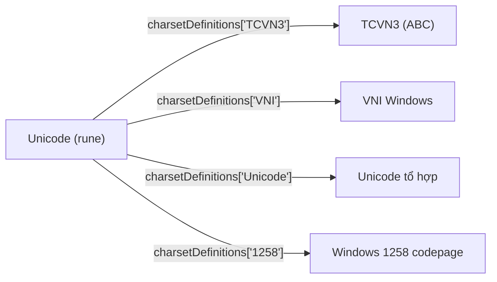
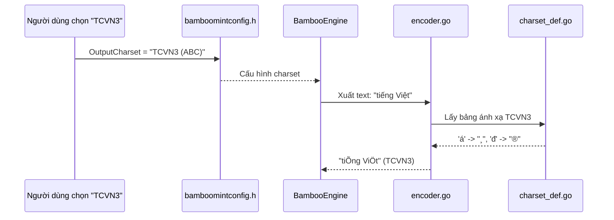

# REQ-020: Chú Thích `charset_def.go` — Định Nghĩa Các Bảng Mã Charset

**Phiên bản:** 1.0
**Ngày cập nhật:** 2026-08-16
**Ngôn ngữ:** Tiếng Việt
**File mục tiêu:** `bamboo/bamboo-core/charset_def.go`
**Mục đích:** Mô tả chi tiết file chứa các bảng ánh xạ ký tự tiếng Việt sang các charset khác nhau.

---

## 1. Tổng Quan File

`charset_def.go` là file **dữ liệu** (data file) chứa các bảng ánh xạ ký tự tiếng Việt từ Unicode sang các bảng mã (charset) khác nhau.



**Nhiệm vụ:**
- Cho phép engine xuất text tiếng Việt theo các bảng mã khác nhau.
- Được sử dụng bởi `encoder.go` để mã hóa output theo charset người dùng chọn.

---

## 2. Cấu Trúc Dữ Liệu

```go
type charsetDefinition map[rune]string

var charsetDefinitions = map[string]charsetDefinition{
    "TCVN3 (ABC)":          { 'đ': "®", 'â': "©", ... },
    "VNI Windows":          { 'đ': "ñ", 'â': "aâ", ... },
    "Unicode tổ hợp":      { 'đ': "đ", 'á': "á", ... },
    "Windows 1258 codepage": { 'đ': "ð", 'â': "â", ... },
    // ... thêm nhiều charset khác
}
```

| Thành phần | Kiểu | Ý nghĩa |
|------------|------|---------|
| `charsetDefinition` | `map[rune]string` | Ánh xạ một ký tự Unicode (rune) → chuỗi ký tự trong charset đích |
| `charsetDefinitions` | `map[string]charsetDefinition` | Tập hợp tất cả các charset được hỗ trợ |

---

## 3. Các Charset Được Hỗ Trợ

### 3.1. `"TCVN3 (ABC)"` — Bảng mã TCVN3 (cũ)

| Ký tự Unicode | TCVN3 | Ghi chú |
|---------------|-------|---------|
| `'đ'` | `"®"` | Chữ đ viết thường |
| `'â'` | `"©"` | Â có mũ |
| `'ă'` | `"¨"` | Ă có móc |
| `'á'` | `"¸"` | A sắc |
| `'à'` | `"µ"` | A huyền |
| ... | ... | ... |

> **Lưu ý:** Đây là bảng mã cũ của Việt Nam, sử dụng trong các phần mềm DOS/Windows cũ.

### 3.2. `"VNI Windows"` — Bảng mã VNI

| Ký tự Unicode | VNI | Ghi chú |
|---------------|-----|---------|
| `'đ'` | `"ñ"` | Chữ đ viết thường |
| `'â'` | `"aâ"` | A + dấu mũ |
| `'á'` | `"aù"` | A + dấu sắc |
| ... | ... | ... |

> **Đặc điểm:** Mỗi ký tự có dấu được biểu diễn bằng chữ gốc + dấu riêng.

### 3.3. `"Unicode tổ hợp"` — Unicode Decomposed (NFD)

| Ký tự Unicode | Tổ hợp | Ghi chú |
|---------------|--------|---------|
| `'á'` | `"á"` | Chữ `a` + dấu sắc tách rời (U+0301) |
| `'à'` | `"à"` | Chữ `a` + dấu huyền tách rời (U+0300) |
| `'đ'` | `"đ"` | Không đổi (đã là đơn vị) |
| ... | ... | ... |

> **Khác biệt quan trọng:** Unicode tổ hợp (NFD) tách chữ cái và dấu thanh thành 2 codepoint riêng biệt, trong khi Unicode chuẩn (NFC) gộp thành 1 codepoint.

### 3.4. `"Windows 1258 codepage"` — Codepage Windows 1258

| Ký tự Unicode | CP1258 | Ghi chú |
|---------------|--------|---------|
| `'đ'` | `"ð"` | Dấu gạch ngang (ð = eth) |
| `'á'` | `"aì"` | A + dấu sắc trong CP1258 |
| ... | ... | ... |

---

## 4. Số Lượng Ký Tự

File chứa khoảng **2000+ dòng**, ánh xạ đầy đủ:
- Chữ cái tiếng Việt có dấu (viết thường và hoa)
- Các biến thể: â, ă, ê, ô, ơ, ư, đ
- Các dấu thanh: sắc, huyền, hỏi, ngã, nặng

Tổng cộng có **~140 ký tự tiếng Việt** được ánh xạ cho mỗi charset.

---

## 5. Luồng Sử Dụng



---

## 6. Phạm Vi Chú Thích Đề Xuất

### Giữ nguyên
- Header copyright
- Dữ liệu ánh xạ (không chú thích từng dòng vì quá nhiều)

### Chú thích
- `charsetDefinition` type — giải thích ý nghĩa
- `charsetDefinitions` variable — giải thích cấu trúc và liệt kê các charset
- Thêm comment cho từng section charset (TCVN3, VNI, Unicode tổ hợp, CP1258)

---

## 7. Checklist Chờ Phê Duyệt

- [ ] Đồng ý phạm vi chú thích cho `charset_def.go`
- [ ] Đồng ý không chú thích từng dòng dữ liệu (vì file quá dài)
- [ ] Đồng ý chú thích cho từng section charset
- [ ] Đồng ý tiến hành edit file `charset_def.go`
