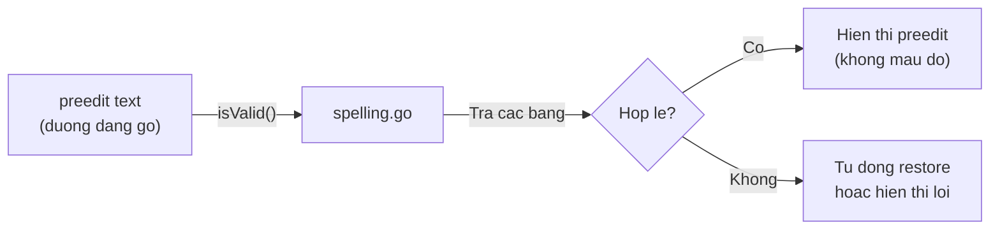
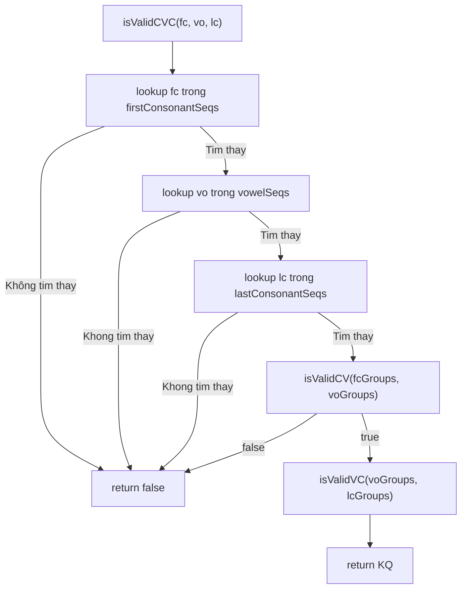

# REQ-021: Chú Thích `spelling.go` — Kiểm Tra Chính Tả Tiếng Việt

**Phiên bản:** 1.0
**Ngày cập nhật:** 2026-08-16
**Ngôn ngữ:** Tiếng Việt
**File mục tiêu:** `bamboo/bamboo-core/spelling.go`
**Mục đích:** Mô tả chi tiết logic kiểm tra chính tả tiếng Việt (spell check) trong `bamboo-core`.

---

## 1. Tổng Quan File

`spelling.go` là **bộ kiểm tra chính tả** (spell checker) cho tiếng Việt. Nó xác định xem một âm tiết (syllable) có hợp lệ trong tiếng Việt hay không.



**Nguyên tắc kiểm tra:**
- Tiếng Việt có cấu trúc âm tiết: **Phụ âm đầu (C) + Nguyên âm (V) + Phụ âm cuối (C)**
- Không phải tổ hợp nào cũng hợp lệ (ví dụ: "kỳ" không hợp lệ, "kỳ" là sai chính tả...)
- File này chứa các bảng cho phép các tổ hợp hợp lệ.

---

## 2. Cấu Trúc Dữ Liệu

### 2.1. Các nhóm phụ âm đầu

```go
var firstConsonantSeqs = []string{
    "b d đ g gh m n nh p ph r s t tr v z",  // Nhóm 0: đơn giản
    "c h k kh qu th",                        // Nhóm 1: k + h
    "ch gi l ng ngh x",                      // Nhóm 2: phức tạp
    "đ l",                                   // Nhóm 3: đặc biệt
    "h",                                     // Nhóm 4: riêng lẻ
}
```

**Cách nhóm:** Các phụ âm được nhóm theo tính chất âm vị học. Các phụ âm trong cùng một nhóm có khả năng đi với các nhóm nguyên âm tương tự.

| Nhóm | Phụ âm | Ví dụ từ |
|------|--------|----------|
| 0 | b, d, đ, g, gh, m, n, nh, p, ph, r, s, t, tr, v, z | ba, da, đi, ga, ghi, ma, na, nha... |
| 1 | c, h, k, kh, qu, th | ca, ha, ka, kha, qua, tha... |
| 2 | ch, gi, l, ng, ngh, x | cha, gia, la, nga, nghỉ, xa... |
| 3 | đ, l | đã, là... (trường hợp đặc biệt) |
| 4 | h | hỏi, hè... (đứng trước một số nguyên âm đặc biệt) |

### 2.2. Các nhóm nguyên âm

```go
var vowelSeqs = []string{
    "ê i ua uê uy y",                       // Nhóm 0
    "a iê oa uyê yê",                       // Nhóm 1
    "â ă e o oo ô ơ oe u ư uâ uô ươ",      // Nhóm 2
    "oă",                                   // Nhóm 3
    "uơ",                                   // Nhóm 4
    "ai ao au âu ay ây eo êu ia iêu iu oai oao oay oeo oi ôi ơi ưa uây ui ưi uôi ươi ươu ưu uya uyu yêu", // Nhóm 5
    "ă",                                    // Nhóm 6
    "i",                                    // Nhóm 7
}
```

**Cách nhóm:**

| Nhóm | Nguyên âm | Đặc điểm |
|------|-----------|----------|
| 0 | ê, i, ua, uê, uy, y | Ngắn hoặc có y/i |
| 1 | a, iê, oa, uyê, yê | Dài, có a hoặc yê |
| 2 | â, ă, e, o, oo, ô, ơ, oe, u, ư, uâ, uô, ươ | Đa dạng |
| 3 | oă | Nguyên âm 3 âm tố (oă) |
| 4 | uơ | Nguyên âm đặc biệt (uơ) |
| 5 | ai, ao, au... | Nguyên âm đôi/3 có dấu (diphthong/triphthong) |
| 6 | ă | Riêng lẻ |
| 7 | i | Riêng lẻ |

### 2.3. Các nhóm phụ âm cuối

```go
var lastConsonantSeqs = []string{
    "ch nh",   // Nhóm 0
    "c ng",    // Nhóm 1
    "m n p t", // Nhóm 2
    "k",       // Nhóm 3
    "c",       // Nhóm 4
}
```

| Nhóm | Phụ âm cuối | Ví dụ |
|------|-------------|-------|
| 0 | ch, nh | tích, tình |
| 1 | c, ng | tắc, tăng |
| 2 | m, n, p, t | tắm, tàn, tập, tất |
| 3 | k | yếk (ít dùng) |
| 4 | c | tốc (đặc biệt) |

---

## 3. Ma Trận Kiểm Tra

### 3.1. `cvMatrix` — Phụ âm đầu + Nguyên âm

```go
var cvMatrix = [][]int{
    {0, 1, 2, 5},       // Nhóm phụ âm đầu 0 đi với nguyên âm nhóm 0,1,2,5
    {0, 1, 2, 3, 4, 5}, // Nhóm phụ âm đầu 1 đi với nhiều nguyên âm hơn
    {0, 1, 2, 3, 5},    // Nhóm phụ âm đầu 2
    {6},                // Nhóm phụ âm đầu 3 chỉ đi với nguyên âm 6
    {7},                // Nhóm phụ âm đầu 4 chỉ đi với nguyên âm 7
}
```

**Ví dụ:**
- Phụ âm nhóm 0 (b, d, đ...) → nguyên âm nhóm 0,1,2,5
  - `ba` ✓ (a thuộc nhóm 1)
  - `bê` ✓ (ê thuộc nhóm 0)
  - `bă` ✗ (ă thuộc nhóm 6, không trong danh sách)
- Phụ âm nhóm 3 (đ, l) → chỉ nguyên âm nhóm 6 (ă)
  - `đă` ✓ (đồng ý, "đăng" là hợp lệ)
- Phụ âm nhóm 4 (h) → chỉ nguyên âm nhóm 7 (i)
  - `hi` ✓ (hỉ, hi...) 

### 3.2. `vcMatrix` — Nguyên âm + Phụ âm cuối

```go
var vcMatrix = [][]int{
    {0, 2},       // Nguyên âm nhóm 0 → phụ âm cuối nhóm 0,2
    {0, 1, 2},    // Nguyên âm nhóm 1 → nhiều phụ âm cuối hơn
    {1, 2},       // Nguyên âm nhóm 2 → phụ âm cuối 1,2
    {1, 2},       // Nguyên âm nhóm 3
    {},           // Nguyên âm nhóm 4 → không có phụ âm cuối
    {},           // Nguyên âm nhóm 5 → không có phụ âm cuối
    {3},          // Nguyên âm nhóm 6 → phụ âm cuối 3
    {4},          // Nguyên âm nhóm 7 → phụ âm cuối 4
}
```

**Ví dụ:**
- Nguyên âm nhóm 4 (uơ) → không có phụ âm cuối
  - "hươ" + "ng" → `hương` ✓ nhưng uơ ở đây là một phần của ươ
- Nguyên âm nhóm 5 (diphthong: ai, ao...) → không có phụ âm cuối
  - `mai` ✓, `ma` + không có phụ âm cuối. `ma` + `y` → `may` ✓

---

## 4. Các Hàm Chính

### 4.1. `lookup()` — Tìm nhóm của một chuỗi

**Input:**
- `seq`: một trong `firstConsonantSeqs`, `vowelSeqs`, hoặc `lastConsonantSeqs`
- `input`: chuỗi cần tìm (ví dụ: "tr", "ươ", "ng")
- `inputIsFull`: có phải chuỗi đầy đủ không
- `inputIsComplete`: có phải đã nhập xong không

**Output:** `[]int` — các chỉ số nhóm mà `input` thuộc về.

**Logic:**
1. Duyệt qua từng nhóm trong `seq`
2. Tách nhóm thành các từ riêng lẻ (cách nhau bởi dấu cách)
3. So sánh `input` với từng từ
4. Nếu khớp → trả về chỉ số nhóm đó

**Ví dụ:**
```go
lookup(firstConsonantSeqs, "tr", true, true) → [0]   // "tr" trong nhóm 0
lookup(vowelSeqs, "ươ", true, true)          → [2]   // "ươ" trong nhóm 2
```

### 4.2. `isValidCVC()` — Kiểm tra âm tiết đầy đủ

**Input:**
- `fc`: phụ âm đầu (ví dụ: "tr")
- `vo`: nguyên âm (ví dụ: "ươ")
- `lc`: phụ âm cuối (ví dụ: "ng")
- `inputIsFullComplete`: người dùng đã nhập xong chưa

**Output:** `bool` — âm tiết có hợp lệ không.

**Luồng kiểm tra:**


**Ví dụ:**
```go
isValidCVC("tr", "ươ", "ng", true) → true   // "trường" là hợp lệ
isValidCVC("k", "ỳ", "", true)     → false  // "kỳ" không hợp lệ
isValidCVC("n", "g", "h", true)    → false  // "ngh" không đủ (thiếu nguyên âm)
```

### 4.3. `isValidCV()` — Kiểm tra phụ âm đầu + nguyên âm

**Logic:** Duyệt `cvMatrix` để xem nhóm phụ âm đầu có đi với nhóm nguyên âm không.

**Ví dụ:**
- Nhóm phụ âm 0 (b, d, đ...) + nhóm nguyên âm 1 (a, iê...) → ✓ (vì cvMatrix[0] chứa 1)
- Nhóm phụ âm 3 (đ, l) + nhóm nguyên âm 0 (ê, i...) → ✗ (vì cvMatrix[3] chỉ chứa 6)

### 4.4. `isValidVC()` — Kiểm tra nguyên âm + phụ âm cuối

**Logic:** Duyệt `vcMatrix` để xem nhóm nguyên âm có đi với nhóm phụ âm cuối không.

**Ví dụ:**
- Nguyên âm nhóm 0 (ê, i...) + phụ âm cuối 0 (ch, nh) → ✓
- Nguyên âm nhóm 5 (diphthong: ai, ao...) + phụ âm cuối 0 → ✗ (vì vcMatrix[5] rỗng)

---

## 5. Phạm Vi Chú Thích Đề Xuất

### Giữ nguyên
- Header copyright
- Các hàm `isValidCV`, `isValidVC` đơn giản (3 dòng)

### Chú thích chi tiết
- `firstConsonantSeqs` — giải thích cách nhóm
- `vowelSeqs` — giải thích cách nhóm
- `lastConsonantSeqs` — giải thích
- `cvMatrix` — giải thích ma trận, ví dụ cụ thể
- `vcMatrix` — giải thích ma trận, ví dụ cụ thể
- `lookup()` — input/output, logic
- `isValidCVC()` — luồng kiểm tra, các trường hợp

---

## 6. Checklist Chờ Phê Duyệt

- [ ] Đồng ý phạm vi chú thích cho `spelling.go`
- [ ] Đồng ý giải thích ma trận `cvMatrix` và `vcMatrix` với ví dụ
- [ ] Đồng ý chú thích luồng `isValidCVC()`
- [ ] Đồng ý tiến hành edit file `spelling.go`
