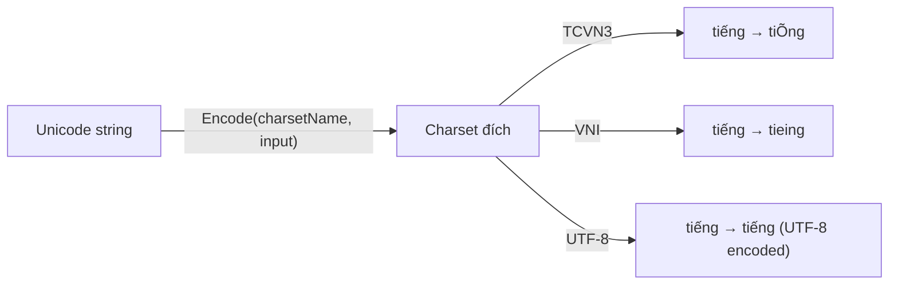
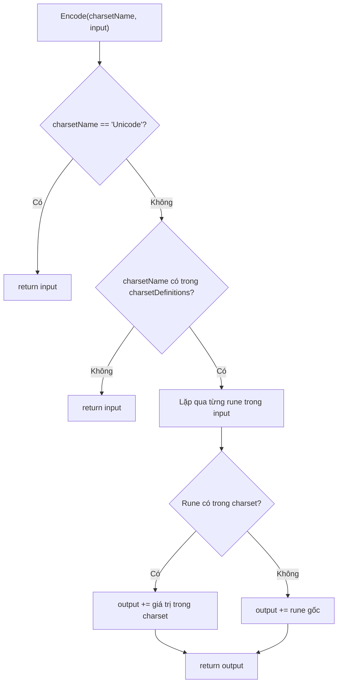
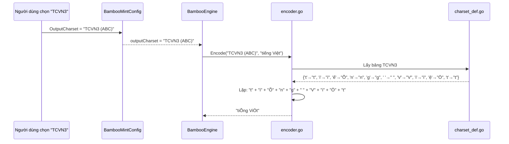

# REQ-022: Chú Thích `encoder.go` — Mã Hóa Output Theo Charset

**Phiên bản:** 1.0
**Ngày cập nhật:** 2026-08-16
**Ngôn ngữ:** Tiếng Việt
**File mục tiêu:** `bamboo/bamboo-core/encoder.go`
**Mục đích:** Mô tả chi tiết logic mã hóa text tiếng Việt từ Unicode sang các charset khác nhau.

---

## 1. Tổng Quan File

`encoder.go` là file **đơn giản** nhất trong `bamboo-core`. Nó chuyển đổi text Unicode thành các bảng mã khác nhau (TCVN3, VNI, UTF-8, v.v.).



---

## 2. Các Hàm Chính

### 2.1. `UNICODE` — Hằng số

```go
const UNICODE = "Unicode"
```

Hằng số định danh cho Unicode. Đây là charset mặc định (không cần chuyển đổi).

### 2.2. `Encode(charsetName, input)` — Mã hóa chính

**Input:**
- `charsetName`: Tên charset đích (ví dụ: "TCVN3 (ABC)", "VNI Windows", "Unicode")
- `input`: Chuỗi Unicode đầu vào

**Output:** Chuỗi đã được mã hóa theo charset đích.

**Logic:**



**Ví dụ:**

| charsetName | input | output | Ghi chú |
|-------------|-------|--------|---------|
| `"Unicode"` | `"tiếng"` | `"tiếng"` | Không đổi |
| `"TCVN3 (ABC)"` | `"tiếng"` | `"tiÕng"` | 'ế' → "Õ", 'n' giữ nguyên |
| `"VNI Windows"` | `"tiếng"` | `"tieing"` | 'ế' → "eù", ... |
| `"Không tồn tại"` | `"tiếng"` | `"tiếng"` | Fallback về input |

### 2.3. `GetCharsetNames()` — Lấy danh sách charset

**Input:** Không có.

**Output:** `[]string` — Danh sách tất cả charset được hỗ trợ.

**Logic:**
1. Thêm `"Unicode"` vào đầu danh sách.
2. Lặp qua tất cả keys trong `charsetDefinitions`.
3. Trả về danh sách đã sắp xếp (theo thứ tự map iteration).

**Ví dụ output:** `["Unicode", "TCVN3 (ABC)", "UTF-8", "Unicode tổ hợp", "VNI Windows", "VIQR", "Windows 1258 codepage"]`

---

## 3. Luồng Dữ Liệu



---

## 4. Phạm Vi Chú Thích Đề Xuất

### Giữ nguyên
- Header copyright

### Chú thích
- `UNICODE` constant — ý nghĩa
- `Encode()` — input/output, logic, ví dụ
- `GetCharsetNames()` — input/output, logic

---

## 5. Checklist Chờ Phê Duyệt

- [ ] Đồng ý phạm vi chú thích cho `encoder.go`
- [ ] Đồng ý chú thích cho Encode() và GetCharsetNames()
- [ ] Đồng ý tiến hành edit file `encoder.go`
