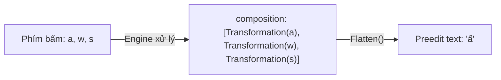
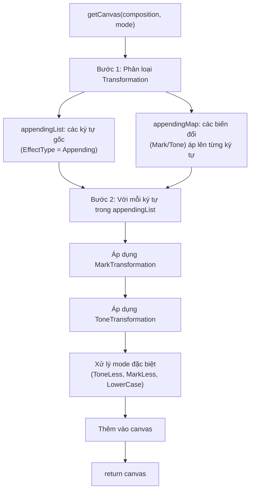

# REQ-023: Chú Thích `flattener.go` — Flatten Composition Thành Chuỗi Hiển Thị

**Phiên bản:** 1.0
**Ngày cập nhật:** 2026-08-16
**Ngôn ngữ:** Tiếng Việt
**File mục tiêu:** `bamboo/bamboo-core/flattener.go`
**Mục đích:** Mô tả chi tiết logic chuyển đổi danh sách các Transformation thành chuỗi ký tự hiển thị (preedit text).

---

## 1. Tổng Quan File

`flattener.go` chuyển đổi **composition** (danh sách các `Transformation` - biến đổi tích lũy từ mỗi phím bấm) thành chuỗi ký tự cuối cùng người dùng nhìn thấy (preedit text).



**Ví dụ thực tế:**

| Phím bấm | Composition | Flatten |
|----------|-------------|---------|
| `a` | `[{a}]` | `"a"` |
| `aw` | `[{a}, {w→ư}]` | `"ư"` |
| `aws` | `[{a}, {w→ư}, {s→sắc}]` | `"ứ"` |

---

## 2. Các Mode Liên Quan

File sử dụng các `Mode` để điều khiển cách hiển thị:

| Mode | Ý nghĩa | Kết quả |
|------|---------|---------|
| `EnglishMode` | Hiển thị phím gốc | `aw` → `"aw"` (không biến đổi) |
| `ToneLess` | Bỏ dấu thanh | `ấ` → `"â"` |
| `MarkLess` | Bỏ dấu mũ/móc | `ấ` → `"á"` |
| `LowerCase` | Chuyển thường | `Ấ` → `"ấ"` |

---

## 3. Các Hàm Chính

### 3.1. `Flatten(composition, mode)` — Entry point

**Input:**
- `composition`: `[]*Transformation` — danh sách các biến đổi từ mỗi phím bấm
- `mode`: `Mode` — chế độ hiển thị

**Output:** `string` — chuỗi hiển thị cuối cùng

**Logic:** Chỉ đơn giản gọi `getCanvas()` và chuyển `[]rune` thành `string`.

### 3.2. `getCanvas(composition, mode)` — Logic chính

**Luồng xử lý:**



**Bước 1 — Phân loại:**

```go
// composition = [Trans(a), Trans(w), Trans(s)]

// appendingList: Chứa các ký tự gốc (Appending)
// appendingList = [Trans(a), Trans(w)]
//   (Trans(s) là ToneTransformation, không phải Appending)

// appendingMap: Ánh xạ từ appendingTrans → các biến đổi tác động lên nó
// appendingMap[Trans(a)] = [Trans(w), Trans(s)]
//   (w tác động lên a: a→ư, s tác động lên ư: ư→ứ)
```

**Bước 2 — Áp dụng biến đổi:**

Với mỗi ký tự trong `appendingList`:

| Thứ tự | Hành động | Ví dụ (aws → ấ) |
|--------|-----------|-----------------|
| 1 | Lấy ký tự gốc | `a` → `EffectOn = 'a'` |
| 2 | Áp MarkTransformation (nếu có) | `a` + mark(Horn) → `ư` |
| 3 | Áp ToneTransformation (nếu có) | `ư` + tone(Acute) → `ứ` |
| 4 | Xử lý ToneLess (nếu mode) | Bỏ dấu thanh |
| 5 | Xử lý MarkLess (nếu mode) | Bỏ dấu mũ/móc |
| 6 | Xử lý LowerCase/UpperCase | Đổi hoa/thường |
| 7 | Thêm vào canvas | `canvas = ['ứ']` |

**Xử lý Virtual Key:**

```go
if trans.Rule.Key == 0 {
    // ignore virtual key
    continue
}
```

Virtual key (phím ảo, `Key == 0`) được bỏ qua — không hiển thị trong output.

---

## 4. Ví Dụ Chi Tiết

### Ví dụ 1: Gõ "aws" → "ứ"

```
Phím:    a     w       s
         │     │       │
Trans:   a    w→ư     s→sắc
                │       │
                └─ tác động lên 'a'
                        └─ tác động lên kết quả của w

appendingList = [a, w]          // a và w là Appending
appendingMap[a] = [w, s]        // w và s tác động lên a

Xử lý a:
  - EffectOn ban đầu: 'a'
  - Áp w (MarkTransformation, Horn): AddMarkToChar('a', Horn) → 'ư'
  - Áp s (ToneTransformation, Acute): AddToneToChar('ư', Acute) → 'ứ'
  - canvas = ['ứ']

Flatten → "ứ"
```

### Ví dụ 2: EnglishMode

```
Phím: a, w, s

appendingList = [a, w, s]       // Tất cả đều là Appending trong EnglishMode
appendingMap = {}               // Không có biến đổi nào

Xử lý:
  - a → chr = Rule.Key = 'a'
  - w → chr = Rule.Key = 'w'
  - s → chr = Rule.Key = 's'

Flatten → "aws"
```

### Ví dụ 3: ToneLess

```
Phím: aws → đã ra "ứ"
Mode: ToneLess

Xử lý:
  - Sau khi áp Mark và Tone: 'ứ'
  - ToneLess → AddToneToChar('ứ', 0) → 'ư'

Flatten → "ư"
```

---

## 5. Phạm Vi Chú Thích Đề Xuất

### Giữ nguyên
- Header copyright

### Chú thích
- `Flatten()` — entry point, input/output
- `getCanvas()` — luồng xử lý chính, các bước
- Giải thích `appendingList` và `appendingMap`
- Xử lý virtual key
- Xử lý các mode (EnglishMode, ToneLess, MarkLess, LowerCase)

---

## 6. Checklist Chờ Phê Duyệt

- [ ] Đồng ý phạm vi chú thích cho `flattener.go`
- [ ] Đồng ý giải thích luồng phân loại và áp dụng transformation
- [ ] Đồng ý ví dụ chi tiết
- [ ] Đồng ý tiến hành edit file `flattener.go`
