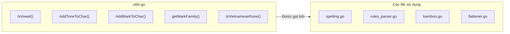

# REQ-024: Chú Thích `utils.go` — Các Hàm Tiện Ích (Utility)

**Phiên bản:** 1.0
**Ngày cập nhật:** 2026-08-16
**Ngôn ngữ:** Tiếng Việt
**File mục tiêu:** `bamboo/bamboo-core/utils.go`
**Mục đích:** Mô tả chi tiết các hàm tiện ích được sử dụng rộng rãi trong `bamboo-core`.

---

## 1. Tổng Quan File

`utils.go` chứa các **hàm tiện ích** (utility functions) được sử dụng bởi nhiều file khác trong `bamboo-core`. Đây là "bộ công cụ" cơ bản để xử lý ký tự tiếng Việt.



---

## 2. Danh Sách Nguyên Âm

### 2.1. `Vowels` — Tất cả nguyên âm tiếng Việt

```go
var Vowels = []rune("aàáảãạăằắẳẵặâầấẩẫậeèéẻẽẹêềếểễệiìíỉĩịoòóỏõọôồốổỗộơờớởỡợuùúủũụưừứửữựyỳýỷỹỵ")
```

**Cấu trúc:**

| Vị trí | Nhóm | Các ký tự | Pattern |
|--------|------|-----------|---------|
| 0-5 | a | `a à á ả ã ạ` | Không dấu + 5 thanh |
| 6-11 | ă | `ă ằ ắ ẳ ẵ ặ` | Móc ngược + 5 thanh |
| 12-17 | â | `â ầ ấ ẩ ẫ ậ` | Mũ + 5 thanh |
| 18-23 | e | `e è é ẻ ẽ ẹ` | Không dấu + 5 thanh |
| 24-29 | ê | `ê ề ế ể ễ ệ` | Mũ + 5 thanh |
| ... | ... | ... | ... |

**Pattern quan trọng:** Mỗi nhóm nguyên âm có **6 ký tự** (không dấu + 5 thanh).
- `pos % 6 == 0` → không dấu
- `pos % 6 == 1` → huyền
- `pos % 6 == 2` → sắc
- `pos % 6 == 3` → hỏi
- `pos % 6 == 4` → ngã
- `pos % 6 == 5` → nặng

**Ứng dụng:**
- `FindToneFromChar(chr)` → `Tone(pos % 6)`
- `AddToneToChar(chr, tone)` → `Vowels[pos + (tone - currentTone)]`

---

## 3. Bảng Ánh Xạ "Họ" Ký Tự

### 3.1. `marksMaps` — Các họ ký tự

```go
var marksMaps = map[rune]string{
    'a': "aâă__",
    'â': "aâă__",
    'ă': "aâă__",
    'e': "eê___",
    'ê': "eê___",
    'o': "oô_ơ_",
    'ô': "oô_ơ_",
    'ơ': "oô_ơ_",
    'u': "u__ư_",
    'ư': "u__ư_",
    'd': "d___đ",
    'đ': "d___đ",
}
```

**Ý nghĩa:** Mỗi họ là một nhóm ký tự có liên quan về âm vị học.

| Ký tự | Họ (string) | Giải thích |
|-------|-------------|------------|
| `'a'` | `"aâă__"` | a, â, ă (3 ký tự + 2 placeholder `_`) |
| `'e'` | `"eê___"` | e, ê (2 ký tự + 3 placeholder `_`) |
| `'o'` | `"oô_ơ_"` | o, ô, ơ (3 ký tự + 2 placeholder `_`) |
| `'u'` | `"u__ư_"` | u, ư (2 ký tự + 3 placeholder `_`) |
| `'d'` | `"d___đ"` | d, đ (2 ký tự + 3 placeholder `_`) |

**Placeholder `_`:** Đánh dấu vị trí không có ký tự, giúp các hàm xử lý biết khi nào dừng.

**Ứng dụng trong `getMarkFamily`:**

```go
getMarkFamily('a') → ['a', 'â', 'ă']
getMarkFamily('o') → ['o', 'ô', 'ơ']
getMarkFamily('d') → ['d', 'đ']
```

---

## 4. Các Hàm Chính

### 4.1. `IsVowel(chr)` — Kiểm tra nguyên âm

**Logic:** Duyệt `Vowels`, nếu `chr` có trong danh sách → `true`.

**Ví dụ:**
- `IsVowel('a')` → `true`
- `IsVowel('b')` → `false`
- `IsVowel('ấ')` → `true`

### 4.2. `FindVowelPosition(chr)` — Tìm vị trí nguyên âm

**Output:** Vị trí trong `Vowels`, hoặc `-1` nếu không phải nguyên âm.

**Ứng dụng:** Được `FindToneFromChar` và `AddToneToChar` sử dụng.

### 4.3. `FindToneFromChar(chr)` — Tìm thanh điệu của ký tự

**Logic:** `Tone(pos % 6)`

**Ví dụ:**
- `FindToneFromChar('a')` → `ToneNone` (vị trí 0, 0 % 6 = 0)
- `FindToneFromChar('á')` → `ToneAcute` (vị trí 2, 2 % 6 = 2)
- `FindToneFromChar('ạ')` → `ToneDot` (vị trí 5, 5 % 6 = 5)

### 4.4. `AddToneToChar(chr, tone)` — Thêm dấu thanh

**Logic:**
1. Tìm `pos` của `chr` trong `Vowels`
2. Tính `currentTone = pos % 6`
3. Tính `offset = tone - currentTone`
4. Trả về `Vowels[pos + offset]`

**Ví dụ:**
```go
AddToneToChar('a', 2)    // a + sắc
  pos = 0, currentTone = 0
  offset = 2 - 0 = 2
  return Vowels[0 + 2] = 'á'

AddToneToChar('â', 3)    // â + hỏi
  pos = 12, currentTone = 0
  offset = 3 - 0 = 3
  return Vowels[12 + 3] = 'ẩ'
```

### 4.5. `AddMarkToTonelessChar(chr, mark)` — Thêm dấu mũ/móc (không dấu thanh)

**Logic:** Tra `marksMaps`, lấy ký tự tại vị trí `mark`.

**Ví dụ:**
```go
marksMaps['a'] = "aâă__"
AddMarkToTonelessChar('a', MarkHat)    // MarkHat = 1
  → marksMaps['a'][1] = 'â'
  
AddMarkToTonelessChar('a', MarkHorn)   // MarkHorn = 3
  → marksMaps['a'][3] = '_' (không hợp lệ)
  → return 'a' (giữ nguyên)
```

### 4.6. `AddMarkToChar(chr, mark)` — Thêm dấu mũ/móc (giữ dấu thanh)

**Logic:**
1. Lưu tone hiện tại: `tone = FindToneFromChar(chr)`
2. Bỏ tone: `chr = AddToneToChar(chr, 0)` → về không dấu
3. Thêm mark: `chr = AddMarkToTonelessChar(chr, mark)`
4. Khôi phục tone: `chr = AddToneToChar(chr, tone)`

**Ví dụ:**
```go
AddMarkToChar('á', MarkHat)    // á + mũ
  tone = ToneAcute (2)
  Bỏ tone: 'á' → 'a'
  Thêm mũ: 'a' → 'â'
  Khôi phục tone: 'â' + sắc → 'ấ'
```

### 4.7. `getMarkFamily(chr)` — Lấy các ký tự trong cùng họ

**Output:** `[]rune` chứa các ký tự trong cùng họ (bỏ placeholder `_`).

**Ví dụ:**
- `getMarkFamily('a')` → `['a', 'â', 'ă']`
- `getMarkFamily('o')` → `['o', 'ô', 'ơ']`

### 4.8. `FindMarkFromChar(chr)` — Tìm loại mark của ký tự

**Logic:** Tìm vị trí của `chr` trong `marksMaps[chr]`.

**Ví dụ:**
- `FindMarkFromChar('â')` → `MarkHat` (vị trí 1 trong "aâă__")
- `FindMarkFromChar('ă')` → `MarkBreve` (vị trí 2 trong "aâă__")

### 4.9. `IsWordBreakSymbol(key)` — Kiểm tra ký tự ngắt từ

**Logic:** Là dấu câu HOẶC là số.

**Ví dụ:**
- `IsWordBreakSymbol(' ')` → `true`
- `IsWordBreakSymbol(',')` → `true`
- `IsWordBreakSymbol('5')` → `true`
- `IsWordBreakSymbol('a')` → `false`

### 4.10. `IsVietnameseRune(chr)` — Kiểm tra ký tự tiếng Việt

**Logic:**
1. Nếu `FindToneFromChar(chr) != ToneNone` → `true` (có dấu thanh)
2. Hoặc nếu `chr != AddMarkToTonelessChar(chr, 0)` → `true` (có dấu mũ/móc)

**Ví dụ:**
- `IsVietnameseRune('á')` → `true` (có dấu sắc)
- `IsVietnameseRune('â')` → `true` (có dấu mũ)
- `IsVietnameseRune('a')` → `false` (không có gì đặc biệt)
- `IsVietnameseRune('b')` → `false`

### 4.11. `canProcessKey(key, effectKeys)` — Kiểm tra có xử lý phím không

**Logic:**
1. Nếu là chữ cái alpha HOẶC trong danh sách effectKeys → `true`
2. Nếu là ký tự ngắt từ → `false`
3. Nếu là ký tự tiếng Việt → `true`

**Ví dụ:**
- `canProcessKey('a', ['s','f'])` → `true` (alpha)
- `canProcessKey('s', ['s','f'])` → `true` (trong effectKeys)
- `canProcessKey(' ', ['s','f'])` → `false` (space ngắt từ)
- `canProcessKey('á', ['s','f'])` → `true` (tiếng Việt)

---

## 5. Phạm Vi Chú Thích Đề Xuất

### Giữ nguyên
- Header copyright

### Chú thích
- `Vowels` — cấu trúc 6 ký tự/nhóm, ứng dụng
- `PunctuationMarks` — danh sách dấu câu
- `marksMaps` — ý nghĩa họ ký tự, placeholder `_`
- `IsVowel()` / `FindVowelPosition()`
- `FindToneFromChar()` / `AddToneToChar()` — pattern pos % 6
- `AddMarkToTonelessChar()` / `AddMarkToChar()` / `getMarkFamily()`
- `FindMarkFromChar()` / `FindMarkPosition()`
- `IsWordBreakSymbol()` / `IsVietnameseRune()` / `canProcessKey()`
- `HasAnyVietnameseRune()` / `HasAnyVietnameseVower()`

---

## 6. Checklist Chờ Phê Duyệt

- [ ] Đồng ý phạm vi chú thích cho `utils.go`
- [ ] Đồng ý giải thích cấu trúc `Vowels` (6 ký tự/nhóm)
- [ ] Đồng ý giải thích `marksMaps` và họ ký tự
- [ ] Đồng ý chú thích các hàm AddTone, AddMark
- [ ] Đồng ý tiến hành edit file `utils.go`
